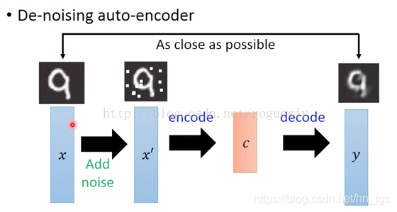

Generator 不用想得太复杂，就是一个函数。函数的形式可以是NN。

输入一个向量，这个向量可以看成一个控制向量，用向量中的元素表示生成对象的属性。生成对象可以是不同的东西，图片矩阵，文字序列都可以，需要具体控制。

这可以弄出一个有趣的应用，通过改变输入向量，生成人脸渐变的中间图像。

比如用向量中的第一个元素表示头发的长度，第二个表示头发的颜色。

一样的，判别器也可以看成一个函数，可以是NN。它的输入是前面生成的对象，比如一张图片。输入是一个数字，就是生成对象的逼真程度，符合程度。

GAN的原理的一个比喻是动物界猎物与捕食者之间的相互进化。比如枯叶蝶和其捕食者麻雀。一开始第一代枯叶蝶长成一般的蝴蝶的模样，彩色的，然后第一代麻雀很容易就认出它，然后第一代枯叶蝶进化成第二代，变成了灰色的，第一代麻雀不认识，进化成了第二代的大比鸟。然后第三代枯叶蝶进化出叶脉，更加相似了。就这样一代代的相互促进，进化。

对于生成器和判别器，就是最初的生成器，参数是完全随机的，生成的图片是一个噪声图片。

GAN可以看成一种结构化学习，
一般的学习任务，回归，分类，输入很简单。
结构化学习，输入这些
是一个高维的结构化数据。从这个角度说，我们传统的机器学习，主要就是回归，分类，GAN开启了一个很大的新的领域。
这样来看，很多NLP问题是结构化输出问题，也就是可以用GAN来做。比如机器翻译，语音生成。

像强化学习一样，用来做一系列的决策，因为一系列决策就是一个序列，也就是结构化数据。

能够做结构化生成的模型，也可以看成是具有大局观的模型。就比如生成句子的时候，一个个词的生成，生成每个词的时候，要考虑整句话的好坏。

GAN的执行流程：
初始化生成器和判别器
迭代训练，每次迭代过程中：
第一步：固定生成器，更新判别器，一开始的生成器生成的是随机图像，这时候从图像数据集里面取若干个样本，他们的标签（也就是得分）是1，而生成器生成的图像的标签是0。用这样的数据来训练判别器 ，就想做一般的分类任务一样。
第二步，固定判别器，更新生成器。

由上图，生成器生成图片，然后把图片输入判别器，判别器输出一个数字结果。因为前面判别器已经训练好了，能分辨逼真的图和不逼真的图，如果生成的图片比较逼真就会的高分，反之就是低分。此时，训练使它的输出值最大化就行。（和一般神经网络类似，一般神经网络最小化，梯度下降，这里最大化，梯度上升）。也就是把整个判别器看成一个损失函数，类似于一般神经网络的交叉熵。
输出的图片可以看成整个神经网络的一个隐藏层。

从上面可以看出，就像训练两个神经网络一样。所以说，GAN也是基于神经网络的，一种神经网络的变体，巧妙的组合，哈哈。

伪代码：

1、从数据集里面取样m个图片
2、随机生成m个向量
3、由m个向量生成m个图像
4、训练判别器，使用上面所述的公式作为损失函数更新判别器的参数。
D(x)表示判别器函数，让V最大，意味着D(X)对真实（真实=数据集里面的图像，后同）图像输出最大化，log(1-D(..))表示要对生成的图像输出最小化，即认为这种图片不够逼真，从而区分去真实图像和不真实的生成图像。1/m就是简单的取均值。
注意这个函数是最开始论文里面给的，后面发展出更好的函数。
5、训练生成器。再生成m个向量，不需要和训练判别器时用的一样，然后同样的使用下面的损失函数更新生成器的参数即可。

探究：
只用生成器学习输出能行吗，神经网络是万能近似函数，我们原来一般使用神经网络做回归分类什么的，是将高维输入得到一个低维输出，实际上对于由低维输入得到高维输出这样的任务神经网络也是完全可以胜任的。也就是这里的生成器的效果，输入向量得到逼真的生成图片。只用生成器的情况下可以怎么学习呢。举例子来说，我们想要学习生成手写数字，首先有手写数字数据集，里面有很多的手写数字，然后我们使用向量对这些数字进行编号，然后训练神经网络时，就输入这些向量，让得到的输出(也就是图片）与原来的图片尽量接近。如下图

现在的问题就是，怎么对这些图片进行编号的向量。你可能会想随机产生，这里随机产生是不行的，因为两个很像的图像，比如上面的第一个1和第二个1，它的向量编号也应该很接近才行，不然神经网络是很难学到的。（当然对于几万张数字你应该可以增大NN规模强行“记住”，但是更丰富的图像就不行了），也就是不能根据规律生成图片。这里同样的有一个原理，就是高维数据的分布规律，某一类图片是占据高维空间中的一个区域，这类图片的子分类又占据一个子区域，GAN就从这个子区域生成图片。所以依然是遵循一定的数据分布规律来生成的，输入向量从低维映射到高维，它也的遵循一定的分布规律来对应上高维数据。举例说输入向量维度1增加表示高维数据代表头发长度的若干个维度增加。如果编号没规律，维度1增加，头发长度忽增忽减，就很难学了。

如上图，数字的规律变形，看上去很神奇，像某个艺术家画出来的一样。实际上是autoencoder学习出来的，编码向量是2维，可以看到数字形状随着编码向量的值变化而有规律的变化，也就是上面说的低维向量的规律变化对应着高维图像的规律变化。

## 自编码器Autoencoder简介：
简单的说，自编码器就是使用神经网络的方式进行数据降维，它的功能就像PCA一样。（我们控制encode的输出维数，就相当于强迫encode过程以低维参数学习高维特征，这导致的结果和PCA类似。似乎autoencoder效果还更好）
自编码器包含编码器(encoder)和解码器(decoder)两部分。

编码器：这部分能将输入压缩成潜在空间表征，可以用编码函数h=f(x)表示。

解码器：这部分能重构来自潜在空间表征的输入，可以用解码函数r=g(h)表示。

因此，整个自编码器可以用函数g(f(x))= r来描述，其中输出r与原始输入x相近。 

Autoencoder的计算过程可以简化如下图所示：首先用对输入白色X进行压缩，提取出最具有代表性的信息或特征，缩减信息量，然后再把缩减过后的信息放到神经网络里去学习，这样相较于学习原始数据白色X会节省大量的时间成本。最后再把学习好的信息解压成黑色的X，通过比对黑白X求出预测误差，进行反向传播，逐渐提升自编码器的准确性。从整个过程来看，我们只用到了输入数据X，并没有用到X对应的数据标签。 

具体的应用到图像中，编码器是卷积和池化，解码器就是反卷积和反池化。比如池化2*2取最值变成1*1，反池化就是1*1直接填充到2*2的4个格子中，或者其它方式。卷积是一个矩阵在另一个矩阵上做滑动运算，比如卷积核为3，步长为1，3*3变成1个像素，最后图片长宽减少了2，反卷积不是1个像素变成3*3的区域，而是对图片先进行填充，外部padding和内部填充，然后再卷积，填充大小和卷积参数有一定对应关系，最后结果又变回和原来一样的尺寸了。也就是说，反卷积就是图片变一下之后再卷积即可。如下图

### De-noising AutoEncoder
对于AutoEncoder，每一次的训练都是自身的对比，这回造成输出和输入越来越类似，而对同种类的其他图片表现不敏感，于是，De-noising AutoEncoder派上了用场，如下图所示，在输入之前，先将图片加入随机噪声，这样每次的输入都会略有差异，然后将带有噪声的图片进行AutoEncoder，将输出的y与加噪声之前的图片进行比较，这样训练出来的y就具有抗噪声的能力，在以图搜图的场景下也就提高了泛化能力。

由上面的，实际上训练了autoencoder之后，最后的decoder就相当于一个生成器generator，比如上面的数字，你对着decoder输入一个随机的二维向量，然后它就能输出一张数字图片。但是autoencoder的缺陷在于，它只能生成数据集里面已有的图像，不能生成不一样的。比如
0.5*a+ 0.5*b结果是不知道的，很可能产生的是噪声。

### 解决这个问题的方式：变分自编码器VAE variational autoencoder
它和AE的不同点就在于，AE中间输出的是隐变量的具体取值，而VAE中间要输出的是隐变量的具体分布情况，这样一来，我们就可以从这个分布中另外取样，送入到decoder，就可以生成类似输入样本 [公式] 的其他样本 [公式] 了，并且这两个会十分近似。

举个例子，这个示例来源于 [1] Variational autoencoders, Jenemy Jordan，如果我们有个人脸的数据集，在AE中，我们希望它完成下图的工作：

即对每一个属性，给出一个确切的取值。比如上面的smile属性，现在取值是0.99，那模型为什么输出一个0.99呢？为啥不是0.98,0.97等等呢？是的，这就是VAE干的事情，VAE希望学习到关于该smile属性的概率分布，当然，该概率分布函数y取值最大时对应的x就是这里的0.99，也即AE给出该属性的那个确切值，如下图所示：

好，那现在我知道当前这个人笑的灿烂程度是0.99，并且长胡须的程度是0.85，假如我现在想知道长胡须程度是0.65的人笑的灿烂程度是0.89的人脸会是怎样的样子怎么办呢？那就取样呗，就是准确值的基础上加上随机值，反正VAE学习到了各个属性的分布，然后再送入decoder变换回来，就类型下图所示： 

于是，VAE的总体架构如下图所示：

VAE这里面有些点，比如分布是什么，需要数学推导，待学。

可以这样理解神经网络，就是我们在做其它某项工作的时候，需要一个万能函数近似器，这时候插入一个神经网络就行了。比如要完成某个数学模型中的某一步，需要一个万能函数近似器，插入一个神经网络就Ok了。

自动编码器可以生成和数据集图片一样的图像，变分自动编码器可以生成和数据集图片接近的图像，那编码器生成图片还存在什么样的问题呢？
编码器最后判断生成的图片的真实度的时候，只是与原图片进行了比较，比如求像素的的L1，L2范数，这种比较是不够合理的，它只能考虑单个像素的关系，不能综合考虑，如像素域之间的关系。所以这时候需要一个智能或者说科学的比较方法，怎么比较呢，采用更复杂的数学方法，可以。但是直接使用神经网络岂不是爽歪歪，万能函数嘛，当然也可以是比较图片相似度的函数。也就是判别器，从编码器的角度看，它是采用分类的方法进行间接的比较。不但能根据综合考虑本图片的像素，因为还学习了数据集中的所有图片，所以可以结合数据集中的所有图片进行比较。另一种方式，也可以在编码器输出图像的后面加上若干层神经网络，再加上一定的方法？达到类似的效果
综上，也就是AE生成相同图像，VAE生成某张图片的近似图片，GAN综合整个数据集生成近似图片。

## 只用判别器生成图片可以吗：

假如使用判别器生成，先假设判别器能判断图片真假，这时就需要可以穷举所有可能的图片的生成器，然后输出判别器打高分的图片即可。那么如何得到能判别真假的判别器呢？

判别器相当于一个分类神经网络，也需要训练出来，它用于区分逼真的图片和不逼真的。分类器需要画出精确的分界线才能很好的分类。
也就是判别器需要负面样本，如果只给它正面样本的话，它就会对所有的样本都只打高分，也就是分类问题，它没有学到分类界限函数。就是说它对高维数据做区域划分的时候，约等于把界限画在呢-∞那个点，这样所有图的都在好图区域。
而且，这个负样本还需要足够的好，不是说随机噪声样本就行。那样判别器画出分界线还是太粗略。负面样本要足够接近真实图像，判别器才能画出精确的分界线。现在怎么产生好的负面样本就很重要了。

可以让生成器记录，穷举图片的时候，避开原来得到低分的区域。这样一步步的就能的到一个足够好的判别器呢。

所以我们需要一个能够穷举和记录的生成器，当然这个穷举记录是智能的穷举记录。满足这个条件的也就是GAN里面的基于神经网络的生成器，实际上还可以用很多基于其它技术的生成器。如下图：

进一步，也就是说结构化学习是输出高维数据，不像一般的学习，输出低维数据。我们评判低维数据好坏很容易，直接L1，L2。但是评判高维数据，就不那么好评判，所以得用智能的算法来评测，也就是神经网络之类的。进一步的，这个判别器也不能是一般的判别器，一般判别器分出正类负类画出的边界不一定是最小的，通过生成器不断找漏洞划出的边界才会是最小的。

# fGAN——深度理解 GAN 理论
fGAN 其实想要表达的就是一件事，任何的 Div（统称为 f-Div）都可以被放到 GANs 的架构中去。
设定 P 和 Q 是两个不同的分布， p(x)和 q(x)代表着分别从 P 和 Q 采样出 x 的几率，
则我们将 f-Div 定义为：
$$D_f(P||Q)=\int\limits_xq(x)f(\frac{p(x)}{q(X)})dx$$  
上述公式衡量 P 和 Q 有多不一样，公式里边的函数 f 可以是很多不同的版本，只要 f
满足以下条件：它是一个凸函数同时 f(1)=0 。

这个f放到v定义式中，形式如下

然后大致就是形成了一个新的目标函数
