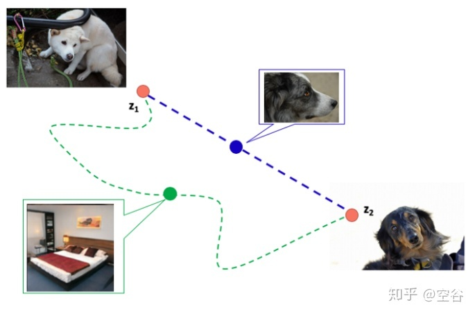
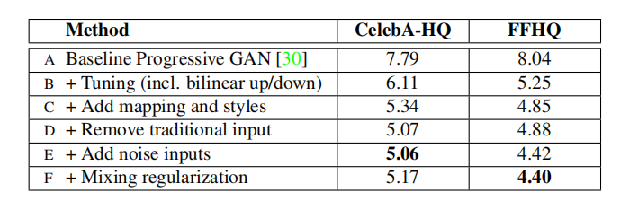
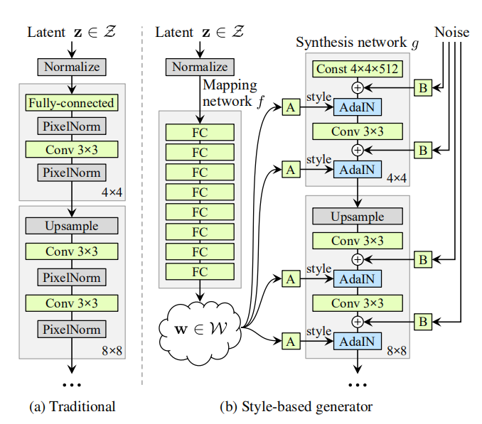
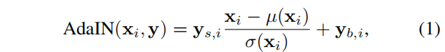
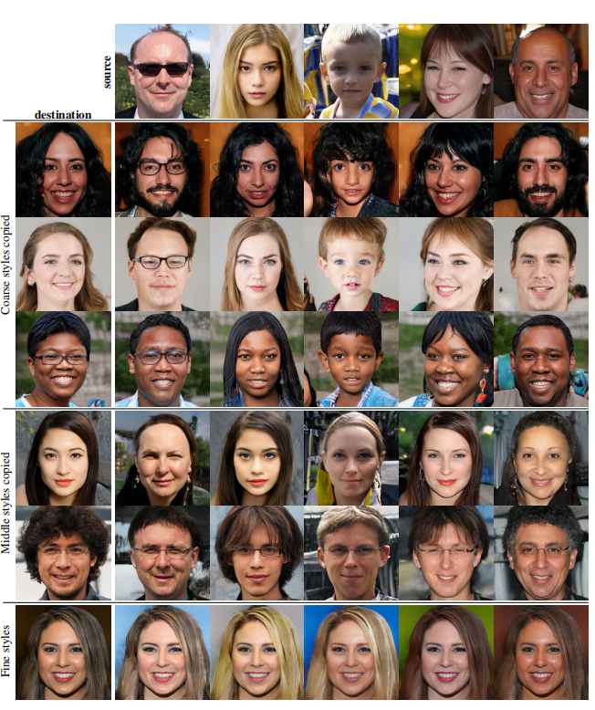

# 总结
网页资料：
 https://zhuanlan.zhihu.com/p/263554045?utm_source=wechat_session

重要的贡献就是以前的论文都不知道潜变量与生成图像特征之间的关系，这个文章通过改变生成器架构，大概弄清楚了这种关系。进而可以通过潜变量控制生成图像了。具体的说是通过中间变量进行解纠缠。

StyleGAN中的“Style”是指的是属性，主要是可以控制生成图像的属性，图像属性是一个很基础和广泛的东西，在这基础上就可以有很多的可能了。所以可以将它理解为属性GAN，这个style和风格迁移里面的style不一样。

模型大小：300M

## 生成器概述
StyleGAN的生成器由两部分组成，第一个是Mapping network，即图1 (b)中的左部分，由隐藏变量 z 生成 中间隐藏变量 w的过程，这个 w 就是用来控制生成图像的style，即风格，为什么要多此一举将 z 变成 w 呢，后面会详细讲到。 第二个是Synthesis ，图1(b)右边部分。它的作用是生成图像，创新之处在于给每一层子网络都喂了 A 和 B，A 是由 w 转换得到的仿射变换，用于控制生成图像的风格，B 是转换后的随机噪声，用于丰富生成图像的细节，即每个卷积层都能根据输入的A来调整"style"。整个网络结构还是保持了 PG-GAN （progressive growing GAN） 的结构。

## latent space interpolations

latent space interpolations 不是StyleGAN提到的，但在多篇paper中有提到，如下图的椅子，左边是比较宽的椅子，右边是比较窄的椅子，中间的椅子是这两种椅子特征的线性组合。IGAN里面有提到。图像的渐变，就是隐变量在欧几里得空间的渐变。

## 风格混合：
具体做法是将两个不同的latent code z1 和 z2 输入到 mapping network 中，分别得到 w1 和w2 ，分别代表两种不同的 style.然后在 synthesis network 中随机选一个分辨率作为交叉点，交叉点之前的部分使用w1 ，交叉点之后的部分使用w2 ，生成的图像应该同时具有 source A 和 source B 的特征，称为 style mixing。  见图3

## 随机变量 Stochastic variation

论文中的 Stochastic variation 是为了让生成的人脸的细节部分更随机、更自然，细节部分主要指头发丝、皱纹、皮肤毛孔、胡子茬等

## Perceptual path length 感知路径距离
如图，当特征充分解耦的时候，即特征组合是线性的，如下图中白色的狗对应的latent code是z1，黑狗图像对应latent code 是 z2，充分解耦时，图中蓝色的虚线是z1 到 z2 最快的路径，在蓝色的路径中的中间图像应该是z1 和 z2 的组合，蓝色路径上生成的中间图像也是狗（ 符合 latent-space interpolation），但是绿色的曲线由于偏离路径太多，生成的中间图像可能是其他的，比如图上的卧室，这是我们不希望的结果。

补充一下，我们可以通过训练好的生成模型得到给定图像的latent code，假设我们有一个在某个数据集上训练好的styleGAN模型，现在要找到一张图像 x 在这个模型中的latent code，设初始latent code 是 z，生成的初始图像是p，通过 p 和 x 之间的差距 设置损失函数，通过损失不断去迭代 z，最后得到图像x的latent code。

翻译：www.gwylab.com 原文来源：https://arxiv.org/pdf/1812.04948.pdf
生成对抗网络中一种基于样式的生成器结构
Tero Karras Samuli Laine Timo Aila
NVIDIA NVIDIA NVIDIA
tkarras@nvidia.com slaine@nvidia.com taila@nvidia.com
 摘 要
我们提出了一种用于生成对抗网络的新生成器体系结构，借鉴了样式转移的相关文献。 新的体系结构导致自动学习地、无监督地高级属性分离（例如，在人脸上训练时的姿势和身份）和生成的图像中的随机变化（例如，雀斑，头发），并且能够直观地、按特定尺度地控制合成（就是比如大尺度的头发长度，头的朝向，小尺度的肤色等）。 新的生成器在传统的生成质量指标方面提高了最新技术水平值，可以显著提高插值特性，并且可以更好地解决变异的潜在因素。 为了量化插值质量和解纠缠，我们提出了两种适用于任何生成器架构的新的自动化方法。最后，我们介绍了一个新的，高度多样化和高质量的人脸数据集。

1. 介 绍
由生成方法产生的图像的分辨率和质量 - 尤其是生成对抗性网络（GAN）[21] - 近来已经迅速改善[29,43,5]。然而，生成器继续作为黑匣子运行，尽管最近的努力[3]，仍然缺乏对图像合成过程的各个方面的理解，例如随机特征的组织。潜在空间的性质也很难理解，并且通常展示的潜空间插值[12,50,35]没有提供将不同生成器相互比较的定量方法。

在样式转移文献[26]的推动下(注：任意样式之间进行图像风格迁移的方法)，我们以一种揭示控制图像合成过程的新方法的方式重新设计了生成器结构。我们的生成器从学习常量输入开始，并基于潜码调整每个卷积层图像的“样式”，因此可以直接控制不同尺度的图像特征的强度。结合直接注入网络的噪声，这种架构变化导致高级属性的自动的，无监督的解缠（例如，姿势，身份）来自所生成图像中的随机变化（例如，雀斑，头发），并且能够进行直观的尺度特定混合和插值操作。我们不以任何方式修改鉴别器或损失函数，因此我们的工作与正在进行的关于 GAN 损失函数，正则化和超参数的讨论是互为独立的[23,43,5,38,42,34] 。

我们的生成器将输入的潜编码嵌入到中间的潜在空间中，这对于**如何在网络中表示噪音因子具有深远的影响**。** 输入潜空间必须遵循训练数据的概率密度，并且我们认为这会导致某种程度的不可避免的纠缠。我们的中间潜在空间不受这个限制，因此可以解纠缠。 ** 由于以前的通过估算潜在空间解缠的方法并不直接适用于我们的情况，我们提出了两个新的自动度量- 感知路径长度和线性可分性 - 用于量化生成器的这些方面。使用这些指标，我们表明，与传统的生成器架构相比，我们的生成器允许 更加线性，更少纠缠的对不同变量因素的进行表示 。最后，我们提出了一个新的人脸数据集（Flickr-Faces�HQ，FFHQ），它提供了更高的质量，涵盖了比现有高分辨率数据集更广泛的变化（附录 A）。我们已将此数据集与我们的源代码和预先训练的网络一起公开提供，见底部链接1，随附的视频可在同一链接下找到。

2. 基于样式的生成器
传统上，潜编码通过输入层，即前馈网络的第一层（图 1a）提供给生成器。 我们而不同于此设计（图 1b，右）， 通过完全忽略输入层并从学习的常量开始。 给定输入潜空间Z中的潜代码z，非线性映射网络f: Z → W首先产生w ∈ W（图 1b，左）。 为简单起见，我们设置了两者的维度空间为512，映射 f 使用 8 层 MLP 实现，我们将在 4.1 节中进行分析。

  
表 1.各种生成器设计的 Frechet'起始距离（FID）（越低越好）。在本文中，我们使用从训练集中随机抽取的 50,000 张图像来计算FID，并报告在训练过程中遇到的最低距离。

图 1.虽然传统的生成器[29]仅通过输入层提供潜编码，但我们首先将输入映射到中间潜在空间 W，然后在每一个卷积层通过自适应实例规范化（AdaIN）控制生成器。 在评估非线性之前，在每次卷积之后添加高斯噪声。 这里“A”代表学习的仿射变换，“B”将学习的每通道缩放因子应用于噪声输入。 映射网络 f 由 8 个层组成，合成网络 g 由 18 层组成 - 每个分辨率两层（分辨率从4^2-1024^2 ）。使用单独的 1×1 卷积将最后一层的输出转换为 RGB，类似于Karras 等人[29]。 我们的生成器共有 2620 万可训练的参数，而传统生成器的参数量为 2310 万。

 然后，学习的仿射变换将 w 专门化为样式，其控制在合成网络 g 的每个卷积层之后的自适应实例归一化（AdaIN）[26,16,20,15]运算。 AdaIN 操作定义为    
 其中每个特征图 xi 分别规范化，然后使用样式 y 中相应的标量组件进行缩放和偏置。 因此，y 的维度是该层上的特征图的数量的两倍。
 
 对比我们的样式转换方法，我们从矢量 w 而不是样本图像中，计算空间不变的样式 y。 我们选择为 y 使用“style”这个词，因为类似的网络架构已经用于前馈式传输[26]，无监督的图像到图像转换[27]和域混合[22]。 与更一般的特征变换相比[36,55]，由于其效率和紧凑的表示，AdaIN 特别适合我们的目的。 
 
 最后，通过引入显式噪声输入，我们提供了生成器一种直接的方法，可以产生随机细节。这些都是由不相关的高斯噪声组成的单信道图像，我们向合成网络的每一层提供一个专用的噪声图像。噪声图像使用学习的特征缩放因子广播到所有特征图，然后添加到相应卷积的输出中，如图1b所示。 第3.2和3.3节讨论了增加噪声输入的影响。

2.1. 生成图像的质量
 在研究生成器的特性之前，我们通过实验证明了重新设计并不影响图像质量，但实际上却大大提高了它。表 1 给出了 CELEBA-HQ [29]和我们新的 FFHQ 数据集
（附录 A）中各种生成器架构的 Frechet'起始距离（FID）[24]。其他数据集的结果在附录 E 中给出。我们的基线 Progressive GAN，按照Karras 等人的设置配置的 [29]，我们默认继承了网络和所有超参数除非另有说明。我们首先通过使用双线性上/下采样操作[62]，更长的训练和调整的超参数来切换到改进的基线（B）。附录 C 中包含了对训练设置和超参数的详细描述。然后我们通过添加映射网络和AdaIN 操作（C）进一步改进了这个新的基线，**并且惊讶地观察到网络不再从将潜编码馈送到第一个卷积层以获益。因此，我们通过移除传统的输入层并从学习到的 4 × 4 × 512恒定张量（D）开始图像合成来简化架构。**我们发现，即使只通过控制 AdaIN 操作的样式接收输入，合成网络也能够产生有意义的结果。  
  
最后，我们介绍了进一步改善结果的噪声输入（E），以及对相邻样式进行去相关的新型混合正则化（F），并对生成的图像进行更细粒度的控制（第 3.1 节）。 我们使用两种不同的损失函数来评估我们的方法：对于CELEBA-HQ，我们依赖于WGAN-GP [23]，而FFHQ使用 WGAN-GP 进行配置 A 和非饱和损耗[21]，其中 R1 正则化[42,49,13]用于配置 B-F。我们发现这些选择可以产生最佳效果。我们的贡献不修改损失函数。

我们观察到基于样式的生成器（E）相比传统生成器（B） 显著提高了 FID，几乎达到了 20％，并行工作[6,5]在
大规模 ImageNet测量证实了这个。图 2 显示了使用我们的生成器从 FFHQ 数据集生成的一组未经验证的新图像。正如 FID所证实的那样，平均质量很高，甚至眼镜和帽子等配件也能成功合成。对于这个图，我们使用所谓的截断技巧避免了从W 的极端区域采样[40,5,32] - 附录 B 详述了如何在 W 而不是 Z 中执行该技巧。注意我们的生成器允许应用仅选择性地截断为低分辨率，以便不影响高分辨率细节。
  
 本文中的所有 FID 都是在没有截断技巧的情况下计算出
来的，我们在图 2 和视频中仅将其用于说明目的。所有图像均以$1024^2$分辨率生成。

## 2.2. 现有技术
关于 GAN 架构的大部分工作都集中在通过例如使用多个
鉴别器[17,15]，多分辨率判别[58,53]或自注意力机制[61]来改进鉴别器。 生成器侧的工作主要集中在输入潜在空间的精确分布[5]或通过高斯混合模型[4]，聚类[46]或鼓励凸性[50]对输入潜在空间进行整形。（注：就是集中在潜空间各种处理吧）

最近的条件生成器通过单独的嵌入网络将类标识符提供
给生成器[44]中的大量层，而潜变量仍然通过输入层提供。
一些作者已经考虑将潜编码的一部分馈送到多个生成器层
[9,5]。 在平行工作中，陈等人[6]使用 AdaIN“自我调制”
生成器，与我们的工作类似，但不考虑中间潜在空间或噪声
输入。

# 3. 基于样式的生成器的属性

我们的生成器架构可以通过对样式的特定尺度修改来控制图像合成。我们可以将映射网络和仿射变换视为一种 从学习的分布中为每种样式绘制样本的方式，并且将合成网络视为基于样式集合生成新颖图像的方式。每种样式的效果都在网络中定位，即：可以预期修改样式的特定子集仅影响图像的某些方面。为了了解这种定位的原因，让我们考虑 AdaIN 操作（方程 1）如何首先将每个通道归一化为零均值和单位方差，然后才应用基于样式的尺度和偏差。根据样式的要求，新的每通道统计数据修改了后续卷积操作的特征的相对重要性，但由于规范化，它们不依赖于原始统计数据。因此，每个样式在被下一个 AdaIN 操作覆盖之前仅控制一个循环。

## 3.1. 样式混合
 为了进一步鼓励样式进行本地化，我们采用混合正则化，
其中使用两个随机潜码而不是训练期间的一个潜编码生成
给定百分比的图像。 当生成这样的图像时，我们简单地从
一个潜编码切换到另一个 - 我们称之为样式混合的操作 -
在合成网络中随机选择的点。 具体来说，我们运行两个潜
码 z1， z2 通过映射网络，并具有相应的 w1，w2 控制样式，以便 w1 在交叉点之前应用，w2 在交叉点之后应用。 这种正则化技术可以防止网络假设相邻的样式是相关的。

3.2 随机变量
人的肖像的很多方面都可以看做随机数，比如头发丝的位置，胡渣，雀斑，或者毛孔。他们都可以随机化且并不影响我们对图片的整体感知，只要他们符合正确的分布。（注：反过来看，就是说鼻子，眼睛这些是非随机的，不能随意生成。）
让我们考虑传统方法是如何实现随机变化的。只在输入层给予输入，网络需要自己发明一种方式，在任何需要的时候，根据早期的激活中生成随空间变化的伪随机数。这会影响网络的容量，并且隐藏生成信号的周期性是困难的-且通常不会成功。正如经常看到的生成图片中的重复模式。我们的模型通过为每个卷积层输入随机数避免这个问题。（注：就是说虽然随机特征是小尺度的，但是在生成器较低的层也即较大尺度上也输入了，应该说较大尺度也有一些随机的特征吧）

3.3 从随机性中分离全局影响
前面的部分以及随附的视频表明，虽然样式的变化具有全局效果（改变姿势，身份等），但噪声仅影响无关紧要的
随机变化（不同梳理的头发，胡须等）。这种观察符合样式转换文献，其中已经确定空间不变统计量（格式矩阵，通道平均值，方差等）可靠地编码图像的样式[19,37]，而随空间变化的特征编码特定的实例。

在我们基于样式的生成器中，样式会影响整个图像，因为完整的要素图将使用相同的值进行缩放和双向化。因此，
可以同时控制姿势，灯光或背景样式等全局效果。同时，噪声被独立地添加到每个像素，因此理想地适合于控制随机变化。如果网络试图使用噪声，如控制的姿势，那将导致空间不一致的决定，然后由鉴别器惩罚。因此，网络学会在没有明确指导的情况下，适当地使用全局和局部渠道。（没看懂，意思就是噪声不会影响全局特征）

# 关于数据集
FFHQ数据集包含了人脸来源的原始图像，高达2个多T，这不是实际用到的人脸图像，实际用到的人脸图像只有80多G，用的dlib对齐裁剪。