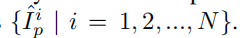

提出了Thumbnail Instance Normalization TIN
先把图片分块
提取缩略图的统计信息 然后将它们应用到分块的风格迁移上，以保证不同分块的风格一致性
这个东西受益于以前提出的笔触感知损失可以在扩大笔触尺寸时保持有效性

一个点：许多研究显示风格迁移倾向于产生相同大小的纹理笔触，则对于小风格大内容的图像是有问题的

框架是很简单的，可以应用在任意高分辨率的图像上
并且可以简单的插入现有的风格迁移网络中，甚至不用训练也能直接提高其性能（注：这个性能是指迁移质量？？）

# 实现
URST可分为3个步骤，拆分，风格化，聚合
1、拆分：先为内容图生成缩略图I_t,然后将I分成一个块序列 {I^i_p | i = 1, 2, ..., N}
2、风格化：风格化阶段，先将缩略图输入风格迁移网络获取归一化统计值，然后应用统计值去风格化图像的小块，得到风格化后的图像块，  这里风格化使用网络可以是目前大部分的风格网络
3、聚合：就是聚合

主要分块的时候会块之间会相互重叠一部分，不是完全分开
有个损失，就是促进笔触放大的损失，没仔细看
其它没什么了