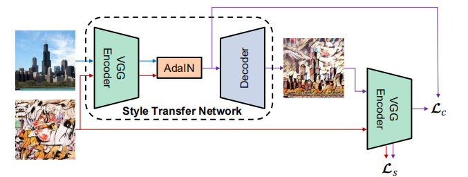

Gatys等人的开创性工作[16]表示，深度神经网络（DNN）不仅编码图像的内容，还编码图像的样式信息。 此外，图像样式和内容在某种程度上是可分离的: 可以在保留图像内容的同时更改其样式。

收到实例规范化的启发，我们提出了一种新的解释，即实例规范化是通过对特征统计量进行归一化来执行风格归一化，发现这些特征统计量可以承载图像的风格信息[16, 30, 33].基于我们的解释，我们引入了对IN的简单扩展，即自适应实例规范化（AdaIN）。给定内容输入 和风格输入，**AdaIN只需调整内容输入的均值和方差以 匹配风格输入的均值和方差即可。** 进一步的证明，文中提到，在条件实例规范会中，“出乎意料的是，网络可以使用IN 层中相同的卷积参数但使用不同的仿射参数来生成完全不同风格的图像。”

我：从一种角度上里面，原来的风格切换只能指定一种风格，就想二分类一线，现在任意风格之间切换就想自监督之下的任意类别分类。它有点像自监督学习了，融会贯通了各种风格，然后能做任意风格之间的切换。

经过作者对风格与规范化的关系的 一系列文献阅读研究，假设和实验。包括BN，IN或CIN。终于悟到了规范化实际上是，在此基础上提出了简单而强大的规范化方法，自适应实例规范化。别人说的：
作者根据前人的工作和自己的实验研究发现，图片由卷积神经网络提取的特征图的每个通道中数据的均值和标准差可以代表这张图片的风格，而且，特征图利用对应通道的均值和标准差进行normalization后可以将风格特征去除，只保留内容特征

#模型架构

结构是比较简单的，就是加了adain的编码解码结构，Vgg的前面少量的层用于编码器，然后加了点东西，内容图和风格图经过它，输出，然后进入adain层，主要就是对齐均值方差，然后进入解码器，解码器结构是编码器的镜像，细节上不使用任何规范化层，思想镜像pad
# 训练