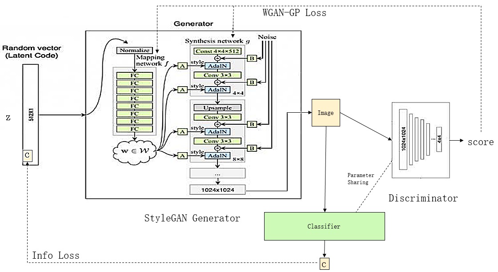
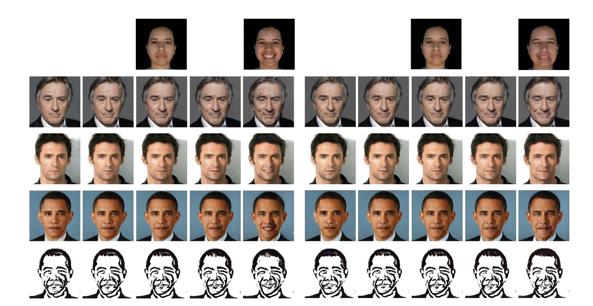
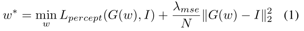
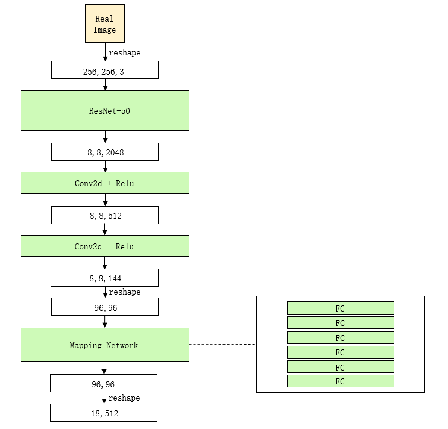

#应用总结
1、可以一键调整颜值，不仅可以变美，还可以反向变丑，详见 https://hub.fastgit.org/a3128630632/generators-with-stylegan2
2、artbreeder 这个网站，已经做得十分成熟了，主要利用了两个核心功能，合成和属性调节
https://www.artbreeder.com/i?k=a26ffd2d6f77c02dd9cb96882116
合成效果十分惊艳，简单想象一下，就是把你的照片和一个很美的艺术照合起来，那么就可以将你的照片变得很艺术，很美

# 相关资料：
https://blog.csdn.net/weixin_41943311/article/details/103904746
http://www.seeprettyface.com/research_notes.html#step7

https://hub.fastgit.org/a312863063/generators-with-stylegan2 

# 控制生成图像特征
1、生成指定类型的人脸，比如男，女，老，少
通过一个分类器来达到，就是先训练好一个分类器，比如性别分类的，然后在模型前面增加一个z码生成器，生成的Z码，经过StyleGAN生成图片，图片通过分类器，然后训练z码生成器使得分类分数高即可

类似的思路，不同的实现方法，提取某个类别数据集，比如男人，然后其它都不变，直接拿这个数据集过去，再训练好StyleGAN即可，就是微调的方法。

2、于是，现在我们希望能更精细控制生成图片的类型，就可以考虑用已有图片的特征码，对其进行替换，从而让其具有被替换图片的特定特征。

3、前面两种方法虽然能实现定制生成，但是由于每一种分类都是单独一个模型，这不利于进一步扩展。我们希望能构造一个通用模型，它能够实现所有定制化的需求。因此，我们借助InfoGAN的思想，将Info信息引入StyleGAN的生成器中，构造出新的具有语义限制的生成器。  
  
略

# Image2StyleGAN 论文解读
论文核心是将用户指定的图像映射到 GAN 潜在空间中来解决可解释性问题，这可以推进了许多潜在应用的诞生。
论文的贡献包括：
1· 一种有效的嵌入算法，可以将给定图像映射到预先训练的 StyleGAN 的扩展潜空间 W+中。
2· 我们研究了多个问题，以深入了解 StyleGAN 潜在空间的结构，例如：可以嵌入哪种类型的图像？ 可以嵌入哪种类型的面孔？ 可以使用哪些潜在空间进行嵌入？
3· 我们建议对向量使用三个基本运算来研究嵌入的质量。结果，我们可以更好地了解潜在空间以及如何嵌入不同类别的图像。作为副产品，我们在多种人脸图像编辑应用程序（包括图像变换，样式转移和表情转移）上均获得了出色的结果。

嵌入方式，这篇文章选择选择一个随机的初始潜在编码，并使用梯度下降法对其进行优化。这中方案泛化性能更好，更稳定。

感知损失和样式转换传统上，使用L1或L2损失函数在像素空间中测量两个图像之间的低级相似性。在过去的几年中，Gatys等人[7，6]观察到VGG图像分类模型[22]学习出的滤波器是出色的通用特征提取器，并建议使用提取特征的协方差统计量来测量图像之间的高级相似性感知，然后将其称作感知损失[12，5]。
## 哪些图像可以嵌入到StyleGAN潜在空间
不同类别的图像都可以嵌入到使用人脸训练的StyleGAN中，文中实验了，人脸，猫狗，绘画，汽车等。
StyleGAN对仿射变化（平移缩放等）的鲁棒性不好，会失真。
掩模覆盖的图像恢复之后不会填充掩模，其余能够还原。
## 潜在空间的形式
我们建议将其嵌入扩展的潜在空间W+中。W+是18个不同的512维W矢量的串联，每个StyleGAN体系结构的一层可以通过AdaIn接收输入。文中实验显示嵌入z和w效果都不好。

## 图像变换（或者说图像渐变）
本文的实验中，人脸渐变成功，但是在非人脸的同一类或者不同类之间渐变都失败。猜测主要是因为StyleGAN在人脸数据集上训练的。
## 风格迁移
这里风格迁移用的是StyleGAN论文中提到的那种交叉操作，前面若干层用w1，后面用w2。这种方法对人脸之外的效果不好。文中说，这也表明StyleGAN的泛化能力更多的驻留在高分辨率的层中，亦即StyleGAN低分辨率层更多的集中在人脸上。

## 表情传递
表情传递的公式就是
w = w1 + λ(w3 - w2)

如图，意思就是将w2到w3上的表情变化施加到w1上面去。

由上，可以得到，现在w就代表了人脸特征集合，现在我们可以像做公式运算一样操作w了。
那么更多的：
w = (w1 + w2) / 2

## 映射方法
映射嵌入的方法，有两种，使用编码器学习将给定图像映射到潜在空间，有两种方法：
（1）训练一个编码器，编码器输入是图像，输出是隐藏编码，这种方法的优点是速度快，缺点是不能处理训练数据集以外的图片；（2）选一个latent code，输入到预训练好的网络（比如StyleGAN），根据生成图像与目标图像的损失，通过反向传播对latent code进行迭代，这种方法的泛化性很好，但是速度很慢，因为要迭代很多次。
本文选择第二种，然后前面说了，嵌入到w+效果好。那么第二种开始选择的隐编码怎么选呢？文章考察了两种，随机值，人脸数据集的均值，文章采用后一种效果更好。另有资料提到结合第一种和第二种更好，就是先用编码器编码作为初始值。
      
损失函数

在所有实验中，我们使用 Adam 优化器的学习率为0.01, = 0.9, = 0.999 和 。 我们使用5000 个梯度下降步骤进行优化，在 32GB Nvidia TITAN V100 GPU 上每个图像花费的时间不到 7 分钟。只是人脸图像的损失
值下降最快，并在约 1000 个优化步骤即可收敛。

celeb-HQ和FFHQ都是同一批人Karras等收集的。

我们的重要见解之一是，当使用扩展的潜在空间W+时，预训练的 StyleGAN 的泛化能力会大大增强

# 编辑真实图像：
参考论文：Image2StyleGAN 如何将图像嵌入到 StyleGAN 潜在空间中
首先借鉴CycleGAN的思想建立StyleGAN的编码器，下面展示一个基于ResNet50模型设计的编码器。
  
上图是编码器的内部结构，主要是在Resnet50的模型后面加上几个转换层（添加较多的转换层有利于将图像特征转换为隐空间编码），实现上是比较容易的。  
过考虑到这是在生成图片域上的训练，而在测试时我们用到的是真实图片，因此对于特定的图片还需要进行二次调整（迭代优化），才能找到它在初始分布域上的准确位置（详见上面的论文）。

