High-Resolution Image Synthesis and Semantic Manipulation with Conditional GANs

总结：
1、从这里可以总结到，对于设计处理图像精细结构的任务，特征金字塔结构是一个比较通用的东西。就是目前的深度CNN结构，低层特征也需要单独提出来使用，不能只使用深层cnn提取到的高层特征。
这个在目标检测，语义分割里面是通用结构，也就是特征金字塔，结果多个底层特征图来获取大小不同目标的精确位置
在GAN里面自然而然的也出现，包括statck GAN 两阶段 ，这里pix2pixHD 两阶生成，三阶段判别，并且看到好几个论文提到遵循pix2pixHD的设计，也就是这个多尺度鉴别器的设计

2、进一步的想象，中间层的特征，也是可以利用的有用的信息，所谓总结结果，不要以为只有最后输出的结果才是可以利用的。然后每个激活值都有相应的信息价值，就是类似知识蒸馏里面，从某种程度上说它代表了数据的分布。

基于条件GAN的高分辨率图像合成和语义操纵  

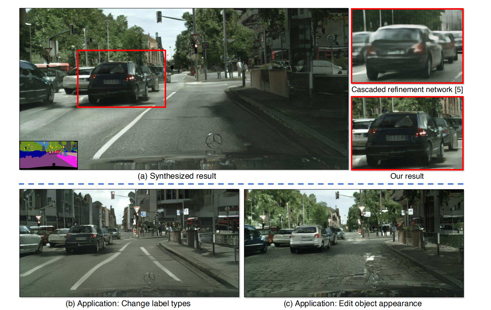  

 图1：我们提出了一个生成对抗性框架，用于从语义标签图中合成2048×1024幅图像((A)中左下角))。 与以前的工作[5]相比，我们的结果表达了更自然的纹理和细节。 (b)我们可以改变原来标签地图上的标签，以创造新的场景，例如用建筑物代替树木。 我们的框架还允许用户编辑场景中单个对象的外观，例如。 改变汽车的颜色或道路的纹理。 请访问我们的网站，以获得更多的并排比较和互动编辑演示。

 
## 摘要

 我们提出了一种利用条件生成对抗性网络(条件GAN)从语义标签图中合成高分辨率照片真实图像的新方法)。有条件的GAN启用了各种应用程序，但结果往往仅限于低分辨率，而且真实性仍然远远不够。在本工作中，我们生成了2048×1024 的具有视觉吸引力的结果，具有新的对抗性损失，以及新的多尺度生成器和判别器结构。此外，我们将我们的框架扩展到具有两个附加特性的交互式视觉操作。首先，我们包含对象实例分割信息，它**允许对象操作**，例如删除/添加对象和更改对象类别。其次，我们提出了一种**在相同输入下生成不同结果的方法**，允许用户交互编辑对象外观。人类的意见研究表明，我们的方法明显优于现有的方法，提高了深度图像合成和编辑的质量和分辨率。

## 引言：

 使用标准图形技术的照片真实图像渲染，因为涉及几何、材料和光传输必须显式模拟。**虽然现有的图形算法擅长于这项任务，但构建和编辑虚拟环境是昂贵和耗时的**。这是因为我们必须明确地模拟世界的每一个方面。 如果我们能够使用从数据中学习的模型来渲染照片真实图像，我们就可以将图形渲染过程转化为模型学习和推理问题。然后，我们可以通过在新数据集上训练模型来简化**创建新虚拟世界**的过程。 我们甚至可以通过允许用户简单地指定整体语义结构而不是建模几何、材料或照明来使定制环境变得更容易。  本文讨论了一种从语义标签图中产生高分辨率图像的新方法。 这种方法有广泛的应用。 例如，我们可以使用它创建用于训练视觉识别算法的合成训练数据，因为为所需场景创建语义标签比生成训练图像要容易得多。   
  本文讨论了一种从语义标签图中产生高分辨率图像的新方法。 这种方法有广泛的应用。这种方法有广泛的应用。 例如，我们可以使用它**创建用于训练视觉识别算法的合成训练数据**，因为为所需场景创建语义标签比生成训练图像要容易得多。 利用语义分割方法，可以将图像转换为语义标签域，编辑标签域中的对象，然后将其转换回图像域。 该方法还为我们提供了高级图像编辑的新工具，例如向图像添加对象或更改现有对象的外观。  
  
  为了从语义标签中合成图像，可以使用pix2pix方法，这是一种图像到图像的迁移框架[21]它在条件设置中利用生成对抗性网络(GANS)[16]。最近，Chen和Koltun[5]表明，对抗训练可能是不稳定的，并且容易在高分辨率图像生成任务中失败。相反，他们采用修正的感知损失[11,13,22]来合成图像，这些图像是高分辨率的，但往往缺乏精细的细节和真实的纹理。  
    
   在这里，我们讨论了上述最先进方法的两个主要问题：**（1）用GANs生成高分辨率图像的困难[21]（2）在先前的高分辨率结果[5]中缺乏细节和真实纹理。** 我们表明，通过一个新的，健壮的对抗性**学习目标**，结合新的**多尺度生成器和判别器结构**，我们可以合成2048×1024分辨率的真实感图像，这比以前的方法[5,21]计算的图像更具视觉吸引力。我们首先只通过对抗性训练获得我们的结果，而不依赖任何手工制作的损失[43]或(例如 VGGNet[47])给感知损失(图 9c，1b)预训练的网络。 然后，我们表明，如果预训练网络是可获得的，从预先训练的网络中添加感知损失[47]可以在某些情况下稍微改善结果。 这两个结果在图像质量方面都大大优于以前的工作。
 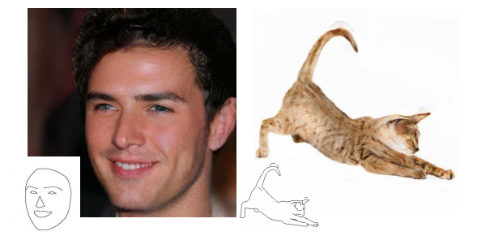  
图2：使用我们的框架**将边缘转换为高分辨率自然照片**的示例结果，使用CelebA-HQ[26]和互联网的猫图像。  
   
 此外，为了支持交互式语义操作，我们将我们的方法扩展到两个方向。
首先，我们使用实例级的对象分割信息，它可以在同一类别中分离不同的对象实例。 这允许灵活的对象操作，例如添加/删除对象和更改对象类型。第二，我们提出了一种方法，在相同的输入标签图下生成不同的结果，允许用户交互地编辑相同对象的外观。

我们比较了最先进的视觉合成系统[5,21]，并表明我们的方法在定量评价和人类感知研究方面都优于这些方法。 我们还对训练目标和实例级分割信息的重要性进行了额外研究。除了语义操作外，我们还在**edge2photo应用**程序上测试了我们的方法(图 2)，这表明了我们的方法的普遍性。 我们的代码和数据可在我们的网站上查阅。 请在arXiv查看我们论文的完整版本。

# 2. 相关工作
## GAN
生成对抗性网络生成对抗性网络(GAN)[16]旨在通过强迫生成的样本与自然图像无法区分来模拟自然图像分布。 GANs提供了各种各样的应用，如图像生成[1,41,60]、表示学习[44]、图像操作[62]、对象检测[32]和视频应用[37,50,52]。 [9,19,26,55]合成较大的图像(例如，[9,19,26,55]提出了各种粗到细的方案）。 **（注：这几个论文里面有提到特征金字塔的，这是目标检测里面的东西，用到了这上面，领域知识迁移了，这也就是一种创新）** 无条件设置中的256×256。 在他们的成功的启发下，我们提出了一种新的粗到细生成器和多尺度判别器结构，适合于条件图像生成的高分辨率。
## 图像到图像的迁移 
许多研究人员利用对抗性学习进行图像到图像的迁移[21]，其目标是将输入图像从一个域迁移到另一个域，给定输入输出图像对作为训练数据。与经常导致图像[21,22]模糊的L1丢失相比，对抗性丢失[16]已成为许多图像到图像任务[10,24,25,31,40,45,53,58,64]的流行选择。判别器可以学习可训练的损失函数，并自动适应目标域中生成的图像和真实图像之间的差异。例如，最近的pix2pix框架[21]使用图像条件GANs[38]用于不同的应用，例如将谷歌地图转换为卫星视图和从用户草图中生成猫。在没有训练对[2,33,34,46,49,51,54,63]的情况下，还提出了各种方法来学习图像到图像的迁移。  
   最近，陈和Koltun[5]认为，由于训练的不稳定性和优化问题，有条件的GAN可能很难生成高分辨率的图像。 为了避免这一困难，他们使用了**基于感知损失的直接回归目标[11,13,22]并产生了第一个可以合成2048×1024幅图像的模型**。生成的结果是高分辨率的，但往往缺乏精细的细节和真实的纹理。 我们的方法是以他们的成功为动力的。 我们表明，使用我们的新目标函数以及新的多尺度生成器和判别器，我们不仅在很大程度上稳定了高分辨率图像上条件GAN的训练，而且与Chen和Koltun[5]相比，还取得了显著的更好效果。 并排比较清楚地显示了我们的优势(图。 1,7,8,9)。
## 深度视觉操作 
最近，深度神经网络在各种图像处理任务中取得了很有前途的结果，如风格转移[13]、修复[40]、着色[56]和恢复[14]。 然而，这些工作中的大多数都缺乏用户调整当前结果或探索输出空间的接口。为了解决这个问题，朱等人。 [62]开发了一种基于GANs学习的先验信息的对象外观编辑优化方法。 最近的作品还[21,45,57]提供用户界面，从低层次的线索，如颜色和素描，创造新的图像。 所有先前的工作都都是低分辨率图像的结果。我们的系统与过去的工作有着相同的精神，但我们专注于对象级别的语义编辑，允许用户与整个场景交互，并操纵图像中的单个对象。因此，用户可以以最小的努力快速创建一个新颖的场景。 我们的界面是受先前数据驱动的图形系统[6,23,28]的启发。 但我们的系统允许更灵活的操作，并产生高分辨率的实时结果。

## 3. 实例级图像合成
我们提出了一个条件对抗性框架，用于从语义标签图生成高分辨率照片真实图像。 我们首先回顾我们的基线模型pix2pix(SEC。 3.1)。 然后，我们描述了如何通过改进的目标函数和网络设计来提高结果的真实感和分辨率(SEC。 3.2)。接下来，我们使用额外的实例级对象语义信息来进一步提高图像质量(SEC。 3.3)。**最后，我们介绍了一种实例级特征嵌入方案，以更好地处理图像合成的多模态性质，从而实现交互式对象编辑(SEC。 3.4)。**
## 3.1. pix2pix基线
pix2pix方法[21]是一个用于图像到图像迁移的条件GAN框架。 它由生成器G和判别器D组成。对于我们的任务，生成器G的目标是将语义标签图转换为逼真的图像，而判别器D的目的是区分真实图像和迁移图像。该框架在有监督的环境中运作。 换句话说，训练数据集作为一组对应的图像{(si，xi)}，其中si是语义标签图，xi是相应的自然照片。条件GANs的目的是通过以下极大极小博弈对给定输入语义标签图的真实图像的条件分布进行建模：min_G max_D LGAN(G，D)，其中目标函数LGAN(G，D)为   
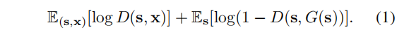   
像素2pix方法采用U-Net[42]作为生成器，采用基于补丁的全卷积网络[35]作为判别器。判别器的输入是语义标签图和相应图像的通道级别的联结。生成的图像的分辨率可达256×256。 我们直接应用pix2pix框架来生成高分辨率图像，但发现训练不稳定，生成图像的质量不理想。 因此，我们将在下一小节中描述如何改进pix2pix框架。

## 3.2. 提高真实感和分辨率
我们通过使用粗到细的生成器、多尺度判别器体系结构和鲁棒对抗性学习目标函数来改进pix2pix框架。
粗-细生成器
我们将发电机分解成两个子网：G1和G2。 我们称G1为全局生成器网络，G2为本地增强器网络。 然后，生成器由元组G={G1，G2}给出，如图3所示。全局生成器网络以1024×512的分辨率工作，本地增强器网络输出分辨率为前一个图像的4倍（沿每个图像维度2×）。 为了以更高的分辨率合成图像，可以使用额外的本地增强器网络。 例如，发电机G={G1，G2}的输出图像分辨率为2048×1024，G={G1，G2，G3}的输出图像分辨率为4096×2048。   
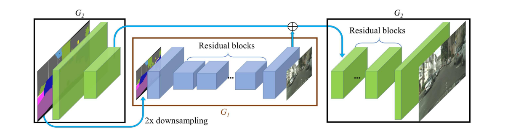   
图3：生成器的网络体系结构。 我们首先在低分辨率图像上训练残差网络G1。 然后，将另一个剩余网络G2附加到G1中，并对这两个网络进行高分辨率图像的联合训练。 具体来说，G2中剩余块的输入是来自G2的特征图的元素和来自G1的最后一个特征图。   

我们的全球发电机是建立在约翰逊等人提出的架构之上的。 [22]，这已经被证明是成功的神经风格转移在图像上达512×512。 它由3个组成部分组成：卷积前端G(1F)、一组剩余块G(1R)[18]和转置卷积后端G(1B)。一个分辨率为1024×512的语义标签图依次通过3个组件输出分辨率为1024×512的图像。局部增强器网络还包括3个组件：卷积前端G(2F)、一组剩余块G(2R)和转置卷积后端G(2B)。输入标签图到G2的分辨率为2048×1024。 与全局生成器网络不同，剩余块G(2R)的输入是两个特征图的元素和：G(2F)的输出特征图和全局生成器网络G1(B)后端的最后一个特征图)。 这有助于将全球信息从G1集成到G2。   

在训练中，**按照它们的分辨率顺序,我们首先训练全局生成器，然后训练本地增强器。然后，我们对所有网络进行微调。**  我们使用这种生成器设计来有效地聚合图像合成任务的全局和局部信息。 **我们注意到，这样的多分辨率流水线是计算机视觉中一个很好的实践[4]两个尺度通常是足够的[3]。** 类似的想法，但不同的体系结构可以在最近的无条件GANS[9,19]和条件图像生成[5,55]中找到。

## 多尺度判别器
**高分辨率**图像合成对GAN判别器的设计提出了巨大的挑战。 为了区分高分辨率的真实图像和合成图像，**判别器需要有一个大的感受域**。 这将需要一个更深的网络或更大的卷积核。 由于这两种选择都导致网络容量的增加，过度拟合将变得更加令人关切。 此外，这两种选择都需要更大的内存占用来进行培训，这已经是高分辨率图像生成的稀缺资源。  
   
为了解决这个问题，我们**使用多尺度判别器。 我们使用3个判别器**，它们具有相同的网络结构，但在不同的图像尺度上工作。 我们将把判别器称为D1，D2和D3。具体来说，我们将真实的和合成的高分辨率图像降采样2x和4x，以创建一个3尺度的图像金字塔。 然后训练判别器D1、D2和D3，分别在3个不同的尺度上区分真实图像和合成图像。虽然判别器具有相同的体系结构，但在最粗的尺度上工作的判别器具有最大的接受场。 它对图像具有更全局的视图，可以引导生成器生成全局一致的图像。另一方面，在最精细的尺度上工作的判别器专门指导发电机产生更精细的细节。**这也使得对粗到细生成器的训练变得更容易，因为将低分辨率模型扩展到更高分辨率只需要在最精细的级别上添加一个额外的判别器，而不是从头开始重新训练。**  在没有多尺度判别器的情况下，我们观察到许多重复的模式经常出现在生成的图像中。有了判别器，学习问题就变成了多任务学习问题   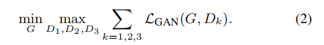 
Iizuka等人提出在无条件GANs[12]中，在同一图像尺度上使用多个GAN判别器。 。 [20]在条件GANs中添加一个全局图像分类器，以合成全局相干内容进行修复。 在这里，我们将设计扩展到不同图像尺度下的多个判别器，用于高分辨率图像的建模。

## 改进的对抗性损失
我们改善了等式中（1）的GaN损失，基于判别器的特征匹配损失。**这种损失稳定了训练，因为生成器必须在多个尺度上产生自然统计。 具体来说，我们从判别器的多层中提取特征，并学会从真实图像和合成图像中匹配这些中间表示。** 为了便于表示，我们将判别器DK的第i层特征提取器表示为D(i)k(从输入到DK的第一层)。特征匹配损失LFM(G，DK)是：   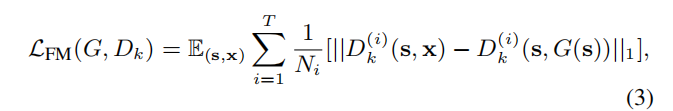    其中T是层的总数，Ni表示每个层中的元素数。（**注：真实图片和输入图片在D中间的特征求差再求l1损失**）我们的GAN判别器特征匹配损失与感知损失[11,13,22]有关，这已被证明是有用的图像超分辨率[31]和风格转移[22]。 在我们的实验中，我们讨论了判别器特征匹配损失和感知损失如何共同用于进一步提高性能。 我们注意到，类似的损失用于训练VAE-GANs[29]。  
我们的全部目标结合了GAN损失和特征匹配损失作为：   
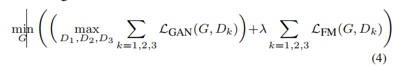   
λ控制这两个术语的重要性。 注意，对于特征匹配损失LFM，Dk只作为特征提取器，而不最大化损失LFM。

3.3. 使用实例图
现有的图像合成方法只使用语义标签图[5,21,25]，每个像素值表示像素所属的对象类的图像。此图不区分同一类的对象。 另一方面，实例级语义标签图包含每个对象的唯一对象ID。 要合并实例图，一个简单的方法是直接将其传递到网络中，或者将其编码成一个热向量。 然而，这两种方法在实践中都很难实现，因为不同的图像可能包含不同数量的同一类别的对象。 一个简单的解决办法是预先分配固定数量的信道(例如。 对于每个类，但是当数字设置得太小时它会失败，当数字太大时它会浪费内存。   
   **相反，我们认为实例图提供的、语义标签图中不可用的最重要信息是对象边界。**  例如，当许多同类对象彼此相邻时，单看语义标签图就无法区分它们。 这对于街道场景来说尤其如此，因为许多停放的汽车或步行的行人往往彼此挨着。 然而，使用实例图，分离这些对象将成为一项更容易的任务。
   因此，为了提取这些信息，我们首先计算实例边界图(图4a)。 在我们的实现中，如果它的对象ID与它的4-邻接像素中任何一个不同，则实例边界图中的像素为1，否则为0。然后将实例边界图与语义标签图的一热向量表示连接起来，并输入生成器网络。 同样，判别器的输入是实例边界图、语义标签图和信道级联，以及真实/合成图像。 图4显示了一个通过使用对象边界改进的示例。 我们的用户研究（第4节）也显示了具有边界图的模型呈现更多的照片真实的对象边界。   
 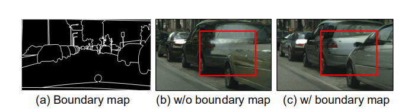  
 图4：使用实例图：(A)我们从实例图中提取边界图。 (b)(c)有了这些信息，分离不同的对象就容易得多。
 
## 3.4. 学习实例级的特征嵌入
语义标签图的图像合成是一个一到多的图问题。 理想的图像合成算法应该能够使用相同的语义标签图生成不同的真实图像。 最近，几项工作学会了在相同的输入[5,15]下产生固定数量的离散输出，或者合成不同模式，由编码整个图像[64]的潜在代码控制。虽然这些方法解决了多模态图像合成问题，但它们不适合我们的图像处理任务，主要有两个原因。 首先，用户没有直观的控制模型将产生哪些类型的图像[5,15]。 其次，这些方法关注全局颜色和纹理变化，不允许对生成的内容[64]进行对象级控制。    
**为了生成不同的图像并允许实例级控制，我们为图像中的每个实例添加额外的低维通道特征作为生成器的输入。** 我们表明，通过操纵这些特征，我们可以对合成过程有灵活的控制。 请注意，由于添加的特征是连续的量，我们的模型原则上能够生成无限多的图像。   
    我们训练编码器E来学习对应于真实图像的特征图。 为了使每个实例中的特征一致，我们在编码器的输出中添加了一个实例平均池层。 然后将平均特征广播到同一实例的所有像素位置。 图5显示了编码特征的示例。 请参阅我们的arXiv进行更详细的讨论。   
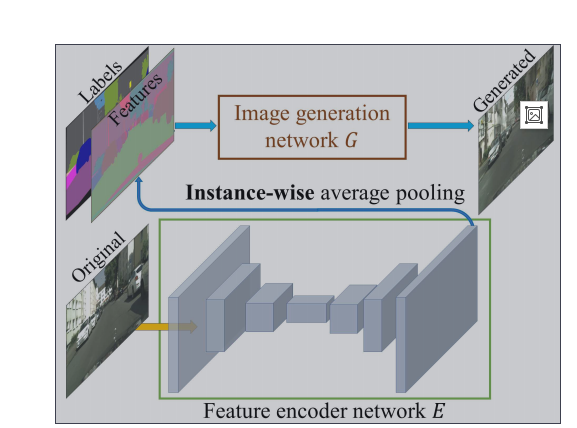  
图5：我们应用实例级别的池化来获得每个对象中的统一特性。 然后将这些特征与标签连接起来，并对E和G进行端到端的训练，以重建原始图像。 这使得特征捕获高级对象信息，比如汽车的颜色，在标签图中丢失了它。
**（注：这个地方待理解, 生成器为什么有真实图像，按理说这个是结果标签y呀，y是最后使用的？y还可以这样用，这个只是训练的时候用，用来训练一个可以捕获所需特征的cnn网络，**也就是说用y训练一个特定的特征捕获器**

在获得该特征图E(X)后，我们将等式4中的G(S)替换为Eq中的G(S，E(X）），通过将标签图s和E(x)连接在一起，并与端到端和生成器一起联合训练编码器，这使得编码器能够为生成器捕获最有代表性的特性，例如汽车的颜色或道路的纹理，而不显式地告诉编码器什么是“纹理"。
  为了在**推理时**执行交互式编辑，在**编码器**被训练后，我们首先在训练图像中的所有实例上运行它，并记录所获得的特征。然后，我们对每个**语义类别的这些特征执行K均值聚类**。 因此，每个聚类对特定样式的特征进行编码，例如道路的沥青或鹅卵石纹理。在推理时，我们随机选择一个聚类中心，并将其作为编码特征。我们对特征空间上的Kullback-Leibler损失[27]进行了实验，以便更好的在测试时间采样，就想最近的工作[64]中使用一样，但发现用户很难直接调整每个对象的潜在向量。替代的，对于每个对象，我们只提供K模式供用户选择。

# 4. 结果
我们首先提供了与领先方法的定量比较 4.1节。然后，我们在报告了一项主观的人类知觉研究4.2节. 最后，我们在SEC中展示了几个交互式对象编辑结果的例子 4.3节.

## 实现细节
我们使用LSGANs[36]进行稳定的训练。在所有实验中，我们将λ=10(Eq 4）K均值K=10 。我们使用三维向量为每个对象实例编码特征。我们实验在我们的目标(Eq4 )中增加了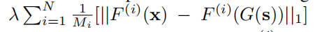的知觉损失。其中λ=10和F^(i)表示VGG网络中的具有M^i元素的第i层。我们观察到这种损失稍微改善了结果。 我们将这两个变体命名为ours和 ours (w/o VGG loss)。 请在我们的arXiv中找到更多的培训和架构细节.请在我们的arXiv中找到更多的训练和架构细节。
## 数据集
我们对城市景观数据集[7]和NYU室内RGBD数据集[39]进行了广泛的比较和消融研究。 我们报告了ADE20K数据集[61]和Helen Face数据集[30,48]的额外定性结果。
## 基线
我们将我们的方法与两种最先进的算法进行比较：pix2pix[21]和CRN[5]。 我们在高分辨率图像上训练pix2pix模型，默认设置为只提供256×256幅图像。 我们通过CRn作者公开可用的模型制作高分辨率图像。

## 4.1. 定量比较
我们采用了与以前的图像到图像迁移作品[21,63]相同的评估协议。 为了量化我们的结果的质量，我们对合成的图像进行语义分割，并比较预测的片段与输入的匹配程度。直觉是，如果我们能产生与输入标签图相对应的真实图像，那么一个现成的语义分割模型(例如。 我们使用的PSPNet[59])应该能够预测地面真相标签。 得到的分割精度见表1。可以看出，对于像素级精度和平均交叉重合(IoU)，我们的方法在很大程度上优于其他方法。 此外，我们的结果与原始图像的结果非常接近，这在理论上是我们可以达到的真实性的“上限。  
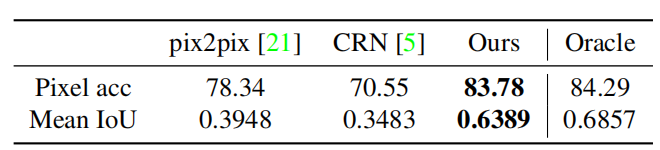   
表1：在CityScape数据集上，用不同的方法对结果进行语义分割[7]得分。 我们的结果在很大程度上优于其他方法，并且非常接近原始图像（即甲骨文)的准确性）。   
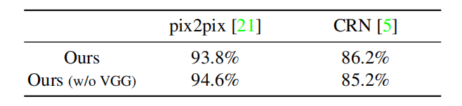   
表2：城市景观数据集[7]的配对比较结果。 每个单元格列出了我们的结果优于其他方法的百分比。 机会是50%。
    
## 4.2. 人类知觉研究
我们通过人类主观研究进一步评估我们的算法。 我们在Cityscapes数据集[7]上执行部署在AmazonMechanicalTurk(MTurk)平台上的成对A/B测试。 我们遵循陈和Koltun[5]中描述的相同的实验过程。 更具体地说，进行了两种不同的实验：无限时间和有限时间，如下所述。
无限的时间.   
对于这项任务，工作人员一次得到两个图像，每个图像都是通过对同一标签图的不同方法合成的。 然后给他们无限的时间来选择哪个图像看起来更自然。 左-右顺序和图像顺序是随机的，以确保无偏比较。 所有500个城市景观测试图像进行10次比较，每种方法产生5000个人类判断。 在本实验中，我们使用仅在标签上训练的模型（没有实例图）来确保公平的比较。 表2显示，我们的方法的两个变体都明显优于其他方法。
有限时间
接下来，对于有限时间实验，我们将我们的结果与CRN和原始图像（地面真相)进行比较）。 在每个比较中，三个图像中的两个被选中，它们被显示在短时间内。 我们随机选择一个持续时间在1/8秒到8秒之间，如先前的工作[5]所采用的。这评估了图像之间的差异可以多快地被感知。 不同时间间隔的比较结果如图所示。 6. 可以看出，随着给定的时间越来越长，这三种图像之间的差异变得更加明显和易于观察。 图7和图9显示了示例合成结果。  
  
图6：有限的时间比较结果。 每一行显示一个方法优于另一个方法时的百分比。
损失函数的分析
我们还利用无限时间实验研究了每个项在我们的目标函数中的重要性。具体来说，我们的最终损失包含三个组成部分：GAN丢失、基于鉴别器的特征匹配丢失和VGG感知丢失。我们将我们的最终实现与GAN丢失和（2）GAN特征匹配丢失(即没有VGG丢失)将我们的最终实现与结果进行比较)。 获得的优惠率分别为68.55%和58.90。可以看出，**添加特征匹配损失大大提高了性能，而添加感知损失进一步增强了结果。** 然而，请注意，使用感知损失并不是关键，我们仍然可以在没有它的情况下生成视觉上吸引人的结果(图 7c，9b)。

使用实例图，
我们使用实例图将结果与结果进行比较，而不使用它们。 我们在图片中突出汽车区域，并要求参与者选择哪个区域看起来更现实。 我们获得了64.34%的偏好率，这表明使用实例图提高了我们的结果的真实性。
附加数据集.此外，我们在NYU数据集上执行无限时间比较(图。 8)。 对于像素2pix和CRN，我们分别获得了86.7%和63.7。 最后，我们在ADE20K数据集上显示了结果[61](图。 和边缘2照片应用(图。 2)。
在我们的arXiv版本中的实验表明，我们的粗到细生成器和多尺度鉴别器都可以稳定GAN训练，以及合成更具视觉吸引力的结果。

## 4.3. 交互式对象编辑
我们的功能编码器允许我们对生成的图像执行交互式实例编辑。 例如，我们可以改变图像中的对象标签，以快速创建新的场景，例如用建筑物代替树木(图。 1b)。 我们也可以改变个别汽车的颜色，或道路的纹理(图。 1c)。
此外，我们还在Helen Face数据集上实现了我们的交互式对象编辑功能，其中不同面部部件的标签是可用的[48](图1。 11)。 这使得编辑人类肖像变得容易，例如。 改变面部颜色以模仿不同的化妆效果或在面部添加胡须。

# 5. 讨论与结论
本文的结果表明，条件GAN能够合成高分辨率的照片真实图像，不需要任何手工制作的损失或预先训练的网络。 我们已经观察到，加入感知损失[22]可以稍微改善结果。 我们的方法允许许多应用，并将潜在地有用的领域，高分辨率的结果是需求，但预先训练的网络是不可用的（例如，医学成像[17]和生物学[8]）。 本文还表明，可以扩展图像到图像的合成流水线，以产生不同的输出，并在适当的训练输入输出对（例如，在我们的情况下，实例图)下启用交互式图像操作。 没有人告诉我们什么是“纹理”，我们的模型学会用真实的纹理来塑造不同的对象。 这些学习到的纹理也可以用来合成新数据集中的图像。

致谢
我们感谢朴泰松、伊索拉、周廷辉、张理查、瓦莱和阿列克谢·艾弗罗斯的有益评论。