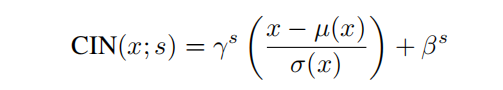

Gayts等最近神经算法渲染内容图像的风格到另一张图像的风格。但是，他们的框架需要一个缓慢的迭代优化过程，这限制了它的实际使用。快速逼真的的前项传播神经网络被提出来加速神经风格转换。不幸的是，速度提升的代价是，网络通常被绑定到一组固定的风格上，并且不能适应任意的新风格。在本文中，我们提出了一种简单而有效的方法，首次实现了任意风格的实时转换。我们方法的核心是提出了一种新颖的适应性实例规范化层，这个层对齐内容特征图和风格特征图的均值和方差。 **此外，我们的方法允许灵活的用户控制，如内容风格的权衡、风格插值、颜色和空间控制，所有这些都使用一个单一的前馈神经网络。**

Gatys等的工作显示，DNN不止编码内容，还编码风格。并且，内容和风格一定程度上是可分离的，所以，改变图像风格的同时宝轮内容是可能的。
我们的方法受到实例规范会IN的启发，实例规范化在前向传播风格迁移领域能带来惊人的效果。为了解释实例规范化的成功，我们提出了一个关于实例规范化的新的解释：IN执行了风格规范化通过规范化特征统计量。（就是说均值和方差代表风格，规范化特征图的均值和方差，就是均值和方差规范化了。给定内容输入和风格输入，AdaIN可以*简单*地调整内容输入的均值和方差，以匹配风格输入的均值和方差。Gatys等人[17]提出了风格迁移中控制色彩保留、空间位置和迁移规模的方法。（注：先做IN就是丢掉原来的风格）

最近，陈和施密特[6]介绍了一种前馈方法，可以通过风格交换层 style swap layer 传输任意风格。给定内容和风格图像的功能激活，风格交换层以补丁补丁方式用最匹配的风格功能替换内容功能。它的速度慢1-2个数量级。

**风格传输中的另一个中心问题是要使用哪种风格损失函数**Gatys等人的原始框架。[16]通过匹配由格兰氏矩阵捕获的特征激活之间的二阶统计信息来匹配样式。本文还提出了其他有效的损失函数，如MRF损失[30]、对抗性损失[31]、直方图损失[54]、珊瑚损失[41]、MMD损失[33]，以及通道均值和方差[33]之间的距离。**请注意，上述所有的损失函数都旨在匹配样式图像和合成图像之间的一些特征统计信息。**

条件实例规范化：  
  
令人惊讶的是，网络可以通过使用相同的卷积参数和不同的仿射参数来生成完全不同风格的图像。

注意，生成器的特征统计量
虽然DNN在[16,33]中作为图像描述符，但我们认为，生成器网络的特征统计量也可以控制所生成的图像的样式。

直观地说，让我们考虑一个检测某种风格的笔触的特征通道。具有这种笔画的样式图像将为此功能产生较高的平均激活值。由AdaIN产生的输出将对该特征具有相同的高平均激活度，同时保持内容图像的空间结构。该特征通道的方差可以编码更微妙的风格信息，这也被传输到AdaIN输出和最终输出图像。

解码器的设计：
随机初始化
解码器主要镜像编码器，所有的池化层都被最近的上采样所取代，以减少生成图片上的棋盘状不真实局部。
使用镜像pad 减少边缘伪影
不使用规范化层
