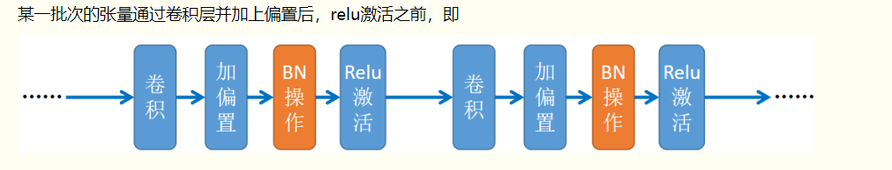
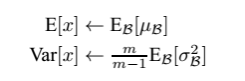
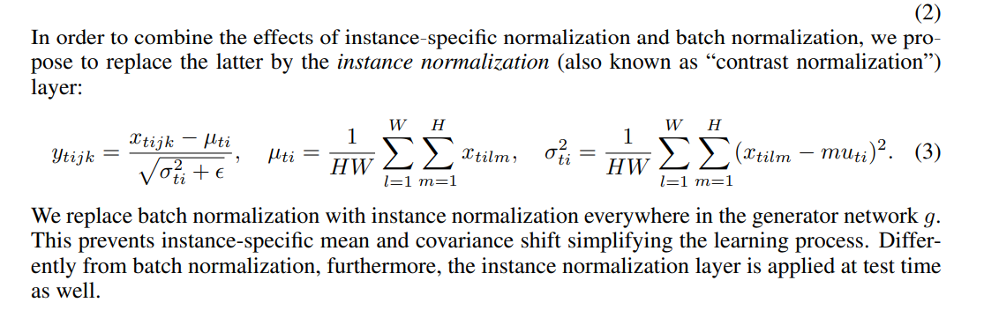

一、基本概念
  
主要作用是
1、防止梯度消失和梯度爆炸。
目前常用的归一化有：  
批归一化，实例归一化，普归一化   
具体的某个领域的应用，还可以有专门对应的归一化，比如语义图转图像的空间自适应归一化 
还有作用：
2、增加了分类效果，一种解释是这是类似于Dropout的一种防止过拟合的正则化表达方式，所以不用Dropout或正则化也能达到相当的效果；
3、简化了调参过程，对于初始化参数权重不太敏感，
4、允许使用较大的学习率
5、在生成模型中，规范化还有特殊的作用

# BN 批归一化介绍：
 BN在2015年由google提出，它的优势：
 加快模型的收敛速度，  
 使得训练深层网络模型更加容易和稳定。   
 
 所以目前BN已经成为几乎所有卷积神经网络的标配技巧了  
 
 在BN出现之前，我们的归一化操作一般都在数据输入层，对输入的数据进行求均值以及求方差做归一化，但是BN的出现打破了这一个规定，我们可以在网络中任意一层进行归一化处理。
## Bn原理
原始论文提到去除Internal Covariate Shift（ICS），后续论文分析不是主要原因
从激活函数角度解释就是将参数调整到范围内，然后输入激活函数的值在梯度不大不小的区域，不会在其饱和或者很大，从而防止梯度消失或者爆炸。
关于正则化：
因为是在Mini-batch上计算mean、variance，而不是整个数据集上。均值和方差有一些小噪音，在进行缩放过程，γ、β也会引入噪声，这样和dropout类似，它往每个隐藏层的激活值上增加了噪音，所以起到了一定的正则化作用。
当mini-batch变大时，由于均值方差更加接近真实值，所以噪声会减小，就会减少正则化的效果。
## BN的步骤
主要分为4步：
- 求每一个训练批次数据的均值，CNN里面就是同一批次的所有样本的对应通道合起来来计算均值和方差
- 求每一个训练批次数据的方差
- 使用求得的均值和方差对该批次的训练数据做归一化，获得0-1分布。其中εε是为了避免除数为0时所使用的微小正数。
- 尺度变换和偏移：将xi乘以γ调整数值大小，再加上β增加偏移后得到yi，这里的γ是尺度因子，β是平移因子。这一步是BN的精髓，由于归一化后的xi基本会被限制在正态分布下，使得网络的表达能力下降。为解决该问题，我们引入两个新的参数：γ,β。 **γ和β是在训练时网络自己学习得到的。**
### 详细说明
前三步就是基本的归一化操作，我们自然而然想一下也能想到的，现在有一堆数据，比如5个56789的数，把数据调整到大部分数据都在-1 ~ 1范围内，但是不改变数据的相对关系，你会怎么办？平移0两侧，然后缩放它们就行了，具体的说
- 首先减掉均值，就是说数据整体做一个位置，数据的大小相对关系没有变，就是变到了0的两侧，包括0
- 然后呢，现在数据不是大部分在-1 ~ 1的范围，比如上面例子，是-2，-1， 0， 1， 2 这时再将数据整体缩小（也可能是放大）就行，整体缩小也不会改变数据的大小关系，缩小的值取多少呢？这个值差不多应该是数据波动范围的均值，也就是专业说法的离散程度，我们取均方差，应该就是比较科学的了

然后进行第4步，为什么进行第四步呢，除了上面说的表达能力下降的原因，从激活函数角度解释原因之一是，目前很多的激活函数在-1~1区间不能达到好的效果，比如relu负数归零，Sigmoid、Tanh函数在零附近也变成线性，没有非线性效果了。
所以需要对归一化之后的值进行一定的调整，这个调整也是类似的平移缩放操作，也就是乘上一个缩放系数，再加上一个偏移系数

 ## 关于BN的使用位置
 在CNN中一般应作用与激活函数之前
   
 一般的看全连接神经网络
 因此前向传导的计算公式就应该是：
z = f(BN(wa + b))   
a是上一层的输输出
其实因为偏置参数b经过BN层后其实是没有用的，最后也会被均值归一化，当然BN层后面还有个β参数作为偏置项，所以b这个参数就可以不用了。因此最后把BN层+激活函数层就变成了：
z = f(BN(wa))

## 预测时均值和方差怎么求？
预测时一般只有一个样本，我们的均值和方差怎么求呢？利用训练集数据来求。比如我们在模型训练时我们就记录下每个batch下的均值和方差，待训练完毕后，我们求整个训练样本的均值和方差期望值，作为我们进行预测时进行BN的的均值和方差（样本方差，除以m-1)   
   

## BN原理
最早以及现在很多文章都说通过降低所谓Internal Covariate Shift，但是这种想法并没有过多实验支持。

## 规范化层在GAN中的应用
在GAN中规范化成不只是防止梯度消失和梯度爆炸，它还有另外一个重要作用，影响甚至控制生成结果。比如spade里面，语义图空间信息，StyleGAN里面，控制生成图像的属性

## 多元线性回归
b_1

# 实例规范化：
实例规范化很简单，就是每个样本的每个通道单独计算均值和方差  
  
t表示批，i表示通道
这是原论文中的公式，注意没有进行仿射变换，就是批规范化后面的乘以γ加上β这个操作，但是在pytorch中可以加上放射变换

注意网上很多错误的说法，包括说均值方差是整个样本上求得，或者默认就加上放射变换的 
 
#条件实例规范化
就是实例规范化之后的范规范化的参数r，β，根据不同的条件设置不同的值。比如根据不同的风格学习不同的值。