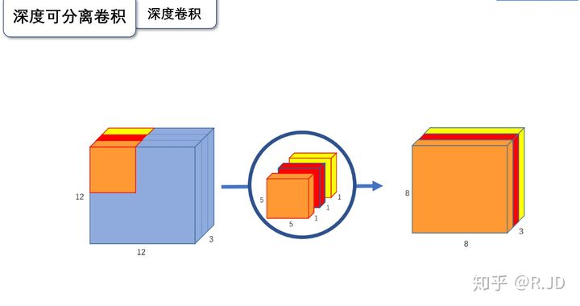
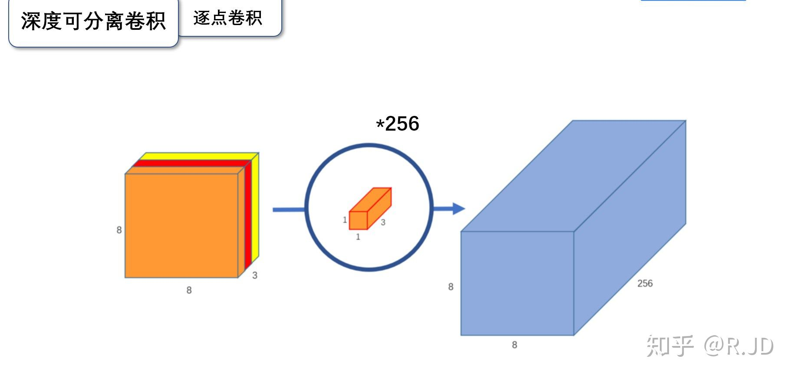
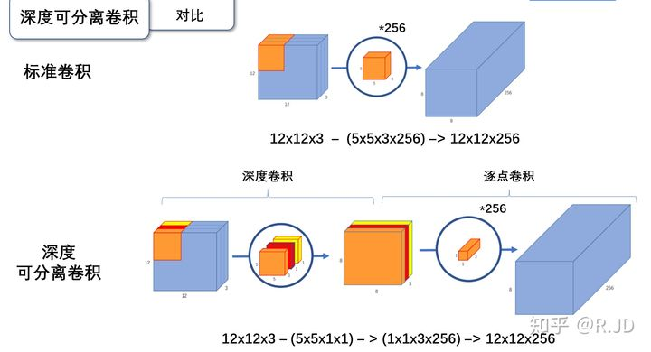
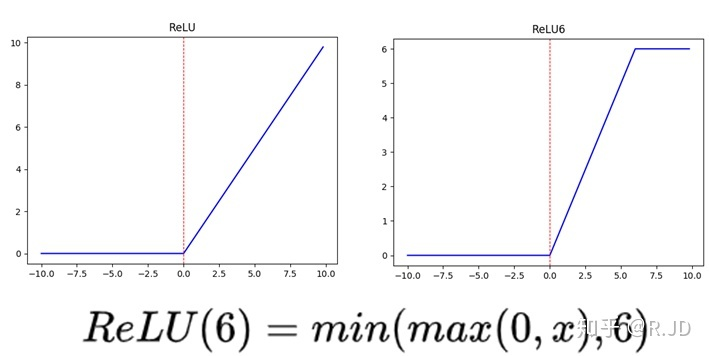
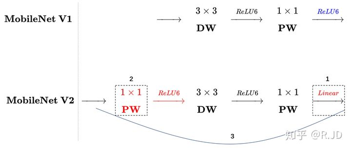
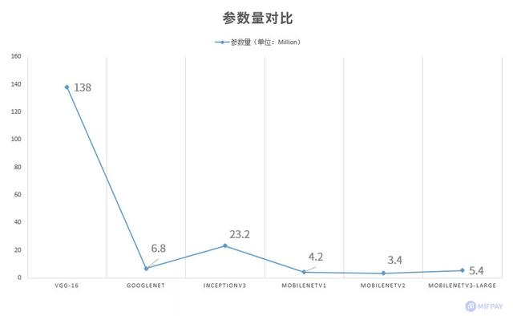
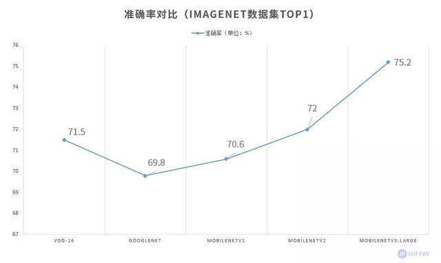

v1 主要优化是深度可分离卷积
这个技术使得参数量和计算量大概降为一般卷积网络的 1 / k^2
深度可分离分为两部分:深度卷积和逐点卷积
深度卷积就是卷积和大小不变，但是只用卷积核一个通道和输入层一个通道卷积就得到输出层一个通道，而不是所有通道。相当于特征之间不交互了，交给后面逐点卷积。

逐点卷积就是1*1的卷积，这是为了特征通信  
 

  

小的地方还有优化relu的relu6激活函数 

ReLU6作为非线性激活函数，在低精度计算下具有更强的鲁棒性

实际效果比VGG速度参数都少30倍，精度只下降1个点

# v2 
线性瓶颈 把某层relu6换成线性的，解决其导致的一个问题
在深度卷积之前再加一个逐点卷积，先升维，再深度卷积，再逐点卷积
借鉴resnet 引入短链接

结果:
大号版参数计算量少量增加 精度提高 4个点 
小号版参数计算量减少，精度提高2个点 

# v3：待学习
mobilenet-v3 small在imagenet分类任务上，较mobilenet-v2，精度提高了大约3.2%，时间却减少了15%，mobilenet-v3 large在imagenet分类任务上，较mobilenet-v2，精度提高了大约4.6%，时间减少了5%

  

图中v2 应该是小号版