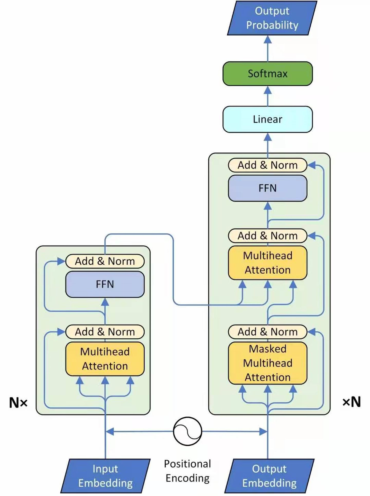

Transformer 英文翻译 变形 变压器 李宏毅 = 变形金刚 SelfAttention 是nn里面的一种层，就像卷积层 Transformer里面大量用到了SelfAttention的层

## 起源

SelfAttention 起源于自然语言翻译nlp任务 原来nlp里面最常用的是rnn 但是rnn存在不容易并行化的缺陷，如下：  
  
没太搞明白执行过程，反正就是节点需要依次计算，先b1，再b2，，， 最后b4 接下来，有用CNN替换RNN的。CNN在卷积核层面和通道层面都可以直接并行。
这样的话，rnn时间为序列长度个单位，而cnn只需要k个单位。这样对吗？还是每个节点都要走k个。

但是cnn能看到的长度只有k，否则就要堆叠cnn的层，但这样同样时空复杂度都高了，且效果不一定好。

## 于是，进一步的人们想出来self-attention

  
sa内部流程和原理比较复杂，先简单的记住，它就是一种层，输入一个序列，然后输出一个序列。但是它具有看过整个序列，并且是并行化计算的优点，就是每个输入节点同时计算。整体上和rnn类似的，使用的时候直接替代rnn就行了。

另外注意，attention是一种通用的东西，当时的self-attention论文开篇就是attention is all you
need，现在可以看到这句话不是作者随口说的或者夸大其词，而是论文里严肃认真的说的真实的情况（现在这么多的应用，甚至把cv领域的经典cnn都挤掉了就是证明）。作者当时就有了这样深刻的认知，可见他们对于这方面技术的认知有多深，牛啊！题外话，一个通用的新技术点出来之后，可以用来洗论文，就是它替代了某某，那就把以前使用某某的地方，都换成这个新技术点，就是一篇论文。所有相关的领域都可以这样洗一遍，就是洗论文了。李宏毅的话，self-attention出来之后，所有的相关论文都被洗了一遍，几乎没有没洗过的。

具体做法：  
  
如上图，大概可以分为5步，还是不是很复杂的

- 1 嵌入，就是矩阵w乘上每个x^i
- 2 同样使用矩阵乘得到q，k，v，
- 3 attention操作，如图，其中attention函数可以是其它的，注意得到的结果是一个数值
- 4 a_{1, *}做softmax，结果就是a^_{1,1}, ***, a^_{1,n} 数值，然后组成长度n的向量
- 5 向量a^_{1, *}与所有v组合形成的矩阵相乘得到b^1 完了, 注意这里有点绕了，就是a^_i维度是n，然后所有v组合起来维度是n*c， 矩阵相乘n对齐，1*n*n*c = 1 * c，结果变成了c维向量b_i

关于输入的a的维度，a^i
是一个向量，Self-attention里面这叫做一个token。这类似图片中的一个点，也叫一个特征点，我们直观看图片的时候是一个点，实际上从信息表示上用一个向量表示更好。可以看到，语言和视觉，两者在这里某种意思产生了一致性的联系。

上述过程可以用矩阵乘法表示出来，首先，得到qkv的过程   
  
代表序列的向量串起来就是矩阵了，然后就是矩阵相乘 然后，attention过程   

attention函数里面就是乘，将k转置一下，乘上q就完了，注意q，k之后是一个数了，维度-1，然后q，k序列两两对应，可以得到a的矩阵，维度又变回来了，尺寸变成n，不是原来的大小
   
然后对矩阵的列应用soft-max。 A的尺寸=序列长度平方 n*n

最后的b 为：  

总的流程

O = softMax((x * w^q ) * (X * w^k) ^T  / c) *  (X * w^v) = softMax(q * K^T / c) * v
可以看出来，这个式子并不复杂
x的结构行表示数据点 = n，列表示通道
上面的第一个x和q既可以看成矩阵，也可以看成一个向量或一行，或一个特征点，或者一个token，K，V不能看做向量

self-attention就是一堆矩阵乘法，就易于用GPU加速    
# 一点简单的理解：
信息的基本特征之一，就是点的组合形成更复杂的信息。最基本的例子我是我们的语言，字母组成单词，汉语字组成词，然后组成句子，再到文章。 计算机里面也是，0，1的组合。单点信息不算复杂，组合起来就复杂了。

AI就是是一种更高级的信息处理方式，它处理信息也会遵循这个最基本的特征，就是处理信息点的组合。

现在AI的基本的两种任务，语言，图像，一种是信息点的一维形式的组合，一种是二维形式信息点的组合。

最基本的神经网络也就是MLP之所以长成那个样子，而不是长成其它样子，就是多个神经元排成一列来处理信息而不是其他样子。MLP的机制就是综合计算上一层所有信息点的值得出下一层的一个点的值，这就是一种处理信息点组合的方式。

关于通道，还不是特别清楚，暂略。

回到SelfAttention，简述self-attention的过程，x乘上参数得到q,k,v，qi与k所有点做 attention，得到n长向量，softmax，再n长向量与n长的v相乘相加，得到bi。为了简化理解，q，k，v可以看成x乘上不同参数情况下的代表，所以可以更简单的说，xi与所有的点相乘，softmax，再与所有的点相乘相加，得到bi，完事儿！

可以看到，这里同样是综合所有信息点的信息，得到结果的过程，也就是一种处理信息组合的方式。
和MLP CNN不同的是，它们是直接所有点或者部分点乘上参数，得出下一层的点。
self attention是乘上统一的参数之后，与其它点相互结合得到下一层的点，这里组合就是ai与其它点先相乘，再相乘相加，这就是叫自注意力的原因吧。
所以可以看到self-attention实际上是一种不同于前两种的处理信息点组合方法的方法。前两种是乘以不同或部分不同参数，然后直接相加。它是乘以相同参数，然后和其它点相乘，再相乘相加这种方式。

## 多头自注意力

self-attenttion有一个变形，multi-head self-attention 多头自注意力

以两个为例子，原来的qkv都分裂为两个，它们由原来的qkv乘上矩阵得到。 下面的步骤就是每个对应的二级头之间，使用原始的attention一样方式计算出b的二级头b^{i,j},所以名字叫头，只是头那里分裂了，其它位置操作没变。
然后b的二级头直接连接起来或者再乘上一个矩阵降低维度，    
多头的意义，在于，每个头可以关注不同的点，比如局部的，全局的 这里有一组Multi-head
Self-attention的解果，其中绿色部分是一组query和key，红色部分是另外一组query和key，可以发现绿色部分其实更关注global的信息，而红色部分其实更关注local的信息。  

# 位置参数

  
前面的结构还有点问题，它无法得到位置信息。为什么，没想明白，暂略。后面看资料找到了：“Self-Attention中的排列不变性，不同顺序输入的tokens会得到一样的结果“， 可以很显然的从改变排列结果不变的角度得到。
作者通过上图的方式添加位置信息，即a^i加上一个e^i,它等价于图中下面部分的在x后面接上一个0-1编码的位置参数。上面这个图中间的w^i W^p * x^i p^i似乎放反了(或者他们定义的矩阵乘法方式不同是反过去的)

# transformer结构

  
左边编码器，右边是解码器 流程 输入->嵌入-> 加上位置参数 —> 多头attention（前面所述） ——> add（resnet类似结构了）和标准化（一般是层标准化）->  feedforwar（what？）nx表示重复n次

右边的也有一个输入，这是上一次的输出结果，然后进入的第一层是Masked multi-head attention。这是由于输出还没有得到

# 视觉transformer

Dert结构 主要方法就是把图像长宽和到一起形成一维序列，然后编码位置时考虑宽高，再和序列相加。attention机制是一样的，transformer大结构也是类似的。 值得一提的，transformer的模型大小比fasterRCNN小

# Swin-transformer

see See [swin-transformer笔记.md](swin-transformer笔记.md)