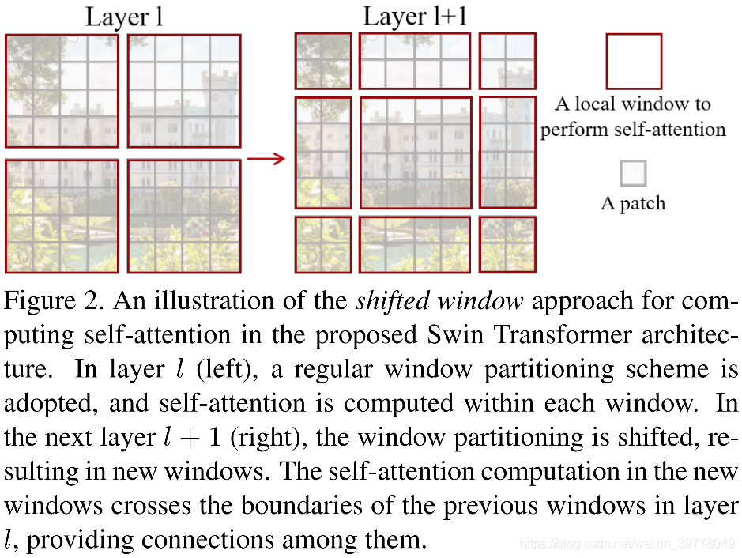

论文：
本文提出了一种新颖的vision transformer 可以作为通用的视觉任务的主干。Transformer从语言应用到视觉领域的主要挑战是两个领域的差异， 比如视觉实体尺度变化巨大以及像素数量很多。
在NLP领域，word tokens作为基本的处理元素，一般通过padding或裁减的方式保持其长度固定，并且这种操作对结果的生成不会产生太大影响。但是在CV领域，如何挖掘多尺度信息是一个重要命题，固定长度的token不太利于多尺度信息的挖掘。

一些密集预测任务例如语义分割需要完成像素级的密集预测，这个计算量对于Transformer中Self-Attention的 O(N^2)计算复杂度是难以解决的。

我们提出了层次化的Transformer来解决这个问题，它的代表技术是滑动窗口计算。

- SwinTransformer首先从小尺寸的patches开始，并且在更深的Transformer Layer中逐步合并相邻的patches，最终形成一系列层次化的特征。这种层次化的特征很容易与一些密集预测结构结合以完成相应任务。
  

- SwinTransformer仅在一个局部窗口内计算Self-Attention（窗口互相不重叠，用于分割整张图片），由于每个窗口中的patches的数目是固定的，因此，这种local的self-Attention计算复杂度对于image size来说即成为线性复杂度。
  

- 但是倘若仅在Local Window内计算Self-Attention，便无法发挥Transformer在全局依赖建模上的能力，因此，SwinTransformer采用了一种Shift-Windows的方法，来引入不同Windows之间的关系，并且由于在一个Windows内，所有的query patches都共享一个key，内存的占用也较少，Shift-Windows的方法相较于Sliding-Windows的方法具有更低的时延，同时建模能力也较为相似。 

和大部分Transformer结构类似，SwinTransformer首先会将RGB图片分割为一系列不重叠的patches 。在SwinTransformer设定中，每个patch的大小为4*4，由于每个像素有RGB三个通道值，因此，每个patch的维度为4*4*3，并最终通过一个线性Embedding层转化为Embedding Dimension C。 

在局部window内计算Self-Attention确实可以极大地降低计算复杂度，但是其也缺失了窗口之间的信息交互，降低了模型的表示能力。为了引入Cross-Window Connection，SwinTransformer采用了一种移位窗口划分的方法来实现这一目标，窗口会在连续两个SwinTransformer Blocks交替移动，使得不同Windows之间有机会进行交互。 

Shifted Window方法是在连续的两个Transformer Block之间实现的。

第一个模块使用一个标准的window partition策略，从feature map的左上角出发，例如一个8*8的feature map会被平分为2*2个window，每个window的大小为w = 4 。
紧接着的第二个模块则使用了移动窗口的策略，window位置会从feature map的 w / 2位置处开始，然后内部进行注意力操作, 这样一来，不同window之间在两个连续的模块之间便有机会进行交互。 但是边缘的window不完整了，论文中给出巧妙的解决方法，首先不移动windows，而是移动特征图，实现windows滑动，然后对不完整的window填充特殊的mask，然attention计算时不对这些值起作用，解决了问题，over。
