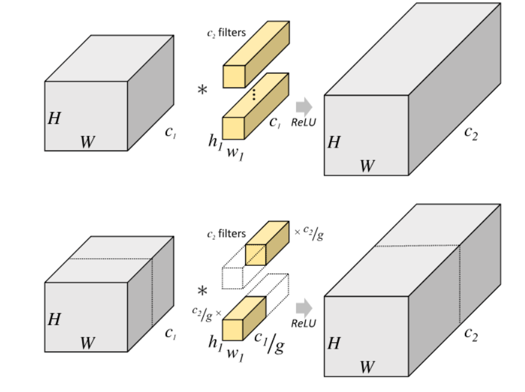
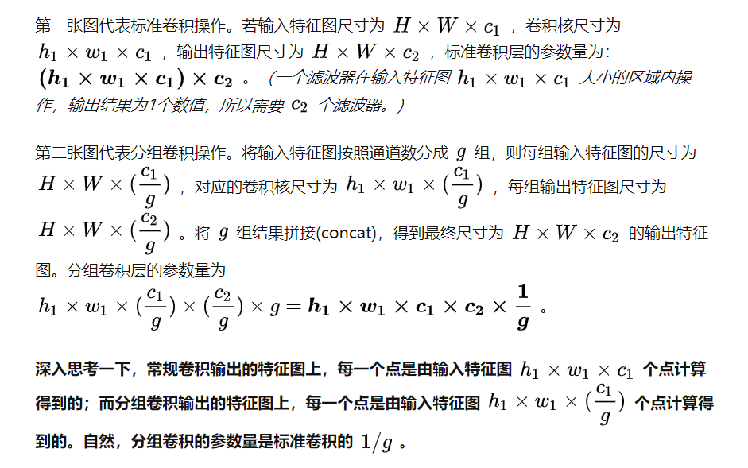

分组卷积：
分组卷积的主要作用是降低计算复杂度和参数量，分成g组，就会降低g倍

先回顾一般的卷积，如图1，卷积核通道数量=输入层c1，一个卷积核得到一个输出层的特征图,最后c2个卷积核得到c2层
分组卷积就是分成G组，输入层，卷积核，输出层都是分成G组，然后每组内部做卷积，最后concat起来就行了。

注意此时卷积核通道数变成了原来的1/g，也就是这种情况下通过c1/g深度的卷积，得到一个特征图,原来是c1深度才能得到，那么参数量和计算量减小为原来的1/g。

详细解释：   
  

详见：https://zhuanlan.zhihu.com/p/65377955

# 进一步的：
## 优点：
1、显然的，更轻量  
2、提升训练速度，因为更利于多GPU训练  
3、某些情况下，模型性能更优，原因应该类似于正则化之类的吧，猜的

## 缺点：
不同组之间的特征图不能通信，大家各走各的，会降低网络的特征提取能力，这也可以解释为什么Xception，MobileNet等网络采用密集的1x1 逐点卷积，因为要保证group convolution之后不同组的特征图之间的信息交流。

另一种解决方式是channel shuffle
为达到特征通信目的，我们不采用dense 逐点卷积，考虑其他的思路：channel shuffle。就是对group convolution之后的特征图进行“重组”，这样可以保证接下了采用的group convolution其输入来自不同的组，因此信息可以在不同组之间流转。图c进一步的展示了这一过程并随机，其实是“均匀地打乱”。