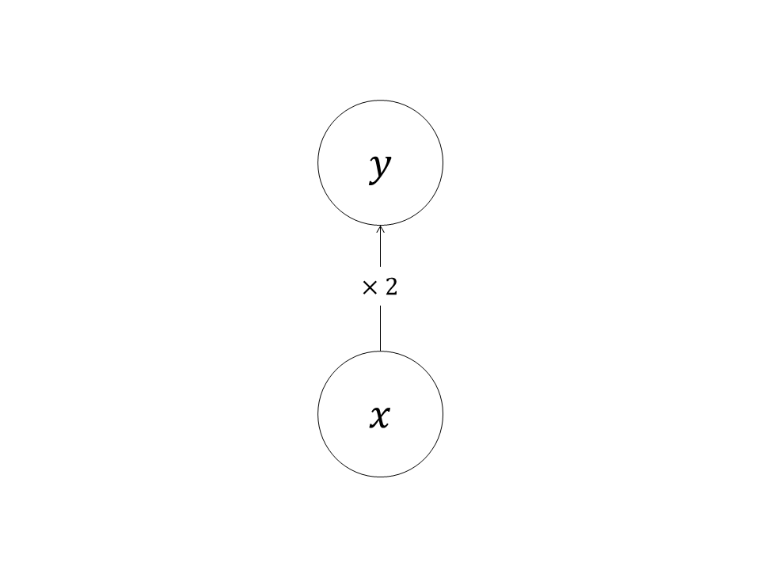
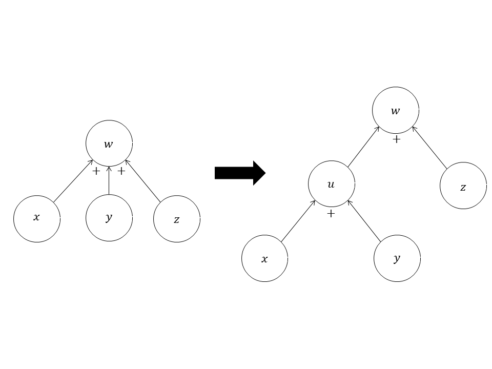
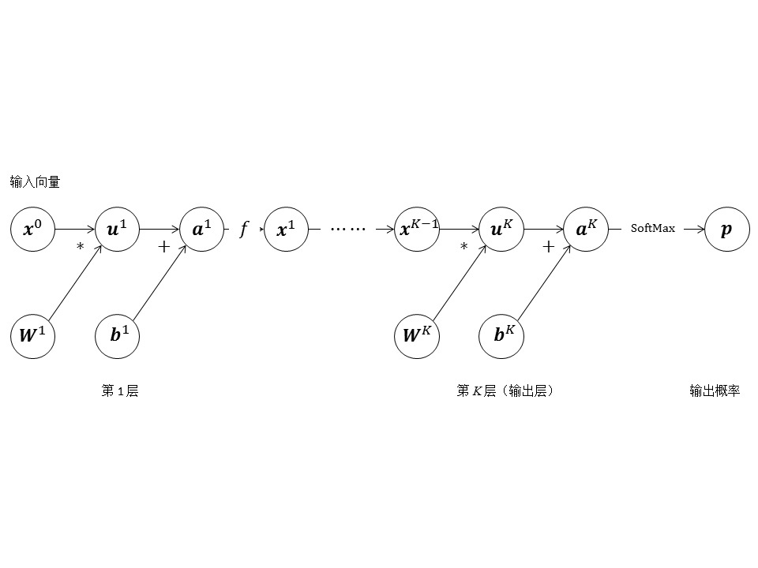
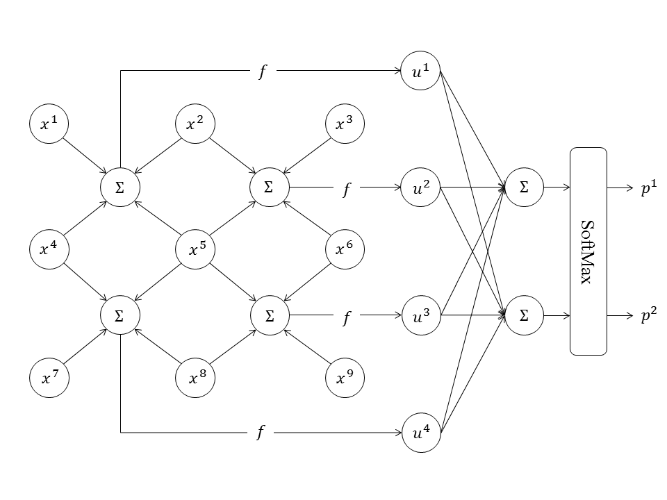

一、原理，首先理解计算图和链式求导 多元多值的复杂函数的计算过程可以抽象成一个有向无环的图，即计算图 计算图用节点表示变量，用有向边表示计算。 例如 y=2x


计算图具有如下特点：
- 计算图中的节点是多对多的，即一个节点可以有多个输入，多个输出
  
- 类似于子树，计算图中也有子计算图，进一步的，还可以子图合并和拆分子图，对应于函数合并和拆分
  从树的角度看，类似于多x叉树化为二叉树
  
  
- 要注意，计算图中的变量和常量是对等的，即可将其中一部分输入节点视为变量，将其他输入节点视为常量，也可以反过来。不要用初等数学的想法，认为只有x是变量。
  
- 将节点值视为向量更为简洁，节点变量实际上可以是高维tensor等，然后函数就是向量到向量的映射，这样会使计算过程简洁很多，求导结果就只用考虑二维的雅克比矩阵。


多层全连接NN的计算图（这个图比较重要，值得记住）


更复杂的

这是一个卷积+全连接形成的计算图，计算过程细化了，这里面就有了多输入+多输出

从这里可以注意到计算图不是树，这个图一个子节点可以有多个父节点

链式求导不说了

# 自动求导的实现

本节讨论计算图自动求导的实现，我们以面向对象式的伪代码来描述该实现。首先是计算图中最基础重要的节点类，示例
```python
import numpy as np
from graph import Graph, default_graph
from util import *

class Node:
    """
    计算图节点类基类
    """

    def __init__(self, *parents):
        self.parents = parents  # 父节点列表，要计算本节点的值，所有父节点必须传入
        self.children = []  # 子节点列表  # 对于子节点，是后面添加的，这个节点传到了哪儿，哪儿就会把它自身添加为本节点的子节点
        self.value = None  # 本节点的值
        self.jacobi = None  # 结果节点对本节点的雅可比矩阵=“导数”
        self.graph = default_graph  # 计算图对象，默认为全局对象default_graph

        # 将本节点添加到父节点的子节点列表中
        for parent in self.parents:
            parent.children.append(self)

        # 将本节点添加到计算图中
        self.graph.add_node(self)

    def set_graph(self, graph):
        """
        设置计算图
        """
        assert isinstance(graph, Graph)
        self.graph = graph

    def get_parents(self):
        """
        获取本节点的父节点
        """
        return self.parents

    def get_children(self):
        """
        获取本节点的子节点
        """
        return self.children

    def forward(self):
        """
        前向传播计算本节点的值，若父节点的值未被计算，则递归调用父节点的forward方法
        """
        for node in self.parents:
            if node.value is None:
                node.forward()

        self.compute()

    def compute(self):
        """
        相当于pytorch的forward
        抽象方法，根据父节点的值计算本节点的值
        """
        pass

    def get_jacobi(self, parent):
        """
        相当于pytorch的backward
        抽象方法，计算本节点对某个父节点的雅可比矩阵=“导数”
        """
        pass

    def backward(self, result):
        """
        反向传播，计算结果节点对本节点的雅可比矩阵=“导数”
        """
        if self.jacobi is None:
            if self is result:
                self.jacobi = np.mat(np.eye(self.dimension()))
            else:
                self.jacobi = np.mat(np.zeros((result.dimension(), self.dimension())))

                for child in self.get_children():
                    if child.value is not None:
                        self.jacobi += child.backward(result) * child.get_jacobi(self) # 就是结果对子节点的导数*子节点对当前节点的导数

        return self.jacobi

    def clear_jacobi(self):
        """
        清空结果节点对本节点的雅可比矩阵=“导数”
        """
        self.jacobi = None

    def dimension(self):
        """
        返回本节点的值展平成向量后的维数。展平方式固定式按行排列成一列。
        """
        return self.value.shape[0] * self.value.shape[1]

    def shape(self):
        """
        返回本节点的值作为矩阵的形状：（行数，列数）
        """
        return self.value.shape

    def reset_value(self, recursive=True):
        """
        重置本节点的值，并递归重置本节点的下游节点的值r 因为本节点的值影响下游节点的值
        """

        self.value = None

        if recursive:
            for child in self.children:
                child.reset_value()
```
这个类还是比较简单的，几个基本的属性，value 和 jacobi。value 包含本节点的值，jacobi 包含设定的结果节点对本节点的导数（广义，报考雅可比等,pytorch为了简化复杂度，y只允许是标量，导数最多是向量，不然存储量就太大了）
get_children() 返回所有子节点，若无子节点则返回空集；
get_parent() 返回所有父节点，若无父节点则返回空集；
forward() 前向计算节点的值，如果有父节点的值尚未计算，则抛出异常；这里结合compute()实现
backward() 接受一个结果节点，计算结果节点对本节点的导数。要利用子节点列表计算所有节点然后相加，这里结合get_jacobi()实现

# 其它
动态图，静态图
有了上面的知识，可以知道两个概念的区别，动态图是指计算图是运行时构建的，静态图是编译时运行前构建好的 

detach操作
相当于把节点的父节点清空，本节点变成一个端节点（起始节点）
父节点的子图仍然存在


简述记忆：
结合计算图的知识，实现就两个关键点，一个是建立图， 建图通过父节点 + 子节点列表实现，一个是前向求值和反向求导，前向传播通过定义的函数实现，反向链式求导通过求导函数求导 再乘上 子节点函数实现，完了
