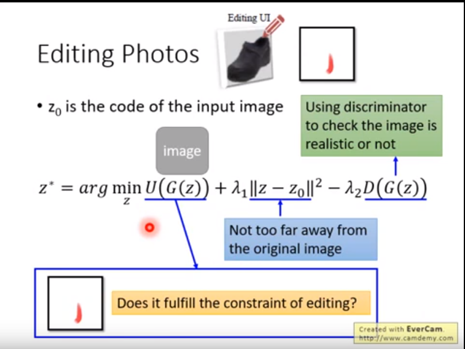

属性编辑
论文模型：
startGAN， STGAN（2019）
我们知道GAN中生成的图片的时候是隐变量通过生成器是生成了图片，也就是存在一种隐变量到生成图片的映射关系  
z->G->y  
另一方面我们知道这个隐变量的若干个维度可能代表了生成图片的某种属性   
不过问题是我们现在只知道整体映射关系，但是不知道它们的具体的映射关系，即具体是那个几个维度对应了哪个属性

那么如何解决这个问题呢
最简单的，我改变隐变量的输入，看看输出变化，不就知道谁对应谁了，这样不行，第一，算法里面没法儿看出输出属性的变化，它不是人，第二，你无法遍历隐变量的变化组合

再想想，
从数据论的角度来说，要知道隐变量和属性的关系，至少要有属性的数据集吧，所以不管怎么说，我们先建立属性相关的数据集才行，
自然地是图片和属性成对结合的数据集
  
然后，怎么做呢？判断生成的图片和数据集中谁的相似度最高，那么隐变量就有怎样的对应关系，还是有问题，上面提出的第二个问题无法解决，无法遍历隐变量的变化组合，并且做相似度对比也难。

再开动脑筋，神经网络模型相当于一个万能函数，能够产生z到y的G,y=G(z)，自然也能构造y到z的反函数G^-1，就是CycleGAN里面那一套。反函数有什么用呢，注意我们现在的样本是有属性标签的，我们将样本y'输入G^-1，得到了z=G^-1(y')，y对应到了z，也就是标签对应到了z。于是通过这样一步我们差不多找到了整体属性和隐变量之间的关系（注意是差不多）。

继续  
还有吗？好像已经完了  
我们已经得到了属性和隐变量之间的映射，再通过G就是图像了，现在已经可以输入属性，得到输出图像了
不对的，想错了，还没有完全找到整体属性和隐变量之间的关系。
现在的G^-1是输入的图像，不是属性，不能直接得到属性到隐变量之间的映射。
然后的办法是，也比较容易想到，使用两张某个属性不同的的图片输入得到隐变量，比较隐变量的差别得出哪些隐变量不同，就能知道该属性和哪些隐变量对应啦！  
不过还不完善，两张某个属性不同的图是不容易找到的，并且具有噪声，所以要找两堆图，也即两个图的集合A-B，他们整体的只有某个属性不同，比如长头发集合A和短头发集合B，得出集合的隐变量的平均的差，这个应该就是属性（比如头发长度）对应的隐变量了。没有噪声。

这个的运算复杂度，加入一次取最多全部数据集求一个属性，那就是最多 = 属性数量`*n*`神经网络 的复杂度，

存在的问题 然后除了取平均值的差，这是不是最好的方法，还有更好的方式吗
更精细的控制，
属性标签不够精细怎么办

智能PS  
  
我们知道隐变量对应的有一个空间
我们训练好了GAN，从隐变量空间中随便找一个位置取一个隐变量，输入GAN就能输出相应的图像了
在不同的位置就能得到不同的输出图像

在隐变量X空间周围的隐变量对应的图像，和x也是类似的。
现在给定一张图，我们先反推出它对应的隐变量z，前面已经有的方法，训练一个G^-1出来。
这个还有一些更好的方法，暂时略

然后就是数学化的思想，整理一下我们的智能编辑这个任务，给定一张图X，用户做出某种编辑操作C，然后生成一张新的图Y。要求Y和满足C的某种关系，并且和X接近，然后生成的图Y要足够逼真。注意这几个字  
  
**要求X啥啥啥，或让X满足啥啥啥要求，或啥啥约束<=>数学函数f(X)满足xxx呀，也就是f(X)= > < != xxx！**  
数学建模强！  

再想一想，和GAN的基本思想对比，Y足够逼真，不就是判别器D(X)最大化吗，然后Y和C足够接近，使用图片对别函数，L1-L2范数什么的，Y和C满足某种要求，就是用户自定义的函数了U(Y, C)，比如同一区域颜色接近 = xxx
最后，函数就是这样的
  
这就是一个最优化寻找函数的问题了，神经网络+梯度下降
求解这样一个问题

关于生成网络中间的特征向量，隐向量：
一般网络直接输出的特征向量会出现特征纠缠现象，即改变特征向量某个维度会改变生成图片的多个特性，styleGAN里面对它做了解决

StyleGAN进一步
StyleGAN提出w空间，进行了语义解耦，最近的方法进一步的提出空间解耦，s空间
StyleSpace Analysis: Disentangled Controls for StyleGAN Image Generation
这样能进行更加精细的控制

通过某种方式改变模型，具有更强的编辑能力的
https://cloud.tencent.com/developer/article/1678264
傻瓜式无限P图，MIT朱俊彦团队“重写”深度生成模型

更通用的说，图像编辑实际上是某种意义上的图像理解，语音识别可以理解我们表达的语言信息，图像编辑实际上理解我们想要表达的画面信息