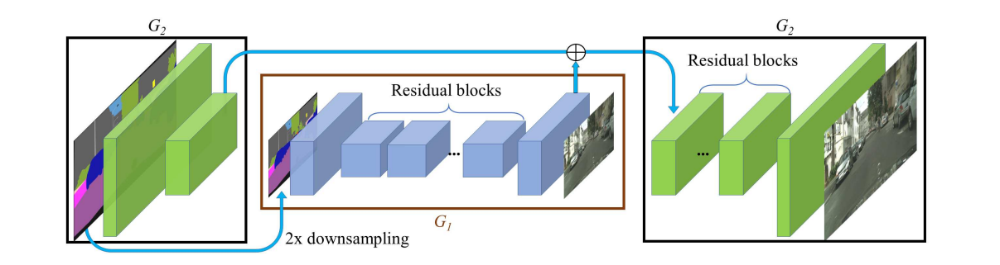

简介：根据语义分割来编辑生成的 19年的 更新 效果更好
NAVDIA公司名义出品的
## 简述：
使用了一种新的规范化方法，利用语义布局提取参数，涉及到一个SPADE结构, 为每个不同位置的激活值提供偏移和缩放参数,这个偏移和缩放参数怎么学的？直接拿来2D卷积即可，显然的2D卷积是我们可选择学习图像空间信息的最好工具了
可以将CycleGAN这类的前面那个编码器去掉了
结果大幅优于以前的先进方法

除了生成器替换spade规范化
另外的和pix2pixHD5区别，生成器去掉下采用，目标函数替换了一个项，其它一样

  
我们的模型允许我们在合成图片的时候同时控制语义和风格。语义通过标签图控制（顶部第一行可以看到），风格通过关联的图片控制，也就是下面三行最左边的那张。可以从我们的网站查看交互式合成的示例。  

# 摘要：
我们提出了空间自适应规范化，一个简单但是有效的通过给定语义输出布局合成照片真实度图像的层。以前的方法是直接将语义布局作为输入放到深度网络中，然后被卷积，规范化和给线性层堆叠起来处理。我们表明，这是次优的因为规范化层倾向于“洗掉”语义信息。为了解决这个问题，我们提出了一种通过空间自适应，学习的迁移，使用输入布局来调节规范化层的激活。在若干个具有挑战性的数据集上，我们的方法的优势超过了现有的方法，不管是视觉保真度还是与输入层的对齐。最终，我们的方法，允许用户控制合成图像的语义和风格。代码在 https://github.com/NVlabs/SPADE  

# 引言
有条件的图像合成涉及到在一定的输入数据条件下合成具有照片真实度的图像。早期的方法通过从图像数据库中拼接片段来计算输出图像。最近的方法直接使用神经网络学习映射。后面的方法，更快，不需要额外的图像数据库。  

我们对有条件的图像合成感兴趣，将一个语义片段合成一个真实的图像。这种形式具有广泛的应用，比如内容生成和图片编辑。我们把这种形式成为语义合成。在本文中，我们证明了通过叠加卷积叠加卷积层、规范化层和非线性构建的传统CNN[20,40]，充其量是次优的，因为它们的规范化层倾向于“洗掉”输入的语义掩模的信息。为了解决这一问题，我们提出了空间自适应规范化，这是一种有条件规范化层，它通过空间自适应、学习的转换，利用输入语义布局来调制激活，并能有效地将语义信息传播到整个网络中。     
 我们在几个具有挑战性的数据集上进行实验，包括COCO-Stuff[5,26]、ADE20K[48]和CityScape[8]。我们表明，借助我们的空间自适应规范化层，一个紧凑的网络可以合成明显更好的结果相比，几种最先进的方法。**此外，一项广泛的研究证明了我们所提出的规范化层对语义图像合成任务的几个变体的都是有效的。（注：重点，空间自适应规范化可以用到多种语义掩模合成任务中，值得学习，这里就是我知道了通用模型，但是这个通用模型的某个小的地方可能不适用于我这个任务，那么我就可以改进这个小点，优化点就来了，这就是创新方法之一)** 最后，我们的方法支持多模态和风格引导的图像合成，实现可用标签控制的、多样化的输出，如图1所示。  

# 相关工作
深度生成模型：
深度生成模型可以学习随机图像。最近的方法包括了GAN以及VAE variational autoencoder。我们的工作构建在GAN上但是目标是有条件的图像合成任务。GANs由一个生成器和一个鉴别器组成，其中生成器的目标是产生真实的图像，这样鉴别器就不能区分合成的图像和真实的图像。  
## 条件图像合成：  
条件图像合成根据输入数据的类型上的不同以多种形式存在。例如，类条件模型[4,29,31,33]学会合成给定类别标签的图像。 研究人员探索了基于文本[16,36,43,46]生成图像的各种模型。另一种广泛使用的形式是图像到图像的迁移[18,20,23,27,49,50]，其中输入和输出都是图像。在本工作中，我们关注于将分割掩码转换为真实图像，我们假设训练数据集包含成对分割掩码和图像。通过所提出的空间自适应规范化，与领先的方法相比，我们的紧凑网络取得了更好的效果。
   
## 无条件规范化层  
无条件规范化层已经是现代深层网络的重要组成部分，可以在各种分类器设计中找到，包括AlexNet中的局部响应规范化(L RN)和Inception-v2网络[19]中的批[24]规范化(B N）。其它流行的规范化层，比如实例规范化（IN）[38]，层规范化(LN)[2]，组规范化(GN)[41]和权重规范化(WN)[37]。我们将这些规范化层标记为无条件的，因为它们不依赖于外部数据，而不是下面讨论的有条件规范化层。  

## 有条件规范化层：  
条件规范化层包括条件批规范化(条件BN)[10]和自适应实例规范化(AdaIN)[17]。这两种方法都是在风格转换任务中首先使用的，后来在各种视觉任务[9,18,29,31,34,45]中采用。与早期的规范化技术不同，条件规范化层需要外部数据，一般操作如下。首先，将层激活规范化为零均值和单位偏差。然后，通过利用学习到的仿射变换对激活值进行调节，对规范化的激活值进行反规范化处理，而这个仿射变换的参数是从外部数据中推断出来的。对于风格转换任务[10,17]，仿射参数用于控制输出的全局样式，因此在空间坐标上是一致的。与以往的工作不同，我们提出的规范化层应用了随着空间变化的仿射变换，使其适合于空间具有变化的的语义掩码的图像合成。（注：依然是在理解了现有模型之后一个简单而自然就能想到的创新点）
  
  
# 3.语义图像合成    
设$m∈L^{H×W}$是一个语义分割掩码，其中L是表示语义标签的整数集，H和W是图像的高度和宽度。 m中的每个条目表示像素的语义标签。 我们的目标是学习一个映射函数，它可以将输入分割掩码m转换为真实图像。  
     
## 空间自适应反规范化：  
令$h^i$表示给定一批N个样本的深卷积网络的第i层的激活。 设$C^i$为该层中通道数，$H^i$和$W^i$是该层中激活图的高度和宽度。我们提出一种新的条件规范化层，成为空间自适应规范化SPatially-Adaptive (DE)normalization1 (SPADE)。类似于批规范化[19]，让激活先在通道层面规范化，然后用学习到的比例和偏差调整激活。 图2显示了SPADE设计。  
   
图2：在SPADE中，掩码首先投影到嵌入空间上，然后卷积产生调制参数γ和β。 与以往的条件规范化方法不同，γ和β不是向量，而是具有空间维度的张量。 产生的γ和β被相乘并添加到规范化的激活元素中。在点(n∈N，c∈Ci，y∈Hi，x∈Wi)处的激活值由   
      
给出。其中，h_(n,c,y,x)^i是某个点规范化之前的激活，µ^i_c和σ^i_c是c通道激活的均值和标准差.    
    
式子(1)中的$γ^i_{c、y、x}(M)$和$β^i_{c、y、x}(M)$的变量是规范化层的学习到的调制参数。与批处理规范[19]相比，它们依赖于输入分割掩码，并随位置(y，x)而变化。我们使用$γ^i_{c，y，x}$和$β^i_{c，y，x}$来表示 将输入分割掩码m转换为第i层激活图中(c，y，x)点的缩放和偏置值的 函数。(注：λ和β是函数)。我们使用一个简单γi两层卷积网络来实现$λ^i_{c、y、x}$和$β^i_{c、y、x}$的函数，其详细设计可在附录中找到。事实上，SPADE与现有的几个规范化层有关，并且是它们的推广。首先，用图像类标签代替分割掩码m，使调制参数不随空间变化（比如  
）  我们得到了条件批规范化层[10]的形式。事实上，对于任何空间不变条件数据，我们的方法都简化为条件BN。同样，我们可以通过用一幅图像替换分割掩码，并且使调制参数空间不变，设置N=1，来变成AdaIN[17]。由于调制参数对输入分割掩码具有自适应性，因此所提出的SPADE更适合于语义图像的合成。  

## 空间自适应生成器 SPADE generator    
使用SPADE，不需要将分割图馈送到生成器的第一层，因为学习的调制参数已经对标签布局进行了足够的信息编码。因此，我们放弃了生成器的编码器部分，这是最近的体系结构[20,40]中常用的。 这种简化导致了一个更轻量级的网络。此外，与现有的类条件生成器[29,31,45]类似，新生成器可以以随机向量作为输入，从而为多模态合成[18,50]提供了一种简单而自然的方法。  

图4展示了我们的生成器体系结构，它使用了几个具有上采样层的ResNet块[14]。 所有规范化层的调制参数使用SPADE学习。 由于每个残差块以不同的尺度工作，所以SPADE降低语义掩码以匹配空间分辨率。  
      
   
 图4：在SPADE生成器中，每个规范化层使用分割掩码来调制层激活。 （左）SPADE残差块结构。 （右）包含一系列带有上采样层的SPADE剩余块的生成器。 我们的体系结构将领先的图像到图像迁移网络(Pix2pixHD[40])的下采样层删除，以较小的参数实现了更好的性能)。（注： pix2pixhd 结构两层似乎就是下采样) 
 
 我们使用和和pix2pixHD相同的多尺度鉴别器和损失函数来训练生成器，除了用铰链损失项hinge loss term[25,30,45]代替最小平方损失项[28]。我们测试了最近无条件GANS中使用的几个基于ResNet的判别器[1,29,31]，它们产生结果类似，但是GPU内存需求为代价更高。将SPADE添加到鉴别器中也会产生类似的性能。对于损失函数，我们观察到去除像素2pixHD损失函数中的任何损失项都会导致生成结果退化。  
  
 ## 为什么SPADE工作得更好？   
 一个简短的答案是，它可以更好地保留语义信息，相对于常见的规范化层。 具体来说，虽然规范化层，如实例规范[38]是几乎所有最先进的条件图像合成模型中必不可少的部分[40]，但当应用于均匀或扁平的分割掩码时，它们往往会洗掉语义信息。    
 
 **让我们考虑一个简单的模块，它首先将卷积应用于分割掩码，然后进行规范化。 此外，让我们假设一个具有单个标签的分割掩码作为模块的输入（即，所有像素都有相同的标签，如天空或草地）。（注：重点，优化或者创新思路的产生，设想最简单最极端的情形）**  
 初始语义图像，对于不同的语义块，每种语义块的标签值是相同的，在这种设置下，经过CNN卷积，同一个语义块输出再次变成相同的。（注：这里没看明白 估计是说语义到图像，语义图里面整个块，比如草地，都是一个值，不想图像到图像，这个块是有所变化的，生成结果就好些，而语义块没有这样的变化，所以效果更差） 现在，在我们将实例规范应用于输出之后，无论输入语义标签是什么，规范化激活都将成为所有零。 因此，语义信息完全丢失。这种限制适用于广泛的生成器体系结构，包括pix2pixHD及其将中间层实现和语义掩模连接的变体，只要网络对语义掩码应用卷积，然后规范化。在图3中，我们经验性地表明，对于pix2pixHD来说正是如此如此。 由于分割掩码一般由几个均匀区域组成，因此在应用规范化时会出现信息丢失问题。相反，SPADE生成器中的分割掩码是通过空间自适应调制而不规范化的。只有来自上一层的激活才被规范化。 因此，SPADE生成器可以更好地保存语义信息。 它在不丢失语义输入信息的情况下，具有规范化的优点  
 
 Multi-modal synthesis  
 通过使用随机向量作为生成器的输入，我们的体系结构为多模态综合提供了一种简单的方法。也就是说，可以附加一个编码器，将真实图像处理成一个随机向量，然后将其馈送到生成器。编码器和生成器形成变分自动编码器[22]，其中编码器试图捕获图像的样式，而生成器组合编码好的样式和风格掩码再使用SPADE重建原始图像。编码器还在测试时充当样式引导网络，以捕获目标图像的样式，如图1所示。 对于训练，我们添加了KL-收敛损失项[22]。

# 5.实验

##  实现细节
我们在生成器和判别器的所有层中都使用了谱规范化Spectral Norm。生成器学习率0.0001，判别器学习率0.0004.我们使用adam 并设置 β1 = 0, β2 = 0.999.所有实验在拥有8个V100 GPU的Navidia DGXI上实施。(注：这是超级计算机，笔记本基本不可能)我们使用同步均值和方差计算，即这些统计数据是从所有GPU中收集的。

## 数据集   
我们在几个数据集上进行实验  
COCO-Stuff[5]来自COCO数据集[26]。 它有118,000张训练图像和5,000张从不同场景中捕获的验证图像。 它有182个语义类。 由于其较大的多样性，现有的图像合成模型在该数据集上表现不佳。  
ADE20K[48]包括20210个训练和2000个验证图像。 与COCO类似，数据集包含具有150个语义类的具有挑战性的场景。
ADE20K-outdoor 户外是ADE20K数据集的一个子集，它只包含室外场景，在Qi等人中使用。 [35]。   

城市景观数据集[8]包含德国城市的街道场景图像。 培训和验证集的大小分别为3000和500。 最近的工作取得了真实感语义图像合成的结果[35,39]在城市景观数据集上。  

闪烁的风景。 我们从Flickr收集了41，000张照片，并使用了1000个样本作为验证集。 我们使用预先训练的DeepLabV2模型[6]来计算输入分割掩码，而不是手动注释。  

我们在同一训练集上训练相互竞争的语义图像合成方法，并在每个数据集的相同验证集上报告它们的结果。  

## 性能指标  
我们采用了以前工作[7,40]的评估协议。 特别地，我们在合成的图像上运行一个语义分割模型，并比较预测的分割掩码与真实图像输入的匹配程度。这是基于直觉上如果输出图像是真实的，那么一个训练好的语义分割模型应该能够预测地面真相标签。为了测量分割精度，我们使用了平均交叉-交叉单位(MIOU)和像素精度(Accu)度量。我们对每个数据集使用最先进的分割网络：COCOStuff的DeepLabV2[6,32]，ADE20K的UperNet101[42]，以及城市景观的DRN-D-105[44]。除了分割精度外，我们还使用Fr´ECHET感知距离(FID)[15]进行测量合成结果分布与真实图像分布之间的距离。    
## 基线  
我们将我们的方法与三种领先的语义图像合成模型进行了比较：pix2pixHD模型[40]、级联细化网络模型(CRN)[7]和半参数图像合成模型(SIMS)[35]。pix2pixHD是目前最先进的基于GAN的条件图像合成框架。 CRN使用的是一个深度网络，它重复地将输出从低分辨率细化到高分辨率，而SIMS则采用半参数方法，将训练集中的实段组合起来，细化边界。 CRN和SIMS都主要使用图像重建损失进行训练。 为了进行公平的比较，我们使用作者提供的实现来训练CRN和pix2pixHD模型。 由于使用SIMS合成图像需要对训练数据集进行许多查询，因此对于COCO-Stuff和完整的ADE20K等大型数据集来说，它在计算上是代价过高的。 因此，我们尽可能使用作者提供的结果图像。  

## 定量比较  
如表1中所示，在所有数据集中，我们方法的性能都大大超过了目前最先进的方法。 对于COCO-Stuff，我们的方法获得了35.2的mIoU分数，比以前的领先方法好约1.5倍。 我们的FID也比以前的领先方法好2.2倍。 我们注意到，SIMS模型产生较低的FID评分，但在CityScape数据集上的分割性能较差。这是因为SIMS通过首先从训练数据集拼接图像补丁来合成图像。 使用真实图像补丁，得到的图像分布可以更好地匹配真实图像的分布。 然而，由于不能保证数据集中存在一个完美的查询（例如，处于特定姿态的人），所以它倾向于复制具有不匹配段的对象。  

## 定性结果
在图5和图6中，我们提供了竞争方法的定性比较。 我们发现，我们的方法产生的结果具有更好的视觉质量和更少的伪影，特别是对于COCO-Stuff和ADE20K数据集中的不同场景。 当训练数据集大小较小时，SIMS模型也呈现出具有良好视觉质量的图像。 然而，所描述的内容往往偏离输入分割掩码（例如，图6第二行中游泳池的形状）。    
   
   
，，， 略
  
## SPADE的有效性：  
为了研究SPADE的重要性，我们引入了一个强大的基线，称为pic2pixHD++，它结合了我们发现的所有技术，以提高像素2pixHD的性能，除了SPADE。 我们还训练模型，通过通道方向的级联(pix2pixHDw/Concat)在所有中间层接收分割掩码输入。最后，将强基线与SPADE相结合的模型表示为像素2pixHDw/SPADE。额外的，我们通过在生成器中使用不同数量的卷积滤波器来比较不同容量的模型。

    
表3：当使用SPADE层时，对于像素2pixHD的解码器体系结构（图4）和编解码器体系结构(我们在像素2pixHD[40]上的改进基线)，mIoU分数都会增加)。 另一方面，简单地在每个层连接语义输入就不能这样做。 此外，我们的紧凑模型在所有层的深度较小，优于所有基线。  
  

如表3所示，所提出的SPADE的体系结构始终优于其对应结构，无论是在图4中描述的解码器风格的体系结构中，还是在pix2pixHD中使用的更传统的编解码器体系结构中。 我们还发现，将所有中间层与分割掩码连接的模型，这是SPADE提供语义信号的直观替代方案，但是并没有达到与SPADE相同的性能。 此外，即使使用较少的参数，解码器风格的SPADE生成器也比强基线获得更好的效果。  

多模态综合。 在图9中，我们在Flickr景观数据集上显示了多模态图像合成结果。 对于相同的输入分割掩码，我们对不同的噪声输入进行采样，以实现不同的输出。 更多结果列入附录。  

语义操作和引导图像合成  
 在图1中，我们展示了一个应用程序，其中用户绘制不同的分割掩码，并且我们的模型呈现相应的景观图像。 此外，我们的模型允许用户选择外部样式图像来控制输出图像的全局外观。 我们通过用图像编码器计算的样式图像的嵌入向量替换输入噪声来实现它。  

# 5. 结论  
我们提出了空间自适应规范化，它利用输入语义布局，在规范化层中进行仿射变换。 所提出的规范化产生了第一个语义图像合成模型，该模型可以为室内、室外、景观和街道场景等不同场景产生真实感输出。 我们进一步演示了它在多模态合成和引导图像合成中的应用。   

感谢  
我们感谢阿列克谢·艾弗罗斯和简·考茨提出的有洞察力的建议。 Taesung Park在NVIDIA实习期间为这项工作做出了贡献。 他的博士学位得到三星奖学金的支持。 

# 附录A： 额外的实现细节
## 生成器
该发生器的结构由一系列提出的具有最近邻上采样的SPADE ResBlks组成。我们同时使用8个GPU训练我们的网络，并使用同步版本的批规范化。我们将谱规范化[30]应用于生成器中的所有卷积层。 图10和图11分别给出了建议的SPADE和SPADE ResBlk的体系结构。 生成器的体系结构如图12所示。  
  
图10：SPADE设计。 术语3x3-Conv-k表示具有k个卷积滤波器的3乘3卷积层。 对分割图进行调整大小，以匹配使用最近邻下采样的相应特征图的分辨率。   
    
 图11：SPADE ResBlk。 剩余块设计在很大程度上遵循[29]和[31]。 我们注意到，对于剩余块前后通道数不同的情况，对短连接也进行了学习（注：这里没明白，为什么？）（图中虚线框）。   
      
 图12：SPADE生成器。 与先前的图像生成器[20,40]不同，语义分割掩码通过图11中提出的SPADE ResBlks传递给生成器。     
## 判别器
判别器遵从pix2pixHD的设计，它使用了带有实例正则化的多尺度设计。唯一的不同是我们对所有卷积层使用普规范化。判别起的具体结构如图13所示
   
图13：我们的鉴别器设计主要遵循pix2pixHD[40]。 它以分割图和图像的级联为输入。 它是基于PatchGAN[20]。 因此，鉴别器的最后一层是卷积层。

## 图片编码器
图像编码器由6个步长-2卷积层组成，然后是两个线性层，以产生输出分布的均值和方差，如图14所示。   
   
图14：图像编码器由一系列具有步长2的卷积层组成，然后是两个线性层，它们输出平均向量µ和方差向量σ。

# 代码实现细节详述
首先是样本 包含 图像   图像的语义图 图像的实例图 都是以图片的格式存在 语义图里面的像素数值表示类别 实例图里面像素数值表示边界

读取数据，首先是基本的tensorflow数据读取流程，其中有
1、将标签图；里面的标签数值变成one hot向量形式，后面接上边界值，最后形成一个若干维的tensor
2、读取图片数据，变成tensor

然后是spade的结构
对语义图进行 调整尺寸 调用规范化函数规范会 然后 卷积 + relu  然后两个不同的卷积层获取不同两种调整的参数 用于反规范化

现在 spade + relu激活+ conv 组成一个大的层
两个大的层 外加一个大的层 组成一个resblk

生成器就是resblk 加上上采样 堆叠起来

然后就是将语义图分别输入到各个大的层的spade中，将图像编码形成的z或者随机生成的隐向量作为x，x贯穿传递经过spade resblk的层，最后经过conv+tanh形成图像

判别器：
单个判别器还是比较简单的，就是堆叠若干层 卷积 归一化 激活 就完了
判别器分别将语义图和真实图像， 语义图和生成图在通道层进行连接，再将连接好的再在批的层面进行一次连接，这样就是一般图像批的tensor，然后输入判别器

这里判别器会将每一层的输出数据都记录下来并返回

判别器的结果再在批的层面进行分离

这里有结构相同，尺度不同的两个判别器，第二个是第一个的一半，将原始输入缩小采样之后输入第二个判别器

最后获取判别器的输出数据，然后在生成器训练步骤中计算3种损失
GAN损失 特征匹配损失 就是真图和假图逐层比较l1损失 感知损失 （VGG 提取特征逐层比较L1范数）

在判别器的训练步骤中，计算一种损失

反向传播  这样就完了

