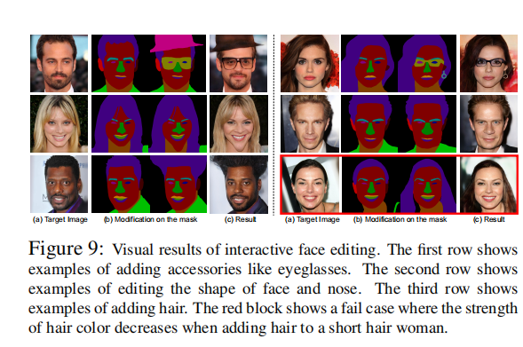

MaskGAN: Towards Diverse and Interactive Facial Image Manipulation   
MaskGAN 走向多样性和交互式的人脸图片编辑   
# 本文总结： 
这篇文章有点不科学，读亏了
第一 文不对题，题目强调增加编辑的多样性和交互性，实际上文章根本没怎么体现这个，反而是在强调风格保留和效果 
第二 没看出来有什么突出的进步，把一些任务不太相关的模型拿来比较，就算在人家模型不太相关的情况下，这个的模型的效果也并没有好多少

本文的核心点就是增加操作的多样性和可交互性   
结构比较复杂，涉及多个部分   
密集映射网络dnn = 图像生成主干（就是风格转移的那种先降后升的堆叠层，输入掩模，得到结果图） + 空间感知风格编码器（Spade类似的，获取反归一化参数的）    
编辑行为模拟训练  两个GAN的训练过程
第一个就是一般的风格迁移类似的GAN，损失函数上做了变动
第二个就是用别用原始语义图和经过vae稍加修改的语义作为DNN输入，得到输出，再用Alpha Blender混合，得到结果，再通过损失函数   
从这里可以看到DMN和EBST似乎是两个不同的部分，是否可以独立运用，比如更换DMN为其它的。

#摘要
人脸操纵近年来已经取得了很大的成就。但是，前面的方法存在着智能操纵预定义的人脸属性和用户操作自由度太小等问题。为了克服这些缺点，我们提出了一个新颖的框架，称之为MaskGAN，它可以支持多样性的以及交互式的人脸操纵。我们的关键想法是将语义掩模作为保真的人脸操纵过程中的合适的中间表示。MaskGAN具有两个主要的组件，1）DMN，密集映射网络 2）编辑行为模拟训练（EBST）特别的的，DMN学习自由形式的用户更改形成的掩模 和 目标图像之间的风格映射，支持生成多种结果。EBST模型在源掩模上对用户的编辑行为建模，使得整个框架对于多种操纵更加健壮。特别的，它引入了双重编辑一致性作为辅助监督信号。   

为了促进更广泛的研究，我们构建了一个大规模高分辨率的人脸数据集并且带有可精确获得的掩模标签的数据集，名为 CelebAMask-HQ。MaskGAN在两个有挑战的任务上做了综合性的测试，它们分别是，属性迁移和风格复制，比其其它先进模型都显示了更优秀的成果。代码，模型，数据集，都在github上可用https://github.com/switchablenorms/CelebAMask-HQ.  

# 1、 引言
面部图像操纵是计算机视觉和计算机图形学中的一项重要任务，可以实现许多应用程序，如自动面部表情和样式(例如。 发型，肤色)转移。该任务大致可分为两类：语义级操作[2,24,29,19,22]和几何级操作[40,38,41,44]。 然而，这些方法要么在一组预定义的属性上操作，要么让用户几乎没有交互操作人脸图像的自由。  

为了克服上述缺点，我们提出了一个新的框架，称为MaskGAN，旨在使多样化和互动的面部操作。**我们的关键思想就是，语义掩模作为灵活的面部操作与真实度保持一个合适的中间表示** 不是直接在像素空间转换图像，MaskGAN学习人脸操作过程为在掩模流形上的遍历[25]，从而在面部组件、形状和姿势方面产生多样性的结果。MaskGAN的另一个优点是它为用户提供了一种直观的方式来指定形状、位置和面部组件类别，用于交互式编辑。  

MaskGAN拥有两个主要的组件，1）密集映射网络2）编辑行为模拟训练。前者学习 语义掩模和渲染图像之间的映射，后者学习建模用户操纵图片是的编辑行为。 具体而言，密集映射网络由图像生成主干和**空间感知风格编码器patial-Aware Style Encoder**组成。S空间感知风格编码器将目标图像及其对应的语义标签掩模作为输入；它产生空间感特征做为图片生成主干网络的输入。在接收到带有用户修改的源掩模后，图像生成主干学会根据空间感知样式特征合成人脸。这样，我们的密集映射网络能够学习用户修改掩模和目标图像之间的细粒度样式映射。  

编辑行为模拟训练是在源掩模上对用户编辑行为进行建模的一种训练策略，它引入双编辑一致性作为辅助监督信号。它的训练管道包括一个获得的密集映射网络，一个预先训练的maskVAE，和一个透明度混合网络。其核心思想是，两个局部扰动的输入掩模的生成的结果(通过在maskVAE学习的掩模流形上遍历获得)混合在一起应该保留主题的外观和身份信息。具体来说，具有编解码结构的maskVAE负责几何结构先验的流形建模。透明度混合子网络学习透明度混合[30]作为图像组成，这有助于保持操作的一致性。经过编辑行为仿真训练，密集映射网络对推理过程中用户输入掩模的各种变化具有较强的鲁棒性。  

MaskGAN在两个具有挑战性的任务上进行了全面的评估，包括属性传输和样式复制，与其他最先进的方法相比，显示出优越的性能。为了促进大规模研究，我们构建了一个大规模的高分辨率人脸数据集，其细粒度掩模标签命名为CelebAmask-HQ。 具体来说，CelebAmask-HQ由3万多张512×512分辨率的人脸图像组成，其中每幅图像都用19个面部成分类别的语义掩模进行注释，例如。 眼睛区域，鼻子区域，嘴巴区域。  

总之，我们的贡献有三个方面：1)我们提出了MaskGAN，用于多样化和交互式的面部操作。 在掩模GAN框架内，密集映射网络被进一步提出，为用户提供一种使用其语义标交互式的操纵人脸的方式。2)我们引入了一种新的训练策略，称为编辑行为模拟训练，它增强了密集映射网络对推理过程中用户输入掩模形状变化的鲁棒性。3)我们贡献CelebAmask-HQ，一个大规模的高分辨率脸数据集和掩模标注。 我们相信这个面向几何的数据集将为人脸编辑和操作社区开辟新的研究方向。  

# 2. 相关工作
生成对抗性网络。 GAN[7]通常由一个生成器和一个相互竞争的鉴别器组成。 由于GAN可以生成真实的图像，它在图像到图像的翻译[14,45,24,36,28]、图像修复[23,42,43,15]和虚拟尝试[39,9,3,35]等任务中享有广泛的应用。  
语义级的人脸操纵  
深度语义层次的人脸编辑已经研究了几年。 包括[2,24,29,19,22,21]在内的许多工作取得了令人印象深刻的结果。 [29]介绍了一种编码器来学习条件GAN的逆映射。DIAT[22]利用对抗性损失来传递属性，并学会将预测的脸和原始的脸混合在一起。(注：人脸属性转换的，比如性别，肤色，效果似乎不错)。 Fader Network利用对抗性训练从潜在空间中分离属性相关特征。 StarGAN[2]被提出使用一个基于目标域标签的单一网络来执行多域图像翻译。 然而，这些方法不能通过原型生成图像。

几何级人脸操控  
最近的一些研究[40,38,41,8]开始讨论在实例级别从原型转移面部属性的可能性。例如，ELEGANT[38]是通过交换两个面的潜码来交换两个面之间的属性。然而，ELEGANT[38]不能准确的从原型中迁移属性(例如。 “微笑”)。对于基于3D的面部操作，虽然基于3D的方法[1,27,6]在正常姿势上取得有希望的结果，但它们在计算上往往昂贵，并且它们的性能可能会随着大的和极端的姿势而降低。

# 3、 我们的方法
## 总体框架。
我们的目标是使用MaskGAN实现结构条件脸操作，给定目标图像$I^t∈R^{H×W×3}$，语义标签掩模$M^t∈R^{H×W}$和源语义标签掩模$M^{src}∈R^{H×W×C}$（用户修改的掩模）。 当用户操纵$m^{src}$的结构时，我们的模型可以将一个被操纵的面$I^{out}∈R^{H×Wx3}$，其中C是语义标签的类别数量。  
## 训练管道
      
图2：整体训练管道。 编辑行为模拟训练可分为两个阶段。 在加载密集映射网络和掩模VAE的预先训练模型后，我们迭代地更新这两个阶段，直到模型收敛。   

 如图2所示，MaskGAN由三个关键要素组成：密集映射网络(DMN)、蒙版VAE和AlphaBlender，它们是通过编辑行为模拟训练(EBST)来训练的。      
DMN(见3.1节)为用户提供了一个接口，用于操作面向语义标签掩模的脸，它可以学习$I^t$和$m^{src}$之间的样式映射。     
MaskVAE负责建模结构先验的流形(见 3.2节)   
Alpha Blender负责保持操纵一致性(见 3.2节)。 

为了使DMN在推理时对用户定义的掩模$M^{SRC}$的变化更加鲁棒，我们提出了一种新的训练策略EBST(见 3.2），可以在$m^{src}$上建模用户编辑行为.    
这种训练方法需要一个训练好的DMN，一个训练到低重建误差maskVAE，和一个从零开始训练 Alpha Blender.  
训练管道可分为两个阶段。在训练阶段，我们用$m^t$代替$m^{src}$作为输入。 在第一阶段，我们首先用$M^T$和$I^t$更新DMN。在第二阶段，我们使用maskVAE生成两个新的掩模$M^{inter}$和$M^{outer}$，与$M^t$有小的不同，并生成两个$I^{inter}$和$I^{outer}$. 然后，AlphaBlender将这两个face混合在一起变成$I^{blender}$，以保持操作的一致性。 在EBST之后，DMN将在推理阶段对m^src的变化更加鲁棒。 目标函数的详细信息见SEC 3.3.
。

## 推理管道
我们只需要DMN进行测试。如图3所示，与训练阶段不同，我们简单地将图像生成骨干的输入替换为$m^{src}$，其中$m^{src}$可以由用户定义。   
   
图3：密集映射网络的体系结构，它由空间-软件风格编码器和图像生成主干组成。 

## 3.1. Dense Mapping Network
密集映射网络采用Pix2PixHD的架构作为骨干，我们用额外的编码器E_ncstyle扩展它，它将接收I^t和M^T作为输入。 详细架构如图3所示。 
### 空间+风格感知编码器
我们提出了一种空间+风格感知编码器，同时接收风格信息，以及它对应的空间感信息$M^t$。为了为了融合这两个域，我们使用了SFT-GAN[37]中的Spatial Feature Transform (SFT)。该SFT层学习映射函数$M：Ψ →（γ，β）$。其中仿射变换参数$（γ，β)$由先验条件$Ψ$即$(γ，β）=M（Ψ）$或者 在获得γ和β后，SFT层在特征映射F上执行特征方向和空间方向调节，即$SFT(F|γ，β)= γ⊙F + β$，其中F的维数与γ和β相同，⊙称为元素相乘。  
在这里，我们从$M^t$的特征和$I^t$特征图F中得到了先验条件$Ψ$。 因此，我们可以在样式信息$I^t$上对空间信息$M^t$进行条件化，生成$（xi，yi）$如下：
   
其中xi，yi是包含空间感知样式信息的仿射参数。为了将空间感知的样式信息转换到目标掩模输入中，我们利用DMN中残差块块zi上的自适应实例规范化[12](AdaIN）。 在样式传输中，AdaIN操作是一种最先进的方法：  
  
这类似于实例规范化[34]，但用条件样式信息替换IN中的仿射参数。   

DMN是一个定义为GA的生成器，其中$I^out=GA(E_ncstyle(I^t，M^t)，M^t))$.使用Spatial-Aware Style Encoder，DMN根据M^t提供的空间信息学习$I^t$与$m^$SRC$之间的样式映射。 因此，$I^t$中的风格(例如 发型和皮肤风格)，过渡到在$M^$SRC$上相应的位置，以便DMN可以合成最终操纵的脸$I^out$。(注：就是风格感知编码器，使用SFT技术结合原图原掩模，得到空间化的风格信息，然后使用AdaIn结合到用户编辑后的掩模I Mask上，最后用于生成图片)。

## 3.2. 编辑行为模拟训练
编辑行为模拟训练可以在训练时对$m^{src}$上的用户编辑行为进行建模。这种训练方法需要一个训练好的DMN，一个训练到低重建误差maskVAE，和一个从零开始训练 Alpha Blender. maskVAE由EncVAE和DecVAE组成，负责对结构先验的流形进行建模。Alpha Blender 写作 B负责保持操纵一致性。我们将GB定义为另一个利用MaskVAE、DMN和AlphaBlender作为的生成器，其中$GB≡B(GA(I^t、M^t、M^{inter})、GA(I^t、M^t、M^{outer}))$。整体训练管道如图2所示， 并在Algo 1中给出了详细的算法。
   
我们的训练管道可以分为两个阶段。   
1、首先，我们需要加载GA、EncVAE和DecVAE的预训练模型。  
2、在第一阶段，我们更新GA一次。   
3、在第二阶段，给定M^t，通过在掩模的潜空间上添加两个反向平行向量，得到了两个具有小结构插值和外推的新掩模$M^{inter}$和$M^{outer}$。这些向量是通过$±z^ref-z^t/λ_inter$获得, 其中$z^{ref}$是随机选择的掩模$M^{ref}$的潜在表示，$λ_{inter}$设置为2.5以进行适当的混合。
4、通过DMN生成两个人脸后，AlphaBlender学会将两个图像混合到目标图像中，从而保持与原始图像的一致性。  
5、 然后，我们迭代地更新GA和GB(图中的第一阶段和第二阶段 如图2)，直到模型收敛。 在EBST之后，DMN将在推理时间内对用户修改的掩模的变化更加健壮。  

Algo 1 

MaskVAE的结构先验：
类似于VAE，学习掩模VAE的目标函数由两部分组成：（一）$L_{reconstruct}$，它控制像素级语义标签差异；（二）L_KL，它控制潜空间中的平滑性。总体目标是最小化以下损失函数：  
  
其中λKL设置为1e5，这是通过交叉验证获得的。 编码器网络EncVAE(Mt)输出潜向量的平均µ和协方差σ。 我们使用KL散度损失来最小化先验P(Z)与学习分布之间的差距，即
   
其中表示向量σ的第j个元素。 然后，我们可以在训练阶段用z=µ + r⊙exp（σ）对潜在向量进行采样，其中r∼N(0，I)是随机向量，⊙表示元素乘法。  
解码器网络DecVAE(Z)输出重构语义标签，并计算像素级交叉熵损失如下：   
  
图片4显示了两个掩模之间的线性插值样本。 MaskVAE可以在掩模上进行平滑过渡，EBST依赖于平滑的潜在空间来操作。   
   
图4：两个掩模之间的线性插值样本（红色块和橙色块之间）。 MaskVAE可以在面罩上进行平滑过渡。   
### Alpha Blender 控制操纵一致性
为了保持$I^{blend}$混合与I^t之间操作的一致性，我们实现了在图片合成中使用了透明度混合，它是通过一个基于深层神经网络的AlphaBlender B的实现，该网络通过两张输入图像I^inter和I^outer 学习混合参数α=B(IInter，Iouter)。如图2的第二阶段所示,Alpha Blender与两个共享权重的DMN联合优化。 这组模型定义为GB。

# 3.3. 多目标学习
学习GA和GB的目标函数由三部分组成：  
(i)$L_{adv}$，这是一种条件对抗性损失，它使生成的图像更加真实，并根据条件掩模Mt纠正生成结构，
（ii）$L_{feat}$，鼓励生产者在多个尺度上提供自然统计数据，
（iii）$L_{percept}$， 改善层低分辨率到高分辨率的生成内容的感知上的细节，向ImageNet上训练的VGG-19的深度特征.(注:没看懂) 
为了提高高分辨率图像的合成质量，我们利用多尺度鉴别器[36]来增加感受野，减少生成图像中出现的重复模式。我们使用两个判别器，指具有相同网络结构的D1，2，在两个不同的尺度上工作。 总体目标是最小化以下损失函数：   
    
其中λf吃和λpercept设置为10，这是通过交叉验证获得的。  
$L_adv$是由定义的条件对抗性损失    
    
$L_{feat}$是一种特征匹配损失[36]它利用鉴别器的中间特征计算真实图像和生成图像之间的L1距离   
  
$L_{precept}$是感知损失[16]它使用固定的VGG-19[33]模型中的中间特征计算真实图像和生成图像之间的L1距离   
   
(注：和spade提到的损失一样，特征匹配损失，判别器逐层L1距离，感知损失，VGG逐层L1距离估计是通用的结构)
4. CelebAMask-HQ数据集
数据集说明 略

# 5. 实验  
我们通过在不同的基准上显示定量和视觉质量来综合评估我们的方法。
## 5.1 数据集
CelebA-HQ。 [17]是一个高质量的面部图像数据集，由从CelebA数据集[26]中提取的30000幅图像组成。 这些图像的处理质量提高到1024×1024的大小。 我们将所有图像的大小调整为512×512，以便进行实验。    
CelebAMask-HQ 基于Celeba-HQ，我们提出了一个新的数据集CelebAmask-HQ，它有30000个语义分割标签，大小为512×512。 数据集中的每个标签都有19个类。

## 5.2 实现细节：  
网络架构  
密集映射网络中的图像生成骨干和PixelbookPixHD一样采用4个残差块。阿透明度混合机也遵循Pix2PixHD的设计，但只下采样3次，并使用3个剩余块。MaskVAE的结构类似于UNET[31]，没有跨步连接skip-connection。在DMN中，空间感知样式编码器不使用任何实例规范化[34]层，因为它会清除掉样式信息。在DMN、AlphaBlender和鉴别器中的所有其他卷积层后面都是IN层。掩模VAE在所有层中使用批处理规范化[13]。

对比方法：
我们选择最先进的Star-GAN[2]，ELEGANT[38]，Pix2Pix HD[36]，SPADE[28]作为我们的对比基线。 StarGAN执行语义级的面部属性操作。 ELEGANT执行几何级面部属性操作。 Pix2Pix HD从语义掩模执行照片真实图像合成。 我们只需删除接收密集映射网络空间感知风格编码器中的MT的分支，作为称为Pix2PixHD-m的基线。SPADE对自然图像执行结构-条件图像操纵。

## 5.3 评价指标
### 语义层次评估
为了评估一种操纵目标属性的方法，我们检查了合成图像的分类精度。 我们使用ResNet-18[10]体系结构，对Celeba数据集上特定属性的训练了二分类面部属性分类器。
### 几何层次评估
为了评估掩模条件图像生成质量，我们将预先训练的具有U-Net[31]体系结构的人脸解析模型应用于生成的图像，并从像素级别测量输入布局与预测解析结果之间的一致性。（注：这里可以看到了，我们可以使用AI模型进行辅助工作）
### 分布评价
为了测量来自不同模型的生成图像的质量，我们使用Fr´echet Inception Distance [11] (FID)来测量生成图像的质量和多样性。
###  人的感知评价
我们进行了一次用户调查，以评估感知生成质量。 给定目标图像（以及样式复制实验中的源图像)，用户需要根据两个标准选择最佳生成的图像：1)属性传输质量和样式2）感知现实主义。 这些选项是从不同的方法生成的随机洗牌图像
### 一致性保留评估
为了进一步评价身份保存能力，我们采用ArcFace[5]进行了一个额外的人脸验证实验(LFW为99.52)。 在实验设置中，我们从CelebA-HQ中的测试集中选择了400对人脸，每对包含一个修改后的人脸（微笑）和一个未修改的人脸。 此外，在测试阶段，每个面被调整到112×112。

##5.4. 和以前工作的比较
比较是w.r.t 三个方面进行的。包括语义层次评价、几何层次评价和分布情况。 我们将我们的方法表示为MaskGAN和MaskGAN+以供参考，其中+表示该模型配备了编辑行为模拟训练。 对于带有修改的Pix2Pix HD[36]，我们将其命名为Pix2Pix HD-m，以供参考。

### 属性迁移评估：
 我们选择微笑这是一种在以前的工作中最具挑战性的属性类型，来比较。 更具体地说，微笑会影响一张脸的整体表达，微笑有很大的几何变化。 为了生成用户修改的掩模作为输入，我们使用HopeNet[32]在测试集上进行了头部姿态估计。利用滚动、俯仰和偏航的角度信息，我们从测试集中选择了400个具有相似姿态的源对和目标对。然后，我们直接将口腔、上唇和下唇的mask从目标mask替换为源mask。 图7，图5和表2显示了MaskGAN和最先进的视觉结果和定量结果。 为了进行公平的比较，StarGAN*和ELEGANT*平均模型由大小为256×256的图像训练。StarGAN具有最佳的分类精度和FID分数，但在微笑区域失败，原因是星GAN的性能可能受到训练数据和网络设计的大小的影响。ELEGANT有合理的结果，但有时不能准确地从源图像中传递微笑，因为它在潜在空间中从源图像中交换属性。 SPADE的分割精度最高，但重建能力较差。只要目标图像没有空间信息就可以用用户定义的掩模学习更好的映射。 MaskGAN具有合理的视觉质量和相对较高的分类精度和分割精度。   
   
表2：几何级面部属性转移的评价。 定量比较与其他方法的具体属性-微笑。 *表示模型由256×256大小的图像训练。 表示该模型是用编辑行为模拟训练训练的。 星甘和ELEGANT的FID评分较好，但属性分类准确率较低。 Pix2Pix HD-m获得了最佳的分类精度，但FID得分低于其他。 虽然MaskGAN不能达到最佳的FID评分，但它具有相对较高的分类精度和分割精度。      
   
图7：与特定属性的其他方法的视觉比较：面部属性传输上的微笑。 *表示模型由256×256大小的图像训练。 前两列是目标对和源对。 中间的五个列显示了几何级操作的结果(我们的MaskGAN、SPADE[28]、Pix2Pix HD-m[36]和ELEGANT[38])，它们使用源图像作为示例。 最后两列显示基于语义级操作的结果(例如。 星甘[2])。 星甘在微笑的区域失败了。 ELEGANT有合理的结果，但有时不能准确地从源图像中传递微笑。 Pix2Pix HD-m的感知质量比其他的低。 SPADE的属性保持能力较差。 我们的掩模GaN具有合理的视觉质量和相对较好的几何级微笑转移能力。   
   
风格复制评价。 为了说明我们的模型的鲁棒性，我们在一个更困难的任务上测试MaskGAN：几何级样式复制。 风格复制也可以被看作是操纵一个脸结构到另一个脸。 我们从测试集中选择了1000幅目标图像，从目标图像中选择了不同顺序的源图像。 对于这个传世，大约一半的配对是不同的性别。 图8，表6和表3显示了MadkGAN和最先进的视觉结果和定量结果。 从视觉结果和属性分类精度（从左到右：男性、重妆和无胡子），SPADE通过使用空间-适应性规范化获得了最佳的分割精度，但未能保持属性(例如 性别和胡须)，MAskGAN显示出比SPADE和Pix2PixHD-m更好的迁移风格能力，如化妆和性别的能力，因为它将空间信息引入到风格特征中，并过程中通过双重编辑一致性模拟用户编辑行为。
一致性保留评估  
  
  
 如表4所示，我们的MaskGAN优于其他最先进的掩膜到图像的一致性保留。 实际上，我们已经探索了增加面部识别损失。 然而，性能增益是有限的。 因此，我们在最终框架中删除了损失。
 
 # 5.5. 消融研究
 在消融研究中，我们考虑了我们模型的两个变体：（一）掩模GaN和（二）掩模GaN。   
  密测图网络， 在图5中，我们观察到Pix2PixHD-m受到用户修改掩模中包含的先验信息的影响。 例如，如果用户修改mask为女性，而目标图像看起来像男性，则预测的图像倾向于化妆而没有胡须的女性。
  
5.6. 交互式面部编辑
我们的MaskGAN允许用户通过语义掩模接口在几何级别上交互编辑面部组件的形状、位置和类别。 交互式人脸编辑结果如图 8所示。 第一行显示了添加眼镜、耳环和帽子等附件的示例。 第二行显示了编辑面部形状和鼻子形状的示例。 第三行显示了添加头发的示例。 更多成果在补充材料中。   
   
 
# 6. 总结
本文提出了一种新的面向几何的人脸操纵框架——Mask GAN)，它包含两个精心设计的组件：1)密集映射网络；2)编辑行为模拟训练。 我们的主要见解是，语义掩模作为一个合适的中间表示，帮助灵活的面部操作与保真度保持。 在两个具有挑战性的任务上对MaskGAN进行了全面的评估：属性迁移和样式复制，显示出比其他最先进的方法更好的性能。 我们进一步贡献了一个大规模的高分辨率人脸数据集与细粒度掩模标注，名为CelebAmask-HQ。 未来的工作包括将MaskGAN与图像完成技术相结合，以更多保留区域的细节，而无需编辑。 此外，Pix2PixHDM不能准确地将样式从目标图像转换为用户修改的掩模。使用Spatial-Aware Style Encoder，Mask GAN不仅可以防止用户修改掩模中受先验知识影响产生的结果，而且可以准确地传递目标图像的风格。
编辑行为模拟训练  表2和表3显示，在训练中模拟编辑行为可以防止推理阶段的内容生成受到用户修改掩模上结构变化的影响。 提高了属性保持能力的鲁棒性，使MaskGAN显示出更好的评价分数。

致谢
这项工作得到香港大学基础研究种子基金、创业基金和感官时间研究捐赠的部分支持。