GAN Compression: Efficient Architectures for Interactive Conditional GANs
# 总结：
## 简述：
模型压缩自然的是一个使用综合技术的地方，
这里面用到了： 知识蒸馏， "一劳永逸"神经架构搜索，MobileNet里面提出的卷积解耦技术
计算量减少9-20多倍，参数量3-30多倍

## 启发点：创新方法，把相近的其它领域的有力技术，新技术，应用到本领域来
## 关键点：
## 创新点：
观察到程度
在神经架构搜索中，通过创造一个一劳永逸网络，它可以直接生成很多子网络，减少性能消耗，约等于动态规划？

# 摘要
条件生成对抗性网络(cGAN)为许多计算机视觉和图形应用提供了可控的图像合成。然而，最近的cGANs比现代识别CNNs更需要1-2个数量级的计算。 例如，GauGAN每幅图像消耗281G MAC，而MobileNet-v3的MAC为0.44G，这使得交互式部署变得困难。在这项工作中，我们提出了一个通用的压缩框架，以减少CGAN中生成器的推理时间和模型大小。 直接应用现有的CNN压缩方法，由于GAN训练的困难和生成器结构的差异，导致性能差。我们以两种方式应对这些挑战。首先，为了稳定GAN训练，我们将原始模型的多个中间表示转移到其压缩模型中，并统一未配对和配对学习。第二，我们的方法不是重复使用现有的CNN设计，而是通过神经架构搜索(NAS)自动找到有效的体系结构)。为了加速搜索过程，我们通过权重共享将模型训练和体系结构搜索解耦。实验证明了我们的方法在不同的监督设置（配对和未配对）、模型体系结构和学习方法(例如pix2pix、Gaugan、CycleGAN)中的有效性。 在不损失图像质量的情况下，我们将CycleGAN的计算量减少了20多×，GauGAN的计算量减少了9×（注：9-20多倍），为交互式图像合成铺平了道路。 代码和演示是公开可用的。（注：参数量3.x倍-30多倍）

# 1、引言
生成对抗性网络(GAN)[16]擅长合成照片真实图像。他们的条件扩展，条件GANs[50,29,80]，允许可控的图像合成，并使许多计算机视觉和图形应用程序，如交互式地从用户绘图[52]创建图像，将舞蹈视频流的运动转移到不同的人[66,9,1]，或为远程社交交互[68]创建VR面部动画。所有这些应用程序都需要模型与人类交互，因此需要低延迟的设备性能，以获得更好的用户体验。 然而，边缘设备(手机、平板电脑、VR耳机)受到内存和电池等硬件资源的严格限制。这种计算瓶颈阻止了条件GAN部署在边缘设备上。与图像识别CNN[34,61,21,27]不同，图像条件GANs在计算上是众所周知的密集。例如，广泛使用的CycleGAN模型[80]需要超过50GMAC*，比MobileNet[27]多100×。 一个更新的模型Gaugan[52]，虽然产生了照片真实的高分辨率图像，需要超过250G MAC，500倍于MobileNet[27,57,26]。   
在本工作中，我们提出了GAN压缩，一种通用的压缩方法，用于减少条件GAN的推理时间和计算成本。我们观察到，压缩生成模型面临两个根本的困难：GANs不稳定地训练，特别是在未配对的环境下；生成器也不同于识别CNN，使得难以重用现有的CNN设计。为了解决这些问题，我们首先将知识从原始教师生成器的中间表示转移到其压缩学生生成器的相应层。 我们还发现，使用教师模型的输出创建伪对对于未配对训练是有益的。这将未配对学习转化为配对学习。其次，我们使用神经架构搜索(NAS)自动找到一个高效的网络，其计算成本和参数显著减少。为了降低训练成本，我们通过训练包含一个 所有可能的通道号配置的“一劳永逸网络”，将模型训练与架构搜索解耦。 一次性网络可以通过权重共享生成许多子网络，并使我们能够在不进行再培训的情况下评估每个子网络的性能。我们的方法可以应用于各种条件GAN模型，而不考虑模型体系结构、学习算法和监督设置（配对或未配对）。
通过广泛的实验，我们表明，我们的方法可以减少三个广泛使用的条件GAN模型的计算，包括像素2pix[29]，循环GAN[80]和GauGAN[52]9×到21个关于MACS的模型，而不损失生成图像的视觉保真度（几个例子见图1）。   
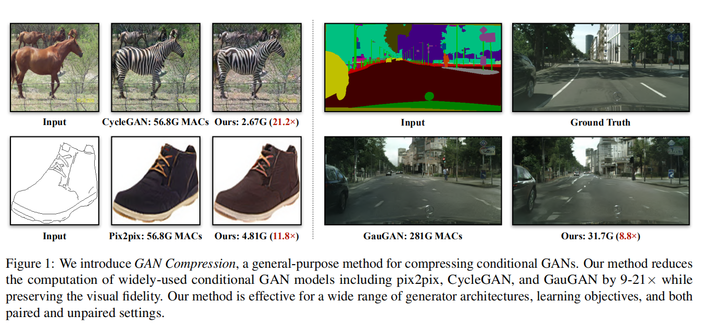   
图1 ：我们介绍了GAN压缩，一种通用的压缩条件GAN的方法。 我们的方法减少了广泛使用的条件GAN模型的计算，包括像素2pix，循环GAN和GauGAN×同时保持视觉保真度。 我们的方法对于广泛的生成器体系结构、学习目标以及配对和未配对设置都是有效的。

# 2、相关工作
条件GAN。 生成对抗性网络(GANs)[16]擅长于[31,5]综合照片真实结果。 它的条件形式，条件GANs[50,29]进一步实现了可控的图像合成，允许用户合成给定各种条件输入的图像，如用户草图[29,58]、类标签[50,5]或文本描述[55,77]。 随后的作品进一步提高了结果[67,52]的分辨率和现实主义。 后来，提出了几种算法来学习没有配对数据[63,59,80,32,71,43,13,28,35]的条件GAN。   
    高分辨率的、真实的合成结果是以密集计算为代价的。 如图2所示，虽然模型大小与图像识别CNN[21]的大小相同，但条件GAN需要两个数量级的更多计算。 这使得在有限的计算资源下在边缘设备上部署这些模型具有挑战性。 在本工作中，我们重点关注用于交互式应用程序的高效图像条件GANS体系结构。   

## 模型加速
 对于各种实际应用[20,19,79,65,18]，硬件效率高的深度学习受到了广泛的关注。 为了减少网络权重中的冗余，研究人员建议修剪[20,19,69]层之间的连接。然而，经过修剪的网络需要专门的硬件来实现其完全加速。 随后的几项工作提出了整个卷积滤波器的修剪[23,38,44]以提高计算的规律性。用于模型压缩的AutoML[22](AMC)利用强化学习自动确定每一层的修剪率。Liu等人。 [45]后来用进化搜索算法取代了强化学习。最近，Shu等人。 [60]提出了通过修改原CycleGAN算法对CycleGAN进行协同进化剪枝。 这种方法是为特定的算法量身定做的。压缩模型在中等压缩比(4.2×下显著增加FID)。相反，我们的模型无关方法可以应用于不同学习算法、体系结构以及配对和未配对设置的条件GAN。我们假设不知道原始的cGAN学习算法。 实验表明，我们的通用方法在保持原始模型的FID的同时，达到了21.1×的压缩比(5×优于CycleGAN专用方法[60]。

## 知识蒸馏
Hinton等人。 [25]介绍了将较大的教师网络中的知识转移到较小的学生网络中的知识蒸馏。对学生网络进行训练模仿教师网络行为。几种方法利用知识蒸馏[48,10,36]压缩识别模型。 最近，Aguinaldo等人。 [2]采用这种方法加速无条件GAN。 与之不同的是，我们关注的是有条件的GAN。我们实验了几种[2,72]条件GANs的蒸馏方法，只观察到边际改进，不足以进行交互应用。 详情请参阅附录6.2。  （注：知识蒸馏简介，这个比较简单易懂的 https://zhuanlan.zhihu.com/p/83456418 知识蒸馏采用teacher-student的形式，主要用于模型压缩，大概是用已经学习好的大的模型的输出向量作为小模型的标签，大模型的softmax输出中相比样本标签多了更多信息，比如分类模型里面，对卡车输出它是轿车比输出它是胡萝卜概率值高很多，这也是有用的信息，这样将能更好的帮助小模型学习）

## 神经结构搜索
神经结构搜索(NAS)已经成功地设计神经网络结构，其性能优于手工制作的大规模图像分类任务[82,40,41]。 为了有效地降低搜索成本，研究人员最近提出了一次神经结构搜索[42,8,70,17,26,4,7]，其中不同的候选子网络可以共享相同的权重集。 虽然所有这些方法都集中在图像分类模型上，但我们使用NAS研究了有效的条件GANS体系结构。（注：创新方法，把相近的其它领域的有力技术应用到本领域来）

# 3. 方法
由于两个原因，压缩交互式应用程序的条件生成模型具有挑战性首先，GANS的训练动态本质上是高度不稳定的。其次，识别和生成模型之间的巨大结构差异使得直接应用现有的CNN压缩算法变得困难。为了解决上述问题，我们提出了一种针对有效生成模型的训练协议（第3.1节），并进一步使用神经架构搜索(NAS)提高压缩比（第3.2节）。总体框架如图3所示。 在这里，我们使用ResNet生成器[30,80]作为示例。 然而，相同的框架可以应用于不同的生成器体系结构和学习目标。   
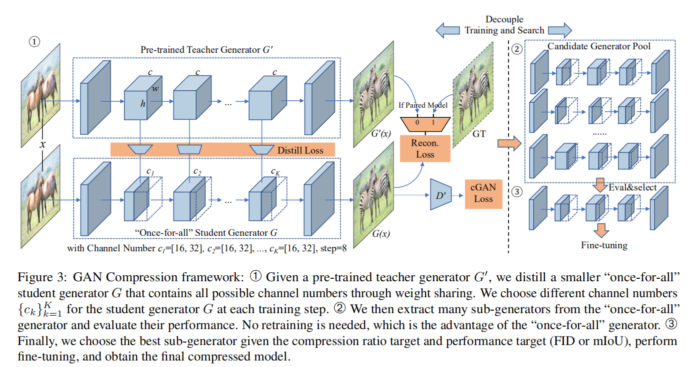   
图3：GAN压缩框架：➀给定一个预先训练的教师生成器G0，我们提取一个较小的“一次性”学生生成器G，其中包含所有可能的信道号，通过权重共享。 在每个训练步骤中，我们为学生生成器G选择不同的信道号{ck}Kk=1。 ➁然后我们从“一次性”生成器中提取许多子生成器，并评估它们的性能。 不需要再培训，这是“一劳永逸”生成器的优势。 ➂最后，我们选择给定压缩比目标和性能目标(FID或mIoU)的最佳子生成器，进行微调，得到最终的压缩模型。

## 3.1 训练目标
统一未配对和配对学习。条件GAN旨在学习源域X与目标域Y之间的映射函数G。它们可以使用配对数据 {xi, yi} 或未配对数据 源数据集{xi} 到目标数据集{yj} 进行训练。这里，N和M表示训练图像的数量。 为了简单起见，我们省略了下标i和j。 已经有若干种训练目标被提出用来处理配对和未配对的情况（例如，[29,52,67,80,43,28]）。多样的训练目标使得构建通用压缩框架边得很困难。 为了解决这一问题，我们将未配对和配对学习统一在模型压缩设置中，而不管教师模型最初是如何训练的。给定原始教师生成器G'，我们可以将未配对训练设置转换为配对设置。 特别是对于未配对的设置，我们可以将原始生成器的输出视为我们的GT，并以配对学习目标训练我们的压缩生成器G。 我们的学习目标可以概括如下：    
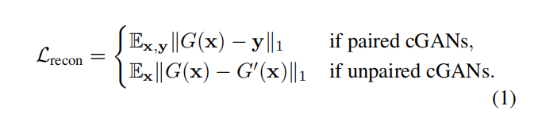   
这里我们表示Ex = Ex∼pdata(X)和E_x,y = Ex，y∼pdata(x，y)。 || ||1表示L1范数.
经过这样的修改，我们可以将相同的压缩框架应用于不同类型的cGAN。 此外，如4.4节所示，使用上述伪对学习使训练更稳定，并产生更好的结果，与原来的未配对训练设置相比。
由于未配对训练已转化为配对训练，除非另有规定，我们将在配对训练设置中讨论以下部分。

继承教师鉴别器
虽然我们的目标是压缩生成器，但鉴别器D存储了学习GAN的有用知识，因为D学习发现当前生成器[3]的弱点。在我们的实验中，我们观察到一个预先训练的鉴别器可以指导我们的学生生成器的训练。使用随机初始化的鉴别器往往会导致严重的训练不稳定性和图像质量的下降。 GAN的目标是：  
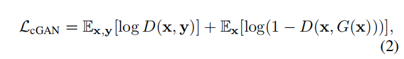   
其中，我们使用教师鉴别器D'的权重初始化学生鉴别器D。 使用标准的极小极大最优化[16]对G和D进行训练。

中间特征蒸馏
一种广泛使用的CNN模型压缩方法是知识蒸馏[25,48,10,72,36,53,12]。通过匹配输出层逻辑的分布，我们可以将黑暗知识从教师模型转移到学生模型，提高学生的表现。
然而，条件GAN通常[29,80]输出确定性图像，而不是概率分布。因此，很难从教师的输出像素中提取暗知识。特别是对于配对训练设置，教师模型生成的输出图像与真实目标图像相比，本质上不包含额外的信息。附录6.2中的实验表明，对于配对训练，天真地模仿教师模型的输出没有带来任何改进。为了解决上述问题，我们匹配了教师生成器的中间表示，正如先前工作[36,75,10]中所探索的那样。中间层包含更多的通道，提供更丰富的信息，并允许学生模型除了输出之外获得更多的信息。蒸馏目标可以形式化为   
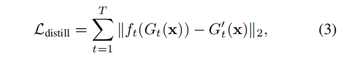  
其中G_t(X)和G'_t(X)是学生和教师模型中第t选择层的中间特征激活，T表示层数。一个1×1可学卷积层ft将特征从学生模型映射到教师模型特征中相同数量的通道。我们共同优化G_T和f_t，以尽量减少蒸馏损失。 附录6.1详细说明了我们在实践中选择的层。 

整个目标：
我们的最终目标如下：   
    
其中超参数λrecon和λdistill控制每个项的重要性。 详情请参阅附录6.1。

3.2. 高效的生成器设计空间
选择设计良好的学生架构对于知识蒸馏的最终性能至关重要。我们发现，原始地缩小教师模型的通道数不能产生一个紧凑的学生模型：降超过4×计算减少时性能开始显著下。可能的原因之一是现有的生成器体系结构往往是从图像识别模型[46,21,56,46]中采用的，并且可能不是图像合成任务的最佳选择。下面，我们展示了如何从现有的cGAN生成器中获得更好的体系结构设计空间，并在空间内执行神经体系结构搜索(NAS。

卷积分解和层敏感度
现有的生成器通常遵循传统的分类和风格CNN采用普通的卷积。最近有效的CNN设计广泛采用分解版本的卷积（深度方向 点方向pointwise？）[27]，这证明有一个更好的性能-计算权衡。我们发现使用分解卷积也有利于cGAN中的生成器设计。(就是mobileNet也就是说又要学一下？)    
   不幸的是，我们早期的实验表明，直接将分解应用于所有卷积层（如分类器）将显著降低图像质量。分解一些层会立即伤害性能，而其他层则更健壮。此外，该层灵敏度模式与识别模型不一样。  例如，在ResNet生成器[21,30]中，Res块层消耗了大多数模型参数和计算成本，而几乎不受分解的影响。 相反，上采样层的参数要少得多，但对模型压缩相当敏感：适度的压缩会导致大量的FID退化。 因此，我们只分解RES块层。 我们对4.4节中的层的敏感性进行了全面的研究。

 
使用NAS的自动减少通道   
现有的生成器在所有层都使用手工设计的（而且大多数是相同的)同样的通道数量，这这包含冗余，而且远非最佳。为了进一步提高压缩比，我们使用通道剪枝[23,22,44,81,47]自动选择生成器中的信道宽度来消除冗余，这可以平方级的减少计算量。我们支持关于通道数量的细粒度选择。 对于每个卷积层，可以从8的倍数中选择通道数，这平衡了MAC和硬件并行[22]。  
   给定可能的信道配置{c1，c2，...，cK}，其中K是要修剪的层数，我们的目标是u使用神经架构搜索找到最佳的信道配置{c^∗1，c^∗2，...，c^∗K}=argmin_c1，c2，...，cKL 满足 MACs<Ft，其中Ft是计算约束。一种直接向前的方法是遍历所有可能的信道配置，训练它收敛、评估和选择性能最好的生成器.然而，随着K的增加，可能的配置数量呈指数增长，每个配置可能需要不同的超参数来确定每个项的学习速率和权重。 这个试错过程太耗时了。
 
## 3.3 解耦训练和搜索
为了解决这一问题，我们将模型训练与体系结构搜索解耦，遵循最近的[8,7,17]中的 one-shot 神经架构搜索方式。我们首先训练一个“一劳永逸”的网络[7]，支持不同的信通道数。不同通道数量的每个子网络都受到同样的训练，可以独立操作。 子网络与“一劳永逸”网络共享权重。图3说明了总体框架。 我们假设原教师生成器有{c_k^0}k=1`K个通道。 对于给定的信通道配置{c_k}_k=1^K，c_k≤c^0_k，我们通过从相应的“一次性”网络的权重张量中提取前面的{c_k}_k=1^K个信道来获得子网络的权重，遵循郭等人的观点。 [17]。(注：意思应该是假如教师网络某一层有100个通道，学生网络对应层有50个通道，那么取教师网络的前50通道的权重作为学生网络的权重)。在每个训练步骤中，我们随机抽取具有一定通道数配置的子网络，计算输出和梯度，并使用我们的学习目标（方程4)更新提取的权重）。 由于前几个通道的权重更新更频繁，它们在所有权重中起着更关键的作用。     
    在“一劳永逸”网络被训练后，我们通过两种搜索方法直接评估每个候选子网络在验证集上的性能，从而找到性能最好的子网络，如下所述：
- Brute Force：我们直接评估每个候选子网络在一定的计算预算下的性能。 虽然这种方法肯定会返回性能最好的方法。 然而，这个搜索过程相当耗时。 
- 进化：我们包括这种搜索方法，因为arXivv3，它诉诸进化算法[54]搜索性能最佳的子网。 这种方法效率高得多（大约比蛮力快20×），可以支持更大的搜索空间。

由于“一劳永逸”网络通过权重共享进行了彻底的训练，因此不需要微调。 这近似于模型从零开始训练时的性能。 这样，我们就可以解耦生成器体系结构的训练和搜索：我们只需要训练一次，但我们可以在不需要进一步训练的情况下评估所有可能的信道配置，并选择最好的一个作为搜索结果。 可选地，我们对选定的体系结构进行微调，以进一步提高性能。 我们在4.4节中报告了这两个变体。   

# 4. 实验
##4.1. 设置
模型。 我们对三个条件GAN模型进行了实验，以证明我们的方法的通用性。
- CycleGAN[80]是一种未配对的图像到图像转换模型，它使用基于ResNet的生成器[21,30]将图像从源域转换为目标域，而不使用对。
- Pix2pix[29]是一种基于条件GAN的配对图像转换模型。 对于该模型，我们用基于ResNet的生成器代替原来的U-Net生成器[56][30]因为我们观察到，在相同的学习目标下，基于ResNet的生成器以较少的计算成本获得了更好的结果。 详细的U-Net与ResNet基准见附录6.2。
-GauGAN[52]是一种最先进的配对图像到图像翻译模型。 它可以生成给定语义标签映射的高保真图像。

我们重新训练pix2pix和循环GAN使用正式的Pytordh与上述修改。 我们重新训练的pix2pix和CycleGAN模型（在我们的回购中可用）略优于官方预先训练的模型。 我们使用这些重新训练的模型作为原始模型。 对于高根，我们使用了作者预先训练的模型。 详见附录6.2。

## 数据集 
我们使用以下五个数据集：
 - Edges→shoes。 我们使用来自UTZappos50K数据集[73]的50，025幅图像。 我们随机分割数据集，使验证集有2，048幅图像，用于稳定评估Fr´ECHET感知距离(FID)（见4.2节）。 我们在这个数据集上评估pix2pix模型。
- Cityscapes。 数据集[14]包含德国街道场景的图像。 训练集和验证集分别由2975和500幅图像组成。 我们在这个数据集上评估了像素2pix和Gaugan模型
Horse↔zebra  该数据集由1,187幅马图像和1,474幅斑马图像组成，这些图像最初来自Image Net[15]，并在CycleGAN[80]中使用。 验证集包含120个马图和140个斑马图。 我们在这个数据集上评估循环GAN模型。
地图↔航拍 该数据集包含从GoogleMaps中刮取并在pix2pix[29]中使用的2194幅图像。 训练集和验证集包含1096和1098图像，分别。 我们在这个数据集上评估pix2pix模型。
COCO-Stuff。 COCO-Stuff[6]数据集是从COCO数据集[39]派生出来的。 它有118,000张培训图像和5,000张验证图像。 我们在这个数据集上评估GauGAN模型。   
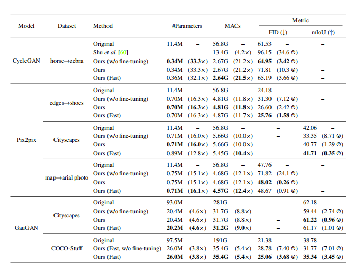   
表1 对GaN压缩的定量评估：我们对城市景观和COCO-Stuff数据集使用mIoU度量（越高越好），对其他数据集使用FID(越低越好。 我们的表示GaN压缩，而我们的(Fast)表示快速GaN压缩，如4.1节所述。 我们的方法可以将最先进的条件GAN压缩9-21×在MACS和5-33×在模型大小，只有较小的性能退化。 对于CycleGAN压缩，我们的通用方法比以前的CycleGAN特定的Co-Evolution方法[60]了很大的优势。
##  管道线 
 我们提出了两条管道来压缩有条件的GaN发生器   
GAN压缩   
 对于每个模型和数据集，我们首先从零开始训练一个MobileNet[27]风格的网络，然后使用该网络作为教师模型来提取一个学生网络。 由蒸馏的学生网络初始化，我们训练一个“一劳永逸”的网络。然后，我们在一定的计算预算下对所有子网络进行评估。 经过评估，我们选择了“一劳永逸”网络中性能最好的子网，并对其进行了微调，以获得最终的压缩模型。详细管道如图4a所示。 表5列出了每个任务的从0移动网络风格的教师和蒸馏学生的大小。 如果没有指定，我们的模型将用这个管道压缩。
 
快速GAN压缩
为了进一步简化和加快压缩过程，由于arXivv3，我们提出了一种改进的管道快速GaN压缩，它可以产生与GaN压缩相似的结果，但具有更简单和更快的管道。在训练阶段，我们不再需要培训一个移动网络[27]风格的教师网络，并运行预蒸馏。 相反，我们直接培训移动网络风格的“一劳永逸”[7]网络从零开始使用原来的完整网络作为教师。在搜索阶段，我们不是对所有子网络进行评估，而是采用进化算法[54]在“一次全部”网络中在一定的计算预算下搜索性能最佳的子网络，并用预先训练的鉴别器对其进行微调，以获得最终的压缩模型。GaN压缩和快速GaN压缩之间的详细差异如图4b所示。使用这个管道，我们可以节省高达70%的训练时间和90%的搜索时间的GAN压缩，如图5所示。   
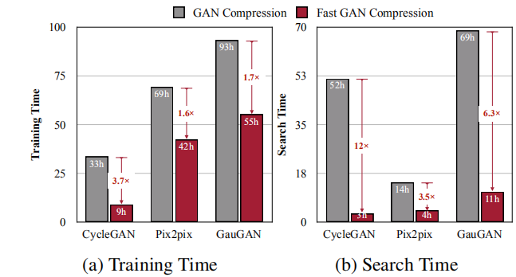   
图5：GAN压缩和快速GAN压缩的训练和搜索时间比较。 快速GAN压缩可节省1.7∼3.7×训练时间和3.5∼12×搜索时间。 CycleGAN，像素2pix和GauGAN模型是在马→斑马，边缘→鞋子和城市景观数据集上测量的。 高根的训练时间是在8个2080Ti GPU上测量的，而其他的都是在一个2080Ti上测量的。由于去除预蒸馏（“一次性”网络更大)和更有效的搜索方法(见附录6.1），快速GaN压缩的搜索空间大于GaN压缩，其性能与GaN压缩相当，如表1所示。 详情请参阅我们的代码。

### 实现细节：
对于CycleGAN和pix2pix模型，我们在所有实验中对生成器和鉴别器使用0.0002的学习速率。 数据集马→斑马、边缘→鞋子、地图和航空照片以及城市景观上的批次大小分别为1、4、1和1。 对于Gaugan模型，我们遵循了原始纸张[52]中的设置，除了批处理大小为16而不是32。 我们发现，我们可以获得一个更好的结果与较小的批次大小。 有关更多实现细节，请参见附录6.1和我们的代码。

## 4.2. 评价指标
该FID评分旨在计算从真实图像和生成图像中提取的特征向量之间的距离，使用InceptionV3[62]网络。该分数测量真实图像和生成图像分布之间的相似性。 较低的分数表明生成的图像质量更好。我们使用一个开源的FID评估代码。 对于配对图像到图像的翻译(像素2pix和Gaugan)，我们计算了翻译后的测试图像到真实测试图像之间的FID。 对于未配对的图像到图像翻译(CycleGAN)，我们计算了翻译测试图像到真实训练测试图像之间的FID。这允许我们使用更多的图像进行稳定的FID评估，就像以前无条件GANS[31]中所做的那样。 当我们使用真实的测试图像而不是真实的训练测试图像时，我们的FID略有增加，当我们使用真实测试图像代替真实训练+测试图像时。
### 语义分割度量
在先前的工作[29,80,52]之后，我们采用语义分割度量来评估CityScape数据集上生成的图像。我们在生成的图像上运行一个语义分割模型，并比较分割模型的性能。 我们选择平均交叉超过联合(MIoU)作为分割度量，我们使用DRN-D-105[74]作为我们的模型给COCO-Stuff的Cityscapes 和 DeepLabV做风格。更高的mIoUs意味着生成的图像看起来更真实，更好地反映输入标签映射。 对于Cityscapes，我们将DRN-D-105的输出语义映射提升到2048×1024，这是真实图像的分辨率。对于COCO-Stuff，我们将生成的图像调整到地面真相图像的分辨率。 请参阅我们的代码以获得更多的评估细节。  
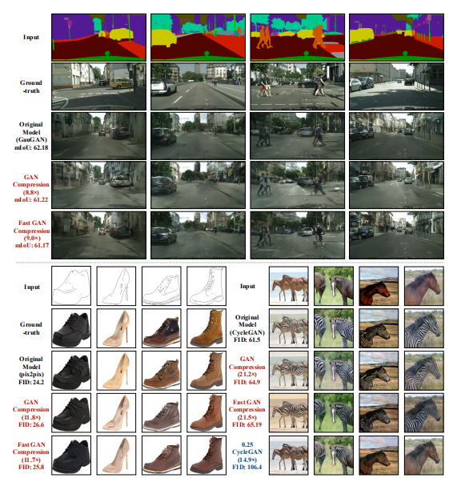  
图6 城市景观、边缘→鞋和马→斑马的定性压缩结果。 我们的方法(GaN压缩和快速GaN压缩)保持了保真度，同时大大减少了计算量。 相反，直接训练一个较小的模型(例如0.25CycleGAN，它将每一层线性缩放到25%的通道)会产生较差的性能。

## 4.3 结果
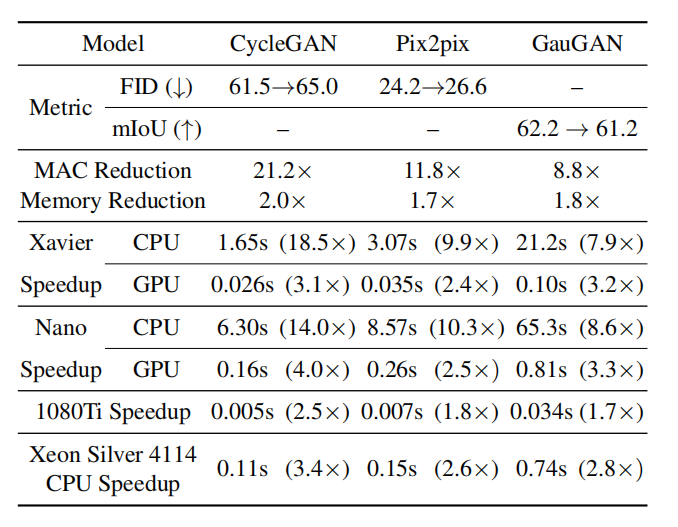   
表2：在NVIDIA JetsonAGXXavier、NVIDIA JetsonNano、1080Ti GPU和Xeon CPU上测量内存减少和延迟加速。 CycleGAN，像素2pix和GauGAN模型是在马→斑马，边缘→鞋子和城市景观数据集训练的。   
### 定量结果 
我们报告了压缩CycleGAN、Pix2pix和GauGAN在表1中的五个数据集的定量结果。 通过使用来自“一劳永逸”网络的性能最好的子网，我们的方法GAN压缩实现了较大的压缩比。它可以将最先进的条件GANs压缩5-21×，并将模型大小减少4-33×，模型性能的仅可忽略不计。具体来说，我们提出的方法显示了循环GaN压缩比以前的Co-Evolution方法[60]的明显优势。 我们可以将CycleGAN发生器的计算减少21.2×，与以前的CycleGAN专用方法相比，这是5×更好的[60]同时实现了更好的FID超过30。
### 性能与计算权衡
除了我们可以较大的压缩比外，我们还验证了我们的方法能够在不同的模型大小下一致地提高性能。 以pix2pix模型为例，我们在图8中绘制了CityScape和Edges→鞋数据集上的性能与计算权衡。   
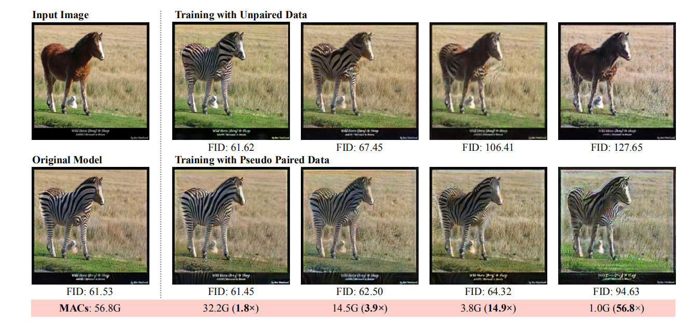   
图7：训练与未配对数据（朴素)和训练与伪配对数据(拟议)之间的比较）。 后者的表现始终优于前者，特别是对于小型车型。 使用所提出的伪对方法，生成器的计算可以压缩14.9×，而不影响保真度。 在这种比较中，这两种方法都不使用自动信道约简和卷积分解。
   
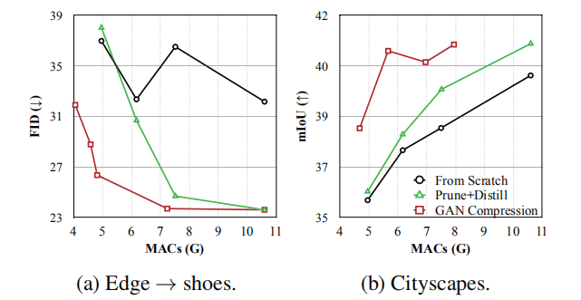  
图8：在城市景观和边缘→鞋子数据集上交换Pix2pix的曲线。 对于较大的模型，修剪蒸馏法的性能优于从头开始的训练，但当模型急剧收缩时，效果很差。 我们的GaN压缩方法可以在不同的尺度上不断提高性能和计算权衡。 （注：这里没懂）

## 未配对转换的优势
我们首先分析了利用教师模型的输出将未配对条件GANs转化为伪配对训练设置的优点。图9a显示了原始未配对训练和我们的伪配对训练之间的性能比较。 当我们的计算预算减少时，由未配对训练方法生成的图像质量急剧下降，而我们的伪配对训练方法保持相对稳定。   
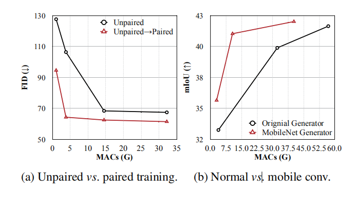   
图9：(A)将未配对训练转化为配对训练（使用教师模型生成的伪对），显著提高了高效模型的性能。 (b)将原ResNet生成器中的卷积分解为信道和深度卷积滤波器，提高了性能和计算权衡。 我们调用我们修改后的MobileNet生成器。未配对训练要求模型足够强，以捕捉源域和目标域之间复杂而模糊的映射。 一旦学会了映射，我们的学生模型就可以直接从教师模型中学习。 此外，学生模型仍然可以从继承的鉴别器中学习关于真实目标图像的额外信息。
### 中间蒸馏和继承教师鉴别器的有效性
略
### 卷积分解的有效性
我们系统地分析了条件GANs对卷积分解变换的敏感性。 我们从CycleGAN中采用基于ResNet的生成器来测试其有效性。我们根据其网络结构将ResNet生成器的结构分为三个部分：DownSample（3个卷积）、ResBlocks（9个剩余块）和Upsample（最后两个解卷）。为了验证每个阶段的灵敏度，我们将每个阶段的所有常规卷积替换为可分离的卷积[27]。性能下降情况见表  4.  
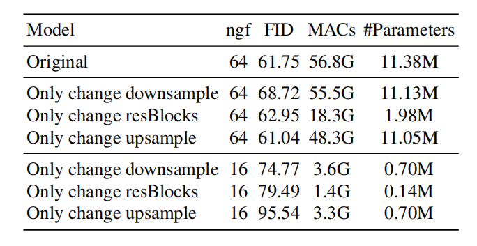   
表4：我们分别在马→斑马数据集上对ResNet生成器的三个部分(Downsample、ResBlock和Upsample)应用卷积分解后的性能进行了报告。 NGF表示生成器过滤器的数量。 计算和模型大小都与ngf2成正比。 我们评估了两个设置ngf=64和ngf=16。 我们观察到，与修改网络的其他部分相比，修改ResBlock块显示出更好的性能和计算权衡。通过测试ngf=64和ngf=16的体系结构，ResBlock修饰的体系结构显示了更好的计算成本和性能权衡。我们进一步探讨了在CityScape数据集上ResBlock修饰架构的计算成本与性能权衡。图。 9b说明，这种Mobilenet风格的体系结构始终比原来的体系结构更有效，它已经降低了大约一半的计算成本。
# 5. 总结
在本工作中，我们提出了一种通用压缩框架，用于降低条件GAN中生成器的计算成本和模型大小。 我们使用知识蒸馏和神经结构搜索来减轻训练的不稳定性，并提高模型的效率。 广泛的实验表明，我们的方法可以压缩几个条件GAN模型，同时保持视觉质量。 未来的工作包括减少模型的延迟和生成视频模型[66,64]的高效体系结构。

## 感谢
我们感谢NSF职业奖#194349，麻省理工学院-IBM沃森人工智能实验室，Adobe，英特尔，三星和AWS机器学习研究奖支持这项研究。 我们感谢徐宁、刘庄、张理查和安东尼奥·托拉尔巴的有益评论。 我们感谢NVIDIA捐赠了JetsonAGXXavier，运行我们的演示