# 基于自然图片流形的生成式的视觉操纵

本文总结简述：
隐向量线性插值做人脸转移
阅读本文的一些准备概念：
1、这篇文章里面的流形可能代表多种概念，有的地方指的是整个流形结构（约等于GAN的G），有的指的是流形上的一个样本点，有的地方指的是降维之后的低维表示，有的地方指的是没有降维的高维表示。

# 引言
真实图片操纵是具有挑战性的任务，因为需要根据用户的控制方式来更改图片外观，同时保证图片的真实性。除非用户拥有相当强的艺术能力，编辑图片是很容易使自然图片的流形衰退的。本文中，我们提出使用GAN从自然数据中直接学习自然图片流形的方法。然后我们定义了一类图片编辑的操作，然后约束它们的输出（注：指某种编辑的结果）总是依赖于学到的流形。这个模型能够针对所有编辑自动的调整输出，让输出尽可能的真实。我们所有的操作被表示为受约束优化的形式，并且能接近实时的使用。我们在真实照片形状和颜色操纵的任务上评价我们的算法。这种方法可以更广泛的用于改变一张图片，让其看起来像另一张，以及根据用户的涂鸦从0开始生成图片意象。

# 1、引言
**今天，视觉交流依然是可悲的单向交流（注：就是只能接受视觉的东西，不能表达视觉的东西），我们所有人能通过视觉的形式接收信息（比如图片，绘画，雕塑），但是只有很少的被选中的具有天赋的人能够有效的通过视觉表达他们自己。** 这种不平衡甚至表现在最平凡的任务中。**考虑一个在线购物的场景**：用户购物是看见一双很适合她的鞋子，但是她想让那双鞋子鞋子更高一点，或者宽一点，或者有不同的颜色。她如何和购物网站表达它的偏好呢？如果这个用户也是一个艺术家，她几分钟之类可以使用图片编辑程序将鞋子转换成她想要的样子，然后使用图片搜索的方式来找到相似的商品。但是，对于我们绝大多数来说，即使这样简单的使用PS进行图片操纵也会带来无法克服的困难。一个原因是在图片编辑中缺乏安全轮，任何非完美的图片编辑会使得图片立即变得失真。换个方式，经典的视觉操纵范式并不能阻止用户操纵图形时产生流行衰退。  

对自然图片的流行进行理解并建模，是长期存在的开放研究问题。但是在过去两年，这个领域取得了快速的进步，GAN的发展极大的推进了这个领域。特别的。最近的若干文章，展示了从真实图片流形中抽取随机图像得到的结果在视觉上是令人印象深刻(注：这句话没看懂）。但是，当前两个原因阻碍了这些进展在实际应用中发挥作用。首先，生成的图片，生成的图片虽然好，但是还是不够真实（并且，想提高他们的分辨率还是有问题的），第二，这些生成模型是设置为从抽样的隐向量中生成图片，典型的如随机抽样。所以，这些方法，**不能按照用户可控制的方法来创建和编辑视觉内容。**  

本文中，我们使用生成对抗网络来学习图片的流行，但是我们不利用它来生成图片。替代的， 我们使用它作为多种图片编辑操作的输出的约束，使得结果始终依赖于学习到的流形。**这个想法，使得我们能够重新阐述若干中编辑操作（尤其是颜色和形状操纵），用一种自然和数据驱动的方式。（重点：数据驱动的方法，就是和自己想的信息论的方式差不多，那现在也可以叫做信息驱动）** 这个模型会自动调整输出，使得输出尽可能的保证真实。   

**
我们展示基于我们的系统的三种应用
1、基于生成模型，操纵已经存在的图片改变它的外观（形状和颜色）  
2、生成转换 将一张图片转换得像另一张图片  
3、基于用户涂鸦和扭曲UI产生的草图，生成新的图片  
**
所有操作都直接使用梯度下降执行优化，这可以形成简单和快速的图片编辑工具。我们希望这个工作可以启发更多的数据驱动的生成式图片编辑，因此在我们的网站发布了我们的代码和数据。http://people.csail.mit.edu/junyanz/projects/gvm/

# 2、前人工作
## 图像编辑和用户交互：
图像编辑是在计算机图像学里面一个已经建立良好的领域，通过用户对输入的图像做操纵来实现一个确定的目标。例如基础的编辑包括改变颜色属性，无论全局还是局部。更高级的编辑方法，比如图像扭曲或者结构化图像编辑，根据用户的编辑智能化的重新洗牌图像中的像素。（指的是比如增加清晰度等？）虽然在专家的手上取得了令人印象深刻的结果，但是当这些类型的方法失败时，他们会产生看起来不真实的结果。常见的伪影报考不真实的颜色，夸张的拉伸，明显的重复以及过度平滑。这是因为它们依赖于低层次的原则（比如颜色、梯度、块）（注：指的是低层次的处理方法，信息，特征？，而不是神经网络和CNN这类智能处理方法和高层特征），不能捕获高层次的信息。  

## 图像变种：  
有很多种技术来在两张图片之间产生平滑的视觉变换。传统的变种方式是，将强度混合与需要和密度关联的几何扭曲结合起来。在再生的变种中，输出序列是从源图片中取样的小的块中重新生成的。因此，每个帧被约束来使其看起来同时像两个来源的图片。Exploring Photobios 探索摄影 技术代表了另一种图片间进行转移的方法，它基于成对图片之间的距离，在很大的图片集合中找到图片之间的最短路径。这里，我们拓展了这个想法，然后生成变种能够同时接近两个图片来源并且保持或者接近真实图片的流形。

## 自然图片统计：  
本地图片统计的生成式模型长期以来被用作诸如图片去噪，去雾过程中的图片重建的先验。一个通常的策略是学习本地滤波或者块模型。例如主要组件，独立组件，高斯混合或者小波基。一些方法尝试通过密集的块覆盖获取整张图片的似然，尽管由于基础的构建块仍然太小不能抓取整张图片的结构和长距离的关系。zhu等最近的研究显示判别式的深度神经网络会学到更强的先验，它既能够抓取到低水平的统计信息，也能狗抓取到高阶语义信息和颜色平衡线索。这种深度先验能够直接用于有限的编辑操作(例如 合成)。 然而，它并不能扩展到本工作中涉及到的编辑操作的多样性。
（注：自然图像实际上相对数量非常少，如果我们考虑给定大小的图像存在多少种可能性，仅仅是64x64大小（最大像素值255）的图像就有大约有 [公式] 种可能性，其中包括绝大多数噪声图像，而自然图像只占据整个图像空间（image space）的极小一部分，因此被类比为“啤酒泡沫”[2]。由于自然图像在整个图像空间中只占据一小部分，因此它存在自己独特的结构和统计，这使得研究自然图像统计变得很有意义。自然图像统计有很多，包括对图像频域信息，深度信息，颜色信息，梯度信息，以及空间域信息的统计。）  

## 神经生成模型：
当前已经做了大量基于神经网络的图像生成工作。早期的概率模型包括首先玻尔兹曼机（例如 [19] 、深度变分，自动编码，以及最近的 随机神经网络 和确定性网络) GAN，学习一个生成式的网络，在最小最大化优化目标下带有第二部分的判别对抗网络。判别器尝试区分生成的样本和真实样本。生成器尝试通过生成看上去高度真实的图片来骗过判别器。不行的是，实践中，GAN不能产生稳定的训练目标，所以目前若干种修改被提出来，比如多尺度生成。然后上面这些模型尝试从随机向量中生成图像，他们不提供工具来在用户直观的控制下改变生成过程。本文中，我们通过学习一个能被 轻易的 很少的 用户直观的 编辑控制的生成式模型改进这种情况。    
（其它方法 GAN GAN改进 our）  

# 3、学习自然图像的流形

让我们假设所有自然图片处于一个理想的低维流形M上，并且距离函数S(X1,X2),它测量了这两张图片感觉上的相似度。直接建模这个你想的流形M是十分具有挑战性的，**因为它涉及到在一个高度结构化的且具有复杂到百万维度的空间中训练生成式的模型，（注：图片数据的特征，高度结构化，就是卷积的局部相关性大这些）** 跟随最近的深度生成网络的在生成具有自然读图片任务上的成功，我们使用GAN从大规模图像数据集中学习模型，用它来估计图像流形。除了高质量的结果，GAN对我们的任务还有一些其他有用的特性，我们将在接下来讨论。

## GAN：
GAN介绍，略
当在某一类确定的图片上训练师，GAN工作良好。

我们通过GAN获取图像到流行M。 我们正式的定义 M = {G(z)|z ∈ Z} ，并把它作为理想的M的近似，我们还用隐变量的欧几里得距离作为两张生成的图片的距离函数的近似。S(G(z1), G(z2)) ≈ ||z_1 1 - z_2||^2.

## GAN 作为流形近似：
我们使用GAN来近似一个理想的流形出于以下两个原因：第一，它产生了高质量的样本，如图2中（a）显示的样本。尽管有时缺乏视觉上的细节，模型能够合成具有吸引力的样本，它在全局结构上接近真实。**第二，隐变量的欧几里得距离通常对应了感知上有意义的视觉相似度（如图2中的（b））。（还是很神奇的，隐变量的欧几里得距离就对应上了视觉上的相似程度）**因此，我们认为，GAN是一种建模图片流形的有力的生成式模型。
 
## 遍历流形：
给定两个流行，G(z_0),G(z_n),我们想要寻找N+1张图片 G(z0), G(z1), . . . G(zN ),它们之间具有平滑的过度。这经常通过构造一个图片图来完成，图片作为节点，图片之间的距离函数作为边，然后计算起始图片和结束图片之间的最短距离。在我们的实验中，我们最小化距离和∑_t=0^N-1 S(G(z_t), G(z_t+1))，其中S是距离函数，这里我们使用S(G(z1), G(z2)) ≈ ||z_1 1 - z_2||^2作为距离函数，所以一个简单的线性插值 [(1-t/N)*z_0 + t/N * z_N]_t=0^N. 图二中的（C)显示了一个平滑并且有意义的图片序列，它是通过在两个隐变量之间的点做插值生成的。现在我们使用这个自然图片流形的近似来进行真实图片的编辑。

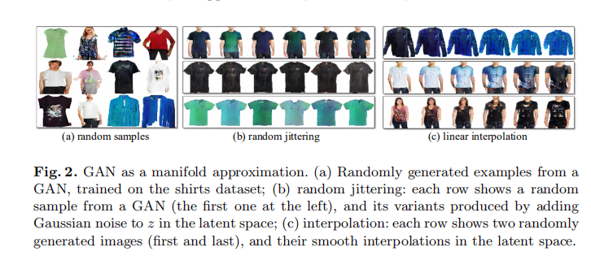  
图2 GAN作为流形近似。 (a)图 从GAN随机生成样本，在T恤数据集上面训练 (b)图 随机抖动，每一行显示了GAN的一个随机的样本（左边第一个），它的变体通过在隐变量z上增加高斯噪声生成 (c)图插值，每行显示了两个随机生成的图片（第一和最后），以及它们在隐变量空间的平滑插值。

4 应用
图1 展示了我们方法的概述。规定一个真实图像，我们首先通过找到GAN对于原始图像的最接近的隐变量特征向量z，将它映射到们的近似上。然后，我们提出一个实时的方法，能够逐步和平滑的的更新隐向量z，然后用它生成期望的满足用户编辑的图片（比如，涂永或者扭曲，更多细节在第5部分），并且这张图片接近真实图片的流形。不幸的是，在这个转换中，生成模型经常丢失输入图像的重要的低水平细节。**因此，我们提出了一个密集对应方法，它从应用到生成模型的编辑中估计每个像素的颜色和形状改变。然后我们使用编辑感知插值技术转换这些改变到原始图像，产生最终的结果。（注：重要的点，通用模型之外遇到问题的解决）**

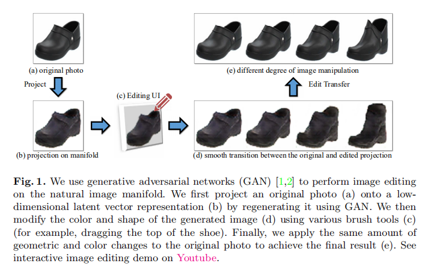
我们使用GAN来执行在自然图片流形上的图片编辑。首先，我们将原始图片映射到低维的隐向量表示上（如图（b）），它是通过GAN再生成的。然后而我们通过多种画笔工具（C）（例如，拖动鞋子的顶部）改变生成的图片（d）的颜色和形状。最终，我们应用同样的数量的几何和颜色改变到原始图片上来实现最终的结果(e)（注：这里是什么意思）。可以在YouTube上看我们的交互式编辑示例。https://www.youtube.com/watch?v=9c4z6YsBGQ0

## 4.1 将图片映射到流形 （注：基本上就是找到隐变量z）
定义一个真实照片$x^R$放置于理想的图片流形M中。但是对于一个近似的流形$M^*$，我们的目标是找到一个生成的图像$x^*∈M^*$, $x^*$在某种距离度量$L(x_1,x_2)$下接近$x^R$， 公式就是  
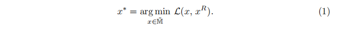 
对于GAN得出的流形，我们可以重新表示上面的公式如下：  
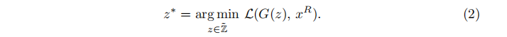
我们的目标是使用GAN在最小化重构误差的情况下重构原始的照片$x^R$，其中$L(x_1,x_2)=||C(x_1)-C(x_2)||^2$是在某种可微的特征空间C上（注：这个应该是指类似于CNN抽取特征这种函数，C(x)输出的就是特征图了，这个特征空间=函数，即可微函数）。 如果C(x) = x, 那么重构误差就是简单的像素级的欧几里得误差。前人的工作【5，25】提出使用深度神经网络激活可以重构出感知上有意义的细节。我们发现原始像素和在ImageNet上预训练的卷积特征的加权组合执行效果最好。  
### 通过优化进行映射
因为特征抽取器C和生成器G都是可微的，我们可以直接利用L-BFGS-B [28]优化上面的目标。但是，C(G(z))的级联是的问题高度非凸，结果是，重构质量严重依赖于z的良好初始化，我们可以从多种随机初始化开始，然后输出花费最小的结果。但是，要得到稳定的重构所需要的随机初始化的数量的数量太大了（操作100），这使得实时处理不可能。我们直接训练了一个最小化的等式2来替代。（注：通用模型和主体框架可能有把握，能做起来，可是实践过程中遇到的这种边缘的细节的问题如何能解决，可能是真正考验实力的地方）。
### 通过前馈网络进行映射
我们训练了一个前馈的神经网络P(x:θ_p)直接预测x的隐变量z。预测模型P的训练目标如下   
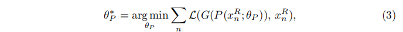    
这里x^r_n表示数据集中的第n张图片。模型P的架构相当于GAN中的判别器D，只是最后的输出数量不同。（注：上面这个就是cycle GAN里面将图片变到隐向量x的那一部分，相当于一个编码器，CyCle是2017年出的，这个是2016）目标3让人联想到自动编码器流水线，带有编码器P和解码器G。但是，解码器G会在整个训练过程中进行调整。但是优化问题2和学习目标3是相同的，但是基于学习的方法通常效果更好并且不会陷入局部最优。我们将这种行为归因于映射问题的规律性以及网络P的容量限制。映射相似的图片会共享相似的网络参数，并且产生类似的结果，在一些情况下，一个图片的损失会提供许多其它外观上类似的图片的信息。但是，学习版本也不总是完美的，通常可以通过少量额外的优化改善它们。
### 一种混合方法：
混合方法利用上面两种方法的优势，给定一个真实的图片$x^R$,我们首先预测$P(x^R;θ_p)$然后使用它作为优化目标即等式（2）的的初始值。所以，学习到预测模型作为了一个非凸优化问题的快速的之下而上的初始化方法。图片3 展示了这3中方法的比较。可以从第7.4节看更多的定量评估。   
 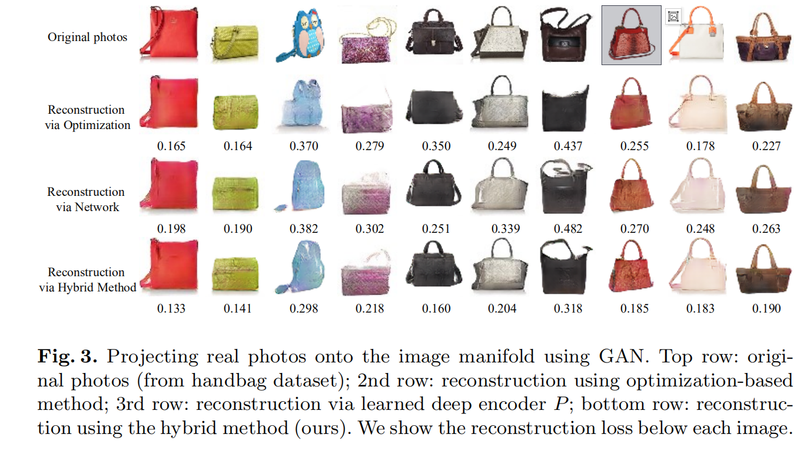
使用GAN将真实图片映射到图像流形上。第一行，原始图像，第二行，使用基于优化的方法重构得到的图像，第三行，使用深度编码器P重构得到的图像，第四行，结合两个方法得到的图像，每张图片下面的数字是重构损失L。 （注：前面说的第二种方法的编码器P和CycleGAN里面没的差不多，然后这个图像是成对的，这里面还可以利用成对信息，也就是第一种方法，所以作者还是很全面和明智的，用到了这个信息）

## 4.2 操纵隐变量
按照前面所说的映射方法将$x^R_0$映射到流形M*中得到$x_0 = G(z_0)$，我们现在可以开始修改图像的流形了。我们更新初始化映射$x_0$使得他匹配用户的意图的同时处于流形中，接近原始的图片$x_0$。  

 每个编辑操作都被表示为输出图像x的局部部分上的约束$f_g(X)=v_g$.编辑操作g包含颜色，形状，以及扭曲余数，更多的描述在5.1节中。给定一个初始的映射$x_0$，我们需要找到一张新的图片$x∈M$接近$x_0$并且尽量满足如下的多种约束：   
 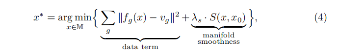   
 其中date term 数据项测量约束偏差，smoothness term 平滑想强制在流形上移动较小的长度，所以图片的内容不会改变太多。在我们的实验中，设置λ_s = 5.
 上面的式子在近似的GAN流形$M^*$上简化为如下形式：   
 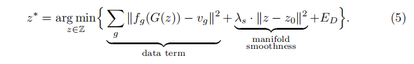    
 最后的$E_D=λ_D * log(1-D(G(z)))$ 可选的，用来让输出产生视觉上的真实性，它就是GAN中的D。这个约束更进一步的将图像的流形推向真实图片，能轻微增加结果的视觉质量。默认的，我们关掉这个部分增加帧率。

### 梯度下降更新
对于（5）式中的大部分约束他们都是非凸的。我们使用梯度下降来解决它，这使得我们可以为用户提供实时的反馈交互。因此，目标5也能实时的处理。为了计算上的原因，我们在改变约束$v_g$后仅仅执行少量的梯度下降更新。每次更新用时50-100ms，这确保了交互反馈。图片4 显示了更新z的一个样例。  
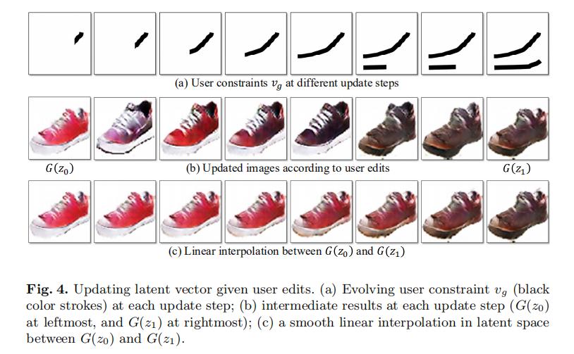  
给定用户编辑更新隐向量（a) 在每个更新步骤中的用户约束$V_g$演化（图中的黑色笔触）(b) 每次更新步骤的得到的中间结果（G（z0）最左边，G（z1）最右边）；（c） 在G（z0）和G（z1）隐空间之间的平滑的插值。
      
给定一个初始的红色鞋子，用户使用黑色笔触逐渐地在鞋子图片上涂鸦（比如，指定一个黑色的区域）。然后我们的更新方法通过增加原来越多的用户约束平滑的改变图片的外观。一旦最终的结果$G（Z1）$计算出来，用户可以看到初始点z0和z1之间的插值序列，并且可以选择任意一个中间的结果作为新的起点。请在我们的补充视频里面查看更多的细节。  
尽管这个编辑框架允许我们在近似的图像流形M*上更改任意生成的图像，但是它不能直接提供给我们一种方式去更改原始的高分辨率图像$x0^R$.（注：这里的意思是改变Z让GAN生成的图像还不是最后的图像，最后的图像还需要根据原图来改然后得到）。下一节中，我们展示了如何在近似流形上的编辑怎么迁移到原始图像上。

## 4.3  编辑迁移
给定原始照片$x0^R$（比如黑色的鞋子）以及它在流形G（z0）上的映射，我们的方法得到的用户修改G（z1）（比如 生成的红色的鞋子）。生成的图像G（z1）获取到我们想要的出错了的改变，尽管质量相比原始图像是退化的。
我们可以替代的改变原始照片生成更加具有照片真实度的结果X1^R，显示生成图像的变化。一个方式是直接迁移像素变化，（比如$x1^R = x0^R + (G(z1)) - G(z0))$. 我们尝试了这种方法，但是它引入了新的伪影由于没有对齐两张图片。为了解决这个问题，我们发展了一种密集对应算法 （dense correspondence）来估计编辑操作引入的几何上和颜色上的差异。  
特别的，给定两张生成的图像G(z0)和G(z1),我们可以生成任意数量的中间帧
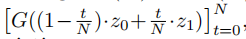 ，其中连续帧表现出轻微的视觉变化。

### 运动+颜色流算法
然后我们通过推广传统光流算法中的亮度恒定假设来估计颜色和几何变化。（注：KL光流算法三个基本假设的第一个，亮度恒定：一个像素点随着时间的变化，其亮度值（像素灰度值）是恒定不变的。这是光流法的基本设定。所有光流法都必须满足。）这会导出下面这样的运动+颜色流目标：
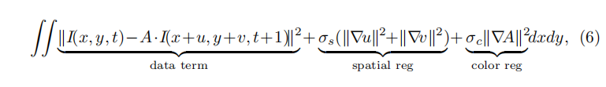  
图5 使用动作+颜色流的编辑迁移。右上角是在左边的鞋子上G(z0)跟随用户的编辑在隐空间（注：应该是M*吧）生成了了插值序列。右中是我们在G（z)相邻图片上计算的动作和颜色流。这些流连接起来然后作为验证，可以被用在G(z0)上来获得一个G(z)（左中）的接近的重建。左下角一行显示了如何使用同样的连接的流将编辑迁移到原始鞋子图片上，然后获得了编辑好的鞋子序列。

其中I(x,y,t)代表了生成的图像 G((1 - t/N ) · z0 + t/N · z1)在(x,y)处像素的颜色值$(r，g，b，1)^T$. (u,v) 是随着时间变化的流向量。A是3*4的颜色仿射矩阵。数据项放宽了亮度恒定假设，通过引入一个本地的颜色仿射转换模型A，而空间和颜色规范化项鼓励了运动和颜色的平滑改变。我们通过使用传统光流算法估计流（u,v)来求解这个目标。然后通过解一个线性等式系统来计算颜色改变A。我们迭代3次。产生8个中间结果帧。

我们估计相邻帧之间的改变，然后逐帧地链接这些改变来获得z0-z1之间任意两帧之间的长距离的改变。图5显示了一个我们在初始的映射G(z0)自哦吼增加流形成的扭曲序列

### 编辑迁移到原始照片上：
当估计了生成的图片序列的颜色和形状变化之后，我们将它们应用到原始的照片上，产生有趣的真实度的图片迁移序列，如图5中所示。因为流和颜色领域的分辨率先知道生成图片的分辨率上，我们使用一个受引导的图片滤波器进行上采样。

# 5 用户接口
用户接口由显示当前编辑图片的主窗口，一个列表显示所有的候选结果的缩略图，一个滑块用来浏览从原始图像到生成图像的所有的插值序列。可以看我们的补充视频查看详情。

候选结果：
给定用户的引导衍生出来的目标（等式5），我们通过将z初始化为z0的随机扰动来生成不同的结果。我们生成了64个样例，选择最好的9个结果，排名一居室目标代价。
相关编辑：
（注：应该可以说成是范围选取，不是只能选唯一结果这个意思，上一条候选结果也是这个意思，就是说一个比较重要的点，**我们的智能编辑要给用户多种选择，只给一个结果可能不是用户想要的**）
完成一次编辑操作以后，他可以拖动滑块查看从原始图片到最终操纵结果之间的所有的中间结果。我们称这个位相关编辑，它使得用户可以通过一次编辑获得更多可能的替代结果。类似于相关属性[34], 一个用户可以通过类似于让手提包的手柄更红，或者让鞋跟更高这样的模糊概念来表达想法，而不用十分明确的说明。(注：就是说视觉上的东西可能不是那么精确的，而是一个范围中的某个点，最终结果可能不是用户想要的，用户可以查看一个范围内的图像，不采用这种方式的话用户编辑效果不好，可能每次都得重新画一次)

## 5.1 编辑约束
我们的系统按照不同的方面提供了3种编辑约束：颜色，草图以及扭曲。我们所有的约束都通过笔刷表达。下面，我们解释每种画笔的用法和对应的约束。  

颜色画笔：颜色画笔允许用户改变指定区域的颜色。用户从画板选择一种颜色并且可以调整画笔粗细。对于每个被画笔标记的像素，我们约束像素p颜色$f_g(I) = I_p = v_g$约束为$v_g$.
草图画笔：草图画笔允许用户简略画出形状或者精细细节的轮廓，我们约束$f_g = HOG(I)_p $为在图像上某个确定位置的一个可微分的HOG描述子（注：hog是一种特征描述子）来接近用户的草图（即$v_g = Hog(stroke)_p$).我们选择了HOG特征提取器，因为它是绑定的，这使得它对绘制不准确的草图具有鲁棒性
扭曲画笔：
扭曲画笔允许用户更显式的改变形状。用户首先选择一个本地区域（一个可调整大小的窗口），然后拖动它到另一个位置。然后我们在移走像素的位置放置颜色和草图约束，鼓励目标块模拟拖走区域的外观。
图片8显示了我们使用颜色和草图画笔进行交互式生成的一样例子。图片1展示了我们使用扭曲画笔拉高鞋子顶部的结果。图片6显示了少量更多的例子。

# 6 实现细节
网络结构：我们使用了DCGAN同样的结构。DCGAN 主要建立在多个卷积，反卷积和relu层上， 并且通过批规范化优化了最大最小训练过程。我们给定100维的随机向量，训练G生成64 * 64 *3的图像。注意我们的方法也能使用其它生成模型（比如变分自编码器 VAE 或者**这个领域后续的改进 （注：强啊，后面的都想到了**）来拟合自然图像的流形。

计算时间：
在我们的Titan X GPU上，每次更新向量Z花费50-100 毫秒，这就可以进行实时的编辑和生成。一旦编辑完成，我们的方法花费5-10秒的编辑迁移时间来产生高分辨率的最终结果。

# 7 结果
我们首先介绍我们的数据集的通过，然后展示3个主要的应用，真实图片操纵，生成式的图片转化，一个使用我们的画笔工具，从草图生成照片。最后，我们评估我们的图片重构方法，并执行人类感觉研究来了解生成结果的真实性。请参考附录材料来获取更多的结果和比较。

## 数据集： 
我们的实验使用了多个来源的多个照片集。鞋子数据集[37],包含来自Zappos.com的50K的鞋子的集合（鞋子大致居中，但不太对齐，大致朝左，正面到侧面视角）；来自LSUN挑战[38]的“教会户外”数据集(126K图像)；来自MIT Places数据集[39]的“户外自然风景”图像(150K)；以及从亚马逊下载的两个基于查询的产品集合，包括“手袋”(138K)和“衬衫”(137K)。 下载的手提包和衬衫大致居中，但没有进一步的对齐。

## 7.1 图像操纵
我们的主要应用是使用5.1节描述的画笔交互进行具有照片级真实度的图像操纵。请从图片6中查看例子，其中左边显示了画笔编辑（虚线表示草图，颜色草图表示颜色，红框和箭头表示扭曲）可以从附录的视频查看更加具有交互性的操纵示例。
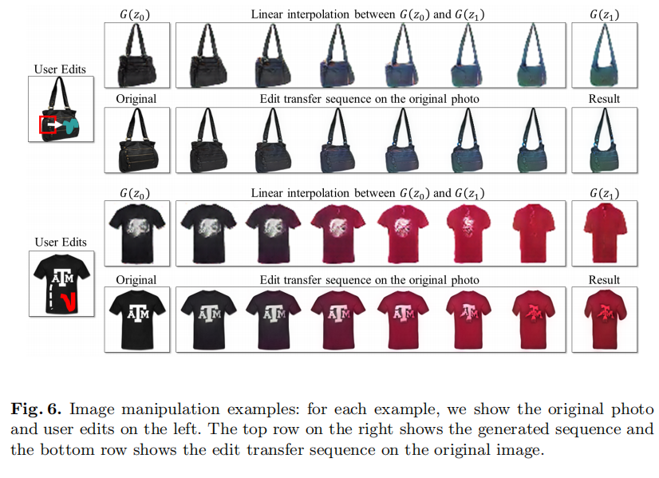  

## 7.2  生成式图片转化
编辑过程的一个有趣的结果是中间生成图片序列可以一类新的图片变种。我们称它为生成式转化“generative transformation”。我们使用这种序列自动地将一张图片的颜色和形状转变成另一张，不需要任何的用户编辑。这种操作可以通过将动作+颜色流施加到原图的任意一张上面即可。图7展示了少量生成式转化例子。  
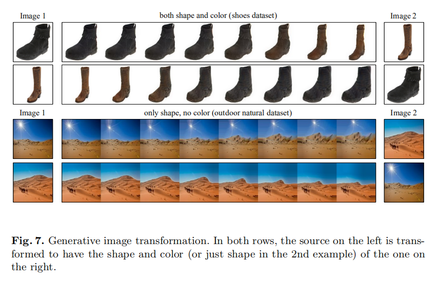  
生成式图像转化。

## 7.3 交互式图像生成
我们方法的另一个副产品是，如果没有设置起始图像，我们仅仅拥有的是用户的画笔线条，本方法可以生成最满足用户约束的图像。这个在数据集勘测和浏览上是有用的。和以前的草图到图像检索方法[41]或者AverageExplorer [42]不同的是由于潜在的矛盾的用户约束，结果看起来可能与任何数据集中的单一图像或者这类图像的平均值非常不同，更多的是真实的混合图像。贡多例子可以看图8.
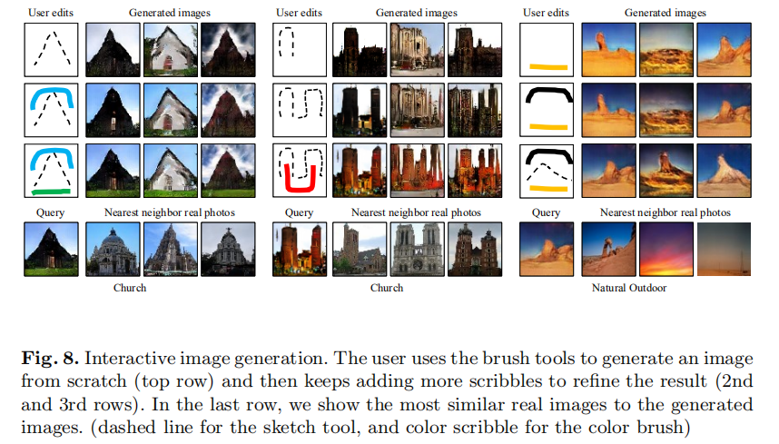
交互式图像生成。用户使用画笔工具从草图中生成图像，最上面一行，然后可以增加更多的草图是结果更加精细，第二，第三行。最后一行，我们现实了最接近真实生成图像的真实图像。  

## 7.4 评价
图像重构评价。我们评价了3个图像重构方法，如4.1节所述：基于最优化的，基于网络的，我们的混合式的组合了前面两种的方法。我们对每个类别，在500张测试图片进行测试，然后使用等式一定义的重构错误L（x，x^R)进行评估。表格1显示了3中方法的在5个不同数据集中的平均重构错误。我们可以看到机遇最优化和基于神经网络的结果类似，两者的组合产生了更好的效果。图3可以看到定性的比较。在附加材料中我们包含了PSNR结果。  
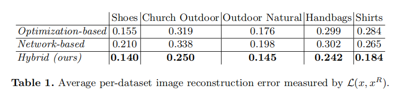  
特定类型模型：目前为止，我们在特定类别的图像上训练了生成式的模型，作为一个比较，我们将3个数据集放到一起训练了交叉类的模型（即卸载，手提包，T恤），观察到模型相对特定类型模型得到了更糟糕的重构错误。我们也尝试使用指定类型的模型重构不同类别的图像。平均交叉类别重构错误更差。鞋子模型重构鞋子是1.40 如果重构手提包是 0.398 如果是T恤是0.451.但是，我们期望一个在多个类别（比如 1000类）上训练的模型能够更好的泛化到新对象上。（注：就是指没有过的的图像吧）

感觉上的研究：我们自行了一个小的感觉上的研究来比较四种类型图片的照片真实度。真实图像，GAN生成的样本，我们的方法（仅仅是形状），我们的方法（形状+颜色）。我们收集了400张图像的20中注释，询问土耳其的亚马逊机械工人，图像是否真实。真实照片：91.5%，DCGAN：14.3%，我们的（形状+颜色）：25.9%,我们的(仅仅形状)：48.7%。DCGAN单独产生图像真实度更低，但是组合我们的编辑迁移之后，真实性显著提升了。

# 8 讨论和局限
我们提出图像编辑的一种步骤，直接约束图像保持真实图像的流形。我们使用先进的DCCGAN（注 2016年）来估计流形。我们展示了如何让交互式的编辑生成图像，然后将结果迁移到原始图像上。因此，生成图像的质量（低分辨率，丢失纹理和细节）以及DCGAN可以应用到的数据的类型（在结构化的数据集比如产生图片上工作得好，但是在跟一般的意象上面差），限制了我们的这种编辑方法能够走多远。但是，我们的方法能没有限定具体的生成模型，可以随着这个领域的进步而改进。我们当前的编辑画笔工具允许粗略的改变颜色和形状但是不能改变纹理和更复杂的结构。我们将这些留给将来的工作。

感谢： 这个工作部分的由以下单位机构支持：Adobe， ebay，intel 以及NVIDIA的硬件授予。朱俊彦收到Facebook研究生奖学金的支持。

