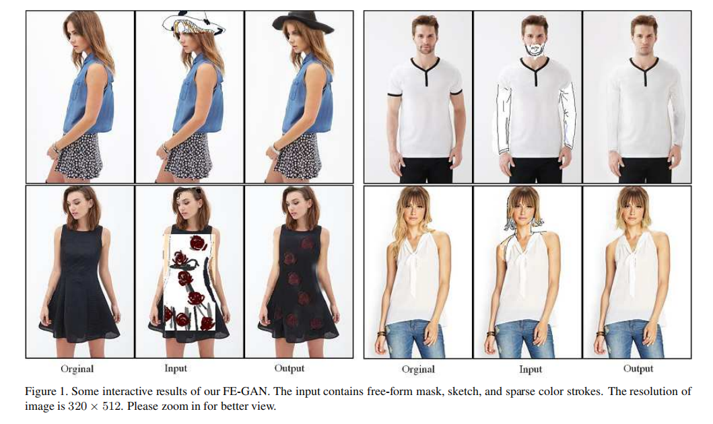

名词解释：
合成掩模 指人的掩模-扣掉的掩模 = (1 - 扣掉掩模) * 前景人的掩模
## 摘要
交互式的时尚图片编辑，让我们的用户使用草图和颜色笔触来编辑图片，是一个有趣的研究问题并且具有很大的应用价值。现有的工作常常把它当成一个通用的 图像修补任务并且没有充分利用时尚图片中的语义结构信息。并且，他们直接利用卷积网络和规范化层来重建完整的图片，这往往会洗掉图片中的草图和颜色信息。本文中，我们提出了一种新颖的时尚编辑生成对抗网络（FE-GAN）, 它能够支持使用自有的草图线条和颜色笔触来编辑时尚图片。 FE-GAN由两个模块组成，1）一个自由形式的解析网络， a free-form parsing network that learns to control the human parsing generation by manipulating sketch and color; 不知道怎么翻译，应该就是操纵人脸草图和颜色，控制人类的解析生成
2）一个解析感知修复网络，利用人类的解析图的语义引导，来渲染纹理细节。

一个新的注意力规范层更进一步的用在修复网络的多个尺寸的解码器上面，用来增强合成图片的质量。更多的在高分辨率上的图像数据集上的实验显示，我们提出的PE——GAN显著的比当前的最现金的时尚图片操纵方法要好

## 1 引言

时尚图片操纵目的是通过用户提供的草图和颜色笔触生成高分辨率的真实的时尚图片。它在多种应用上面都具有巨大的潜在价值。例如，时尚设计师可以很容易的用不同的风格编辑服装。电影制作人可以通过控制脸部表情，发型，身体形态来创建角色。本文中，我们提出了PE-GAN，一个时尚图片操纵网络能够支持灵活和高效的用户交互。例如简单的草图和少量的颜色笔触。图片1中显示了PE-GAN的一些交互式操纵的结构，表明它可以生成真实的令人相信的带有细节的图片。    

图1 我们的FE-GAN的一些交互结果。 输入包含自由形式的掩码、草图和稀疏的颜色笔画。 图像分辨率为320×512。 请放大以获得更好的视图。  

通常，图片操纵在神经网络技术的显著进步下取得了很大的进展。但是，以前的方法把它当做一个端到端的图片完成问题没有灵活的用户交互。这些方法通常没有明显的估计然后利用图片的语义结构信息。进一步的，他们过度的使用了卷积层和批规范化，这在输入的传播过程中会显著的洗掉草图和颜色信息。结果，生成的图片通常包含不真实的人工痕迹和不期望的纹理。  

为了解决这个问题，我们提出了一个新颖的PE-GAN，它包含形式自由的解析网络，和解析感知修复网络，并且具有多尺寸的注意力规范化层。不同于以前的方法，我们不是一步就直接的生成完整的图片。替代的，我们首先生成的一个从不完整的输入中生成解析图。然后在解析图中包含的布局中渲染纹理细节。（我：不完整输入-生成解析图-生成最终图）。特别的，在训练阶段，给出一个从图片中获取的不完整的解析图，以及草图，稀疏的颜色笔触，一个二进制的掩模，以及从高斯分布中获得的噪声采样，自由形式的解析网络在草图和颜色的指导下学习构造出完整的人类解析图。然后解析感知修复网络获取到生成的解析图，不完整的图片，然后组合编码器输入的合成掩模，然后合成最终的编辑过的图片。**为了更好的获取草图和颜色信息，我们设计了注意力规范化层，能够学习注意图然后选择更多有效的基于草图和颜色条件下的特征 我：这句话是重点哦**注意力规范化层在修复网络的解码器的多个尺度中插入。而且，我们为修复网络开发了一个背景感知部分卷积编码器，它只基于背景中的有效像素，为了从图片中获取更多精确和有效的特征。**我，注意这句话，获取特征的精度性，也是一个课题应该，我们获取了特征，这个特征的精确度怎样。譬如一个近视眼带上眼镜和没带眼镜看到远处的一条狗的区别**

我们在我们新收集的时尚数据集中进行了实现，数据集名为FashionE，并且在两个有挑战的数据集，DeepFashion和MPV上。结果显示，组合多尺寸的注意力规范化层以及自由形式的解析网络帮助我们的PE-GAN显著的其它先进的图片操纵方法，包括定量和定性的。主要的贡献总结如下。
- 我们提出了一个自由形式的解析网络支持用户通过草图和颜色更简单的控制解析生成
- 发展了新的注意力规范化技术，能够基于学习到的图更有效的提取特征
- 我们设计了带有背景感知部分卷积层和多尺寸注意力标准和层的解析感知修复网络，可以生成更高清晰度的真实的编辑过的时尚图片

## 2 相关工作
图片操纵  
使用GAN的图片操纵是计算机视觉中一个流行的话题，包含了图片迁移，图片完成，图片编辑等等。基于条件GAN，Pix2Pix被提出，用来进行图片到图片的迁移。目标在于合成一张高分辨率的图片。 Pix2PixHD提出一种新颖的框架。具有由粗到细的多尺度的判别器。【22】设计了框架来从带有原始方形掩模的图片中重建低分辨率的图片，但是当使用自由掩模的时候它有时候会生成伪影并且不允许图片编辑。为了弥补这些不足，Deepfillv2利用用户草图作为输入，然后引入自由形式的掩模来替换原始的掩模。**在Deepfillv2之上， Xiong et all. [30]更广的研究了一个背景感知图片修复方法，显示的解绑了结构推理和内容完成。我：这个重要**FaceShop 是一个图片编辑系统，通过获取草图和颜色输入。但是，当重建区域的时候它合成的图片边缘模糊。如果太多区域被擦掉，它会产生坏的结果。最近，一个新的人脸编辑系统，SC-FEGAN被提出，它当用户提供自由形式的输入时，它也生成高质量的图片。但是，它只设计用来编辑人脸。本文中，我们提出的一个新颖的时尚编辑系统，基于草图和系数的颜色，利用解析网络中包含的特征，这在前面的方法中常常被忽略。而且，我们还引入了新颖的多尺度注意力标准和来抽取更多基于草图和颜色的显著的特征。

规范化层：
规范化层已经成为现代神经网络一个通用的组件，BN在Inception-V2中被使用，使得训练幅度神经网络更加容易。 其它流行的规范化层，包括Instance Normalization (IN) [3], Layer Normalization(LN) [13], Weight Normalization (WN) [24], Group Normalization (GN)被分类为无条件的规范层，因为使用过程中没有引入额外的数据。不同于上面的在规范化技术， 统建规范化层需要额外的数据。特别的，层的激活首先规范化为0均值和单位方差。然后一个学习到的放射变换会从尔盖的数据中推理出来，这可以用来调节激活值已达到反规范化规范化过的激活值的作用。（就是和BN里面的那个调节类似？）。放射变化在不同的任务中是不同的。对于风格转换的任务来说，方法参数是不变性因为它们要用于控制输出图片的全局风格。对于语义图片合成任务来说， SPADE [23]应用了一个空间变化的放射变化来保留语义信息。但是对于时尚编辑来说，稀疏的草图和颜色笔触会会在深的SPADE块中逐渐消失，因为规范化倾向于清晰掉这些稀疏的特征。

本文中，我们提出了一种新颖的规范化技术，命名为注意力规范化成 。相对于直接学习放射变化，注意力规范化成学习一个注意力图来从规范化激活中抽取显著的特征。注意力规范化成有更紧凑的结构占用更少的资源。

## 3、时尚编辑
我们提出新颖的方法进行时尚编辑，允许用户编辑图片。。。。和前面重复内容省略。  
我们首先讨论自由形式的解析网络，它能根据自由形式的草图和颜色操纵人体解析，它是在帮助解析感知修复网络产生令人信服的交互式的结果起到了关键作用。然后，我们设计了注意力规范化层，插入的修复解码器的多个尺度中，它可以选择性的提取有效的特征，并增强视觉质量。最后，我们详细描述了我们的学习目标函数。
  
3.1 自由形式的解析网络
相对于重建一张不完整的图片，从不完整的解析图中预测一个解析图是更加容易的，因为更少解析图中的细节更少。同时，解析图中的语义信息可以作为精确渲染图片各个部分纹理细节的指导。最后，我们提出了一个自由形式的解析网络来，它根据不完整的解析图和任意的草图和颜色来合成一个完成的解析图。

3.2 解析感知修复网络
解析感知修复网络的如图2下面部分所示。受到 [16]启发，我们引入了一个部分卷积编码器来从不完整的图片的有效区域提取中提取特征。不是直接使用掩码，我们使用合成掩模来是网络只聚焦在背景区域。合成掩模可以表示如下   
    M′ = (1 - M) ⊙ M_foreground, (1)  
其中M',M和M_foreground分别是组合成掩模，原始掩码，以及北京掩码。⊙表示元素相乘。除了部分卷积编码器意外，我们引入了一个标准的卷积编码器来从合成的解析图中提取语义特征。人体解析图拥有语义和本地信息可以用来指导修复，因为一个区域里面拥有同样语义会是类似的。给出语义特征，网络能够在指定区域更加精确的渲染纹理。两个编码特征图按照通道方向被concat连接到一起。然后连接的特征图经过若干个扩展残差块。在上采样过程中，设计良好的多尺寸缩放注意力层被引入，用来获取注意力图，它是基于草图和颜色笔触的。学习到的注意力图是有助于在正向激活中选择更有效的特征的。我们会在下一节中详细解释。

受到SPADE [23]启发，我们设计了一个条件规范化变量，并命名为注意力规范化层ANLs。但是，不是直接推理一个外部数据的放射变换，ANLs学习一个注意力图，它被用来从早期的规范化激活提取显著的额特征。图2右上角展示了ANLs的设计，其详细设计描述如下。  
让x^1 表示深度神经网络中的第i层的激活值。让N表示为一个批batch的样本数量。让C^i表示x^i的通道的数量，让H^i和W^i表输出激活的宽和高。当x^i传递给第i层ANLs时，他们首先由通道角度被规范化。然后规范化过的激活被注意力图和bias偏差修改。最后，瞎改过的激活值传递个ReLU然后一个卷积层和concat链接原始的规范化激活。位置在 (n ∈ N, c ∈ C^i, h ∈ H^i, w ∈ W^i)的最后连接前的激活值表示为  
  

3.4 学习目标函数
由于非完整图像纹理的复杂性以及草图和颜色的多样性，训练自由形式解析网络和解析感知修复网络是一个挑战性的任务。为了解决这个问题，我们使用了若干种损失来让训练在不同的方面更加容易和稳定。特别的，我们使用了对抗损失L_adv，感知损失L_perceptual，风格损失L_style，解析损失L_parsing，多尺度纹理损失L_feat，以及总的变化损失L_TV来调整训练。我们定义一个人脸变化损失来消除人脸区域上的伪影。我们定义了掩模损失，使用L1范数，让I_gen 表示生成的图像，I_real表示真实图像，M表示掩模，计算方式如下：  
L_mask = ||I_gen ⊙ M M I_real ⊙ M||_1  （5）
我们还定义了背景损失来增强背景的质量，令M_foreground为背景部分的掩模，然后L_foreground如下：  
L_foreground = ||I_gen ⊙ M_foreground - I_real ⊙M_foreground||_1
人脸部分的损失和背景计算类似。
对于自由形式解析网络的目标函数为  
L_free-form-parser = γ1* L_parsing + γ2*L_feat + γ3*L_adv, (7)  
修复网络的中的目标函数为：  
L_inpainter =λ1*L_mask + λ2*L_foreground + λ3*L_face + λ4*L_faceTV + λ5*L_perceptual + λ6*L_style + λ7*L_adv,  (8)

## 4、实验
### 4.1 
我们在DeepFashion上进行我们的实验] from Fashion Image Synthesis track.
我们使用了[16]中提供的不规则掩模。。。。
我们使用了[10]中提供的不规则掩模生成不规则的笔触数据集。在我们的实验中，使用掩模代替笔触。

### 4.3 实现细节
 训练过程
 训练过程分为两个阶段，第一个阶段，训练自由形式的解析网络，我们使用xxx  
 第二阶段是训练修复网络。  
 对于两个阶段，都使用adam优化器。
 第一阶段批的大小是20，第二阶段是8
 在每个训练周期，我没训练一步生成器，然后训练一步判别器。
 所有试验是4 NVIDIA 1080 Ti GPU上
 
 从图片中提取草图和颜色领域的方法和SC-FEGAN类似，不是使用HED方法，我们使用Canny边缘检测器生成草图，依赖于人体解析，我们使用每个分段区域的中值颜色来代表那个区域。更多细节展示在图4中。如图1中显示的，所有草图都是人画的，书籍掩模截取边缘，颜色以及噪声。注意输入包含高斯噪声。它增强了模型的鲁班性。。。。  
 
 判别器
 判别器，在自由形式解析网络中使用，和Pixel2PixelHD中使用的多尺度判别器结构类似，拥有两个补丁GAN判别器。在修复网络中使用的判别器，和 Edge-connect 使用的判别器类似，拥有5个卷积层和spectral norm blocks