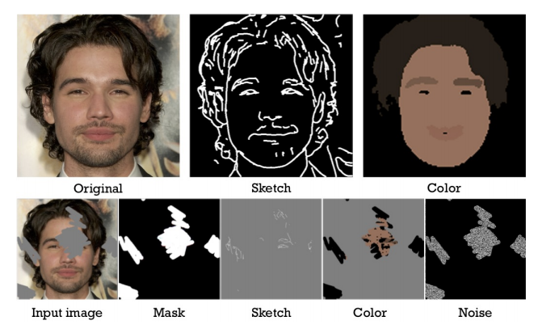

# SC-FEGAN: Face Editing Generative Adversarial Network with User’s Sketch and Color

# 摘要
我们提出了一个新颖的图片编辑系统，利用用户提供的自由形式的掩模，草图以及颜色作为输入。我们的系统有端到端的可训练的卷积王海鸥组成。相对于现有的方法，我们的系统完全使用自由形式的用户的颜色和形状输入。这允许系统应对用户的草图和颜色输入，把它作为生成图片的指导。在我们的特有的工作中，我们使用额外的风格损失是的生成结果更加真实，即使图片中大块区域别移除。我们提出网络架构SC-FEGAN很适合与根据用户感觉上的输入生成高质量的结果。 
代码和demo：https://github.com/JoYoungjoo/SC-FEGAN.
  
# 引言：
有什么应用场景，略。。  
最近的工作中，基于深度学习的方法被用户重建图像中被擦除的部分。最典型的方法是使用普通的（方形）掩模，然后利用编码解码生成器重构掩盖掉的区域。然后，使用全局和局部判别器用来判别结果是否真实。但是，这种系统限于低分辨率图片，并且在掩盖区域的边界上生成违和的图像。此外，恢复区域上的合成图像往往达不到用户的期望，因为生成器从来没有得到任何用户输入作为指南。在这一限制上得到改进的几项工作包括Deepfillv2[17]，一项利用用户草图作为输入的工作，以及GuidedInpating[20]，它将另一幅图像的一部分作为输入来恢复丢失的部分。 然而，由于Deepfillv2不使用颜色输入，因此合成图像中的颜色是通过从训练数据集学习的先验分布推断来的。GuidedInpating使用其他图像的部分来恢复已删除的区域。 然而，很难详细恢复，因为这样的过程需要推断用户首选的参考图像。 另一项最近的工作Ideepcolor[19]提出了一种系统，它接受用户输入的颜色作为参考，为黑白图像创建彩色图像。然而，Ideepcolor中的系统不允许编辑对象结构或恢复图像上删除的部分。在另一项工作中，介绍了一种人脸编辑系统Face Shop[12]它接受草图和颜色作为用户输入。然而，FaceShop作为一种交互式合成图像生成系统具有一定的局限性。 首先，它利用随机矩形可旋转掩码来擦除本地和全局鉴别器中使用的区域。 这意味着本地鉴别器必须调整恢复的本地补丁的大小以接受拟合的输入尺寸，并且调整大小过程将扭曲图像的擦除和剩余部分中的信息。 因此，产生的图像将在恢复部分有尴尬的边缘。 其次，如果面积过大，面店会产生不合理的合成图像。为了解决上述局限性，我们提出了一种具有完全卷积网络的SC-FEGAN，该网络能够进行端到端的训练。我们提出的网络使用SNPatchGAN[17]鉴别器来解决和改进违和的边缘。该系统不仅训练一般的GAN损失，而且同时训练风格损失，以编辑人脸图像的部分，即使缺少一个大的区域。我们的系统创建高质量的真实复合图像与用户的自由形式输入。 草图和颜色的自由形域输入也有一个有趣的额外效果，如图1所示。 综上，我们做出以下贡献：
 
我们提出一种类似于具有门控卷积层[17]的Unet[13]的网络体系结构。 这种体系结构对于训练和推理阶段都更容易和更快。 在我们的案例中，它比由粗到细的网络能产生更优越和精细的结果。我们创建了自由形式领域的，掩模，颜色，草图数据。这个数据用来制作不完整的图片数据用来训练，而不是使用刻板化的输入。
我们使用了SN-PatchGAN判别器，并且使用额外的风格损失训练我们的网络。这个应用涵盖了图像大量被擦除的情况，并且显示了处理掩码边缘的健壮性。 它还允许生产的图像细节，如高质量的合成发型和耳环。

# 2 相关工作
交互式图像修改有着广泛的历史，主要涉及到使用手工制作的特性而不是深度学习技术的技术。历史 略。。。
2.1 图像迁移
pix2pix CycleGAN 略
最近，在领域到领域的变化之后，一些研究工作已经证明了系统可以接受用户输入来为生成的结果添加所需的方向。StarGAN[2]使用单个生成器和鉴别器，通过使用域标签进行训练，灵活地将输入图像转换到任何期望的目标域。Ideepcolor[19]被引入到一个系统中，通过将用户想要的颜色作为掩码，将单色图像转换为彩色图像。在这些工作中，与用户输入交互的图像转换表明，用户输入可以通过向生成器提供图像来学习。
2.2 图像补全
不成功的工作，略  
在后续研究Deepfillv2[17]中，引入了一个自由形式的掩码和SN-PatchGAN，以单个鉴别器取代现有的矩形掩码和全局和局部鉴别器。**此外，还提出了学习被遮挡区域特征的门控卷积层 重点**。 该层可以通过训练自动地从数据中呈现掩码，这使得网络能够在结果上反映用户的草图输入。我们在下一节中描述的建议网络不仅允许使用草图，而且允许使用颜色数据作为编辑图像的输入。尽管我们使用了U-net结构，而不由粗到细的网络结构，如Deepfillv1，2[5,17]，但我们的网络在没有复杂训练计划或其他复杂层要求的情况下产生高质量的结果。

# 3 方法
本文介绍了一种基于神经网络的人脸图像编辑系统SC-FEGAN，并描述了输入批量数据的制作方法。 该网络可以训练端到端，并产生高质量的合成图像与现实的纹理细节。   
在3.1节中，我们讨论了我们制作训练数据的方法。 在3.2节中，我们描述了我们的网络结构和损失函数，它们允许从草图和颜色输入中提取特征，同时在训练中实现稳定性。
 
图2。 草图和颜色域数据集和批处理的输入。 我们使用HED边缘检测器[16]提取草图。 彩色地图是由使用GFC[9]的分割区域的中位颜色生成的。 网络的输入由不完整的图像、掩码、草图、颜色和噪声组成。
## 3.1  训练数据
训练数据集对于模型输出结果和配平用户输入都十分重要，从celebA-HQ选取29000张训练，1000张测试，将他们重新缩放的512*512大小。
为了表达眼部的复杂性，我们在眼部位置使用自由形式的掩模进行训练。
对于草图和颜色，我们利用自由形式掩模以及CFC[9]中提供的人脸分割，来制作草图域和颜色域中的内容。**这是我们的系统能够对用户手动输入样例产生良好结果的关键步骤。**
我们在头发区域随机的使用掩模，因为相比脸部的其它区域，它具有更复杂的属性。我们在下面进行详细的讨论。
### 眼睛位置的自由形式掩模
我们使用和deepfillv2相似的掩模方法来制作不完整的图像。但是，当训练人脸图像时，我们以眼部为起始位置，随机的应用自由绘画掩模来表达眼部的复杂性。算法1 描述了详情。
算法1
``` python
Algorithm 1 Free-form masking with eye-positions
maxDraw, maxLine, maxAngle, maxLength are hyper parameters
GFCHair is the GFC for get hair mask of input image
Mask=zeros(inputSize,inputSize)
HairMask=GFCHair(IntputImage)
numLine=random.range(maxDraw)
for i=0 to numLine do
    startX = random.range(inputSize)
    startY = random.range(inputSize)
    startAngle = random.range(360)
    numV = random.range(maxLine)
    for j=0 to numV do
        angleP = random.range(-maxAngle, maxAngle)
        if j is even then
            angle = startAngle + angleP
        else
            angle = startAngle + angleP + 180
        end if
        length = random.range(maxLength)
        Draw a line on Mask from point (startX, startY)   with angle and length.
        startX = startX + length * sin(angle)
        startY = stateY + length * cos(angle)
    end for
Draw a line on Mask from eye postion randomly.
end for
Mask = Mask + HairMask (randomly)
```
这段算法描述的似乎是按照一定方式用程序生成区域块来模仿用户画的块，从起始点开始，每次角度渐变，长度随机的方式移动一段距离

### 草图和颜色域：
这个部分，我们使用和FaceShop中类似的方法。但是，我们排除了AutoTrace当将bitmap转换成矢量的草图数据时。
使用Hed边缘检测器来生成模拟用户输入的用于修改图像的草图数据，我们还会将草图里面的曲线进行平滑并且擦除较小的边缘。(边缘检测生成的边缘一般是不够平滑的，要平滑处理)。

为了创建颜色领域的数据，我们首先使用尺寸为3的中值滤波，在接上20次的双边滤波（ bilateral filter）（注：双边滤波器之所以能够做到在平滑去噪的同时还能够很好的保存边缘(Edge Preserve)）。之后，GFC用来对图像做分割，每个风格部分使用对应部分的中值颜色来替代。

当从颜色域创建了数据之后，不使用直方图均衡化，以避免明暗颜色混淆污染。然而，由于。。。。，我在是在直方图均衡化之后使用边缘检测的（注：为啥前面不说？？）。然后，我们乘上掩模，类似于前面的自由形式掩模附加的过程，这就得到了彩色笔刷画过的图像。可以从图2中看我们的数据的样子。（可以看到，他这个输入有好几项，相对用户输入是比较多的，包含去掉掩模区域的图像，掩模，噪声掩模，掩模区域的边缘=草图，掩模区域的颜色

引文：
[9] Y. Li, S. Liu, J. Yang, and M.-H. Yang. Generative face
completion. In The IEEE Conference on Computer Vision
and Pattern Recognition (CVPR), volume 1, page 3, 2017. 1, 3, 4
