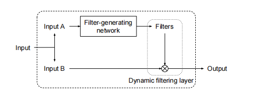
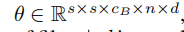

网络由两部分组成，滤波器生成网络和动态滤波层。滤波器生成网络基于输出生成样本特定的滤波器参数。动态滤波层将样本特定滤波器应用到输入上。这两个部分都是可微分的，因此梯度可以整个网络中传播。过滤器可以是卷积，但是其它形式也是可以的。  特别的，我们提出了局部滤波，可以通过为止指定。

我们的方法，还有点类似于resnet，resnet相加，我们的是过滤器处理。
  
滤波器网络的输出，θ ∈ R^s×s×c_B×n s是滤波器的大小，大小根据应用而定，C_b是b的通道数，n是滤波器的数量，输出被应用到 I_B ∈ R^h×w×cB