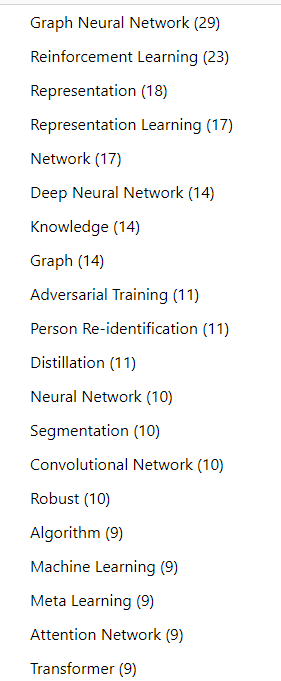
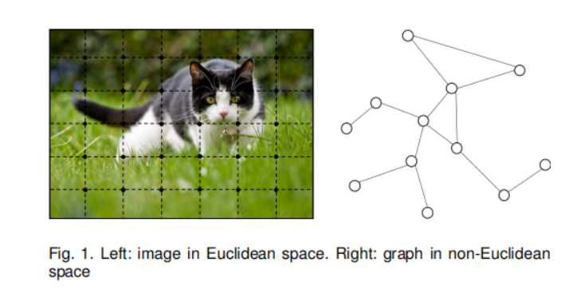
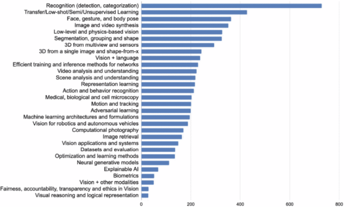
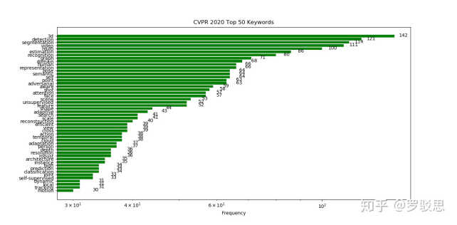
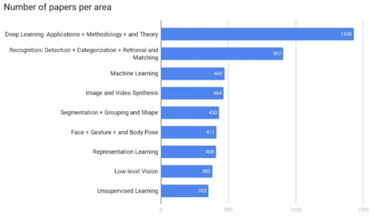

https://www.aminer.cn/conf/cvpr2020/?s=al 专门做论文统计的网站

2021第一季度
AAAI 2021  
研究领域  

可以看到，图神经网络GNN是很热的了
简单理解：这里面的图就是我们数据结构里面的图，图神经网络就是用来处理这一类数据的，可以看成对图的智能处理。图是非欧空间的数据，什么是非欧空间，流形就是一种非欧空间，一个图也是一个非欧空间，如下方的，点之间的距离 = 边长之和，不是一般的欧式距离？传统的神经网络，方便处理欧式空间的数据，比如图片内部的点就是按照欧式空间进行排列的，如下图，就是tensor的样子，但是不适合处理非欧空间的，比如图，所以GNN被专门开发出来处理。

具体的应用领域，图的领域就都可以用，推荐系统，人、内容或商品之间就组成图，cv也有，比如人的姿态，关节节点组成图。
 
 好看可以看到这个会里面GAN的不多，当然也有它是ai会议，不是专门cv会议的原因 

最佳论文， 3篇
Informer: Beyond Efficient Transformer for Long Sequence Time-Series Forecasting
改进transformer用于长序列，长时间跨度的预测

另外一篇q learning 多智能体学习的 不懂
一篇是消除政策偏见的，技术上应该指导性不强

提名奖 3篇

2020 年的
CVPR

CVPR 2020 《Unsupervised Learning of Probably Symmetric Deformable 3D Objects from Images in the Wild》 同时踩中无监督学习和3D视觉技术两个热点
可以看到，目前3D是cv领域的研究热点，也就是说自然的cv在2d图像上处理效果好了，自然地发展到3d领域。
还有视频，位于第4位，现在的视频也是挺强的。

ECCV

最佳论文，光流估计，主要用于视频的目标追踪的。
两篇亚军论文是：1、智能体任务处理时间和外界发生变化时间的之间进行平衡的评价指标（比自动驾驶识别前方物体做出反应，和物体运动到一定程度之间的平衡），3、特定角度下三维场景合成
可以看到，似乎也从单纯图像进化到了视频和3D。

总结：应该说视频和3D是目前比较热点的研究方向，也是CV在静态2D图像领域取得好效果之后自然的衍生。

三大顶会近年最佳
近年最佳：
ICCV：
2019
SinGAN：Learning a Generative Model From a Single Natural Image
从单张图片中学习生成

cv三大顶会简介：

ICCV 的全称是 IEEE International Conference on Computer Vision，即国际计算机视觉大会，由IEEE主办，每两年召开一次。
2019情况
最佳论文一篇（冠军），荣誉提名2篇（亚军），提名（7篇）季军
2019年收到 4303 篇论文，是上一届大会 ICCV 2017 论文投稿数量（2143）的 2 倍以上。最终大会接收了 1075 篇论文，接收率为 25.02%，其中 200 篇为 oral 论文（4.6% 接收率）。

CVPR是IEEE Conference on Computer Vision and Pattern Recognition的缩写，即IEEE国际计算机视觉与模式识别会议。该会议是由IEEE举办的计算机视觉和模式识别领域的顶级会议。
CVPR 2020 收到 6656 篇有效投稿，录取了 1470 篇论文。有效投稿量从 2018 年的 3300 篇，到 2019 年的 5160。

ECCV的全称是European Conference on Computer Vision(欧洲计算机视觉国际会议)，两年一次。
有效投稿数为5025，最终收录1361篇论文

